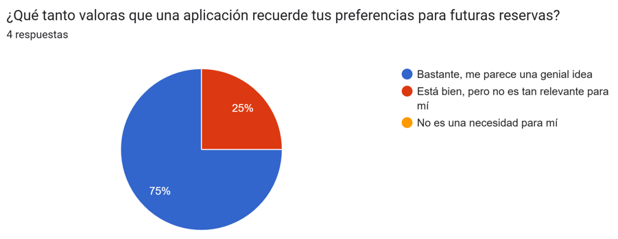

# 
Informe del Trabajo Final

    </img> 
    <strong>Universidad Peruana de Ciencias Aplicadas</strong> 
    <strong>Ingeniería de Software</strong> 
    <strong>1ASI0728 - Arquitecturas de Software Emergentes - 7281</strong> 
    <strong>Profesor: Richard Leonardo Berrocal Navarro </strong> 
     INFORME

#### Startup: **Sweet Manager**

#### Product: **Sweet Manager**

## Team  Members:

|               Member                |    Code    |
| :---------------------------------: | :--------: |
| Rojas Sánchez, Mauricio Abraham Rivo  | U202211572 |
| Acuña Alarcón, Aaron Elías  | U202211552 |
| Peña Rivera, Manuel Sebastian  | U202210138 |
| Rodriguez Santos, David Bryan  | U202212236 |
| Serrano Ircañaupa, Nelson Elias  | U202214733 |

# Registro de Versiones del Informe

# Project Report Collaboration Insights

En esta sección, regirstraremos los cambios y logros que se completaron en cada entrega del reporte.

TB1
La entrega TB1 finalizó con éxito y están documentadas en el siguiente repositorio de Github perteneciente a la organización del equipo: https://github.com/Spicy-Solutions/final-report Durante el desarrollo del informe se tuvieron en cuenta los siguientes aspectos:

Se redactaron y estructuraron los contenidos asignados a cada miembro utilizando el formato Markdown. Luego, se realizaron commits para garantizar el avance en el repositorio.
Se completaron los siguientes puntos: capitulos I-IV, conclusiones y video exposición, en colaboración del equipo. 
Se llevaron a cabo reuniones semanales para hacer una revisión de lo elaborado por el grupo. 

# Contenido

- [Registro de Versiones del Informe](#registro-de-versiones-del-informe)
- [Project Report Collaboration Insights](#project-report-collaboration-insights)
- [Capítulo I: Introducción](#capítulo-i-introducción)
   * [1.1. Startup Profile](#11-startup-profile)
      + [1.1.1. Descripción de la Startup](#111-descripción-de-la-startup)
      + [1.1.2. Perfiles de integrantes del equipo](#112-perfiles-de-integrantes-del-equipo)
   * [1.2. Solution Profile](#12-solution-profile)
      + [1.2.1. Antecedentes y problemática](#121-antecedentes-y-problemática)
      + [1.2.2. Lean UX Process](#122-lean-ux-process)
         - [1.2.2.1. Lean UX Problem Statements](#1221-lean-ux-problem-statements)
         - [1.2.2.2. Lean UX Assumptions](#1222-lean-ux-assumptions)
         - [1.2.2.3. Lean UX Hypothesis Statements.](#1223-lean-ux-hypothesis-statements)
         - [1.2.2.4. Lean UX Canvas](#1224-lean-ux-canvas)
   * [1.3. Segmentos objetivo](#13-segmentos-objetivo)
- [Capítulo II: Requirements Elicitation & Analysis](#capítulo-ii-requirements-elicitation-analysis)
   * [2.1. Competidores](#21-competidores)
      + [2.1.1. Análisis competitivo](#211-análisis-competitivo)
      + [2.1.2. Estrategias y tácticas frente a competidores](#212-estrategias-y-tácticas-frente-a-competidores)
   * [2.2. Entrevistas](#22-entrevistas)
      + [2.2.1. Diseño de entrevistas](#221-diseño-de-entrevistas)
      + [2.2.2. Registro de entrevistas](#222-registro-de-entrevistas)
      + [2.2.3. Análisis de entrevistas](#223-análisis-de-entrevistas)
   * [2.3. Needfinding](#23-needfinding)
      + [2.3.1. User Personas](#231-user-personas)
      + [2.3.2. User Task Matrix](#232-user-task-matrix)
      + [2.3.3. User Journey Mapping](#233-user-journey-mapping)
      + [2.3.4. Empathy Mapping](#234-empathy-mapping)
      + [2.3.5. As-is Scenario Mapping](#235-as-is-scenario-mapping)
         - [As-is Scenario Mapping Huésped:](#as-is-scenario-mapping-huésped)
         - [As-is Scenario Mapping Administrador:](#as-is-scenario-mapping-administrador)
         - [As-is Scenario Mapping Dueño:](#as-is-scenario-mapping-dueño)
   * [2.4. Ubiquitous Language](#24-ubiquitous-language)
- [Capítulo III: Requirements Specification](#capítulo-iii-requirements-specification)
   * [3.1. To-Be Scenario Mapping](#31-to-be-scenario-mapping)
         - [To-be Scenario Mapping Huésped:](#to-be-scenario-mapping-huésped)
         - [To-be Scenario Mapping Administrador:](#to-be-scenario-mapping-administrador)
         - [To-be Scenario Mapping Dueño:](#to-be-scenario-mapping-dueño)
   * [3.2. User Stories](#32-user-stories)
   * [3.3. Impact Mapping](#33-impact-mapping)
   * [3.4. Product Backlog](#34-product-backlog)
- [Capítulo IV: Solution Software Design](#capítulo-iv-solution-software-design)
   * [4.1. Strategic-Level Domain-Driven Design](#41-strategic-level-domain-driven-design)
      + [4.1.1. EventStorming](#411-eventstorming)
         - [4.1.1.1. Candidate Context Discovery](#4111-candidate-context-discovery)
         - [4.1.1.2. Domain Message Flows Modeling](#4112-domain-message-flows-modeling)
         - [4.1.1.3. Bounded Context Canvases](#4113-bounded-context-canvases)
      + [4.1.2. Context Mapping](#412-context-mapping)
      + [4.1.3. Software Architecture](#413-software-architecture)
         - [4.1.3.1. Software Architecture System Landscape Diagram](#4131-software-architecture-system-landscape-diagram)
         - [4.1.3.2. Software Architecture Context Level Diagrams](#4132-software-architecture-context-level-diagrams)
         - [4.1.3.3. Software Architecture Container Level Diagrams](#4133-software-architecture-container-level-diagrams)
         - [4.1.3.4. Software Architecture Deployment Diagrams](#4134-software-architecture-deployment-diagrams)
   * [4.2. Tactical-Level Domain-Driven Design](#42-tactical-level-domain-driven-design)
      + [4.2.1. Bounded Context: IAM Bounded Context](#421-bounded-context-iam-bounded-context)
         - [4.2.1.1. Domain Layer](#4211-domain-layer)
         - [4.2.1.2. Interface Layer](#4212-interface-layer)
         - [4.2.1.3. Application Layer](#4213-application-layer)
         - [4.2.1.4. Infrastructure Layer](#4214-infrastructure-layer)
         - [4.2.1.5. Bounded Context Software Architecture Component Level Diagrams](#4215-bounded-context-software-architecture-component-level-diagrams)
         - [4.2.1.6. Bounded Context Software Architecture Code Level Diagrams](#4216-bounded-context-software-architecture-code-level-diagrams)
            * [4.2.1.6.1. Bounded Context Domain Layer Class Diagrams](#42161-bounded-context-domain-layer-class-diagrams)
            * [4.2.1.6.2. Bounded Context Database Design Diagram](#42162-bounded-context-database-design-diagram)
      + [4.2.2 Bounded Context: Operations and Monitoring Bounded Context](#422-bounded-context-operations-and-monitoring-bounded-context)
         - [4.2.2.1. Domain Layer](#4221-domain-layer)
         - [4.2.2.2. Interface Layer](#4222-interface-layer)
         - [4.2.2.3. Application Layer](#4223-application-layer)
         - [4.2.2.4. Infrastructure Layer](#4224-infrastructure-layer)
         - [4.2.2.5. Bounded Context Software Architecture Component Level Diagrams](#4225-bounded-context-software-architecture-component-level-diagrams)
         - [4.2.2.6. Bounded Context Software Architecture Code Level Diagrams](#4226-bounded-context-software-architecture-code-level-diagrams)
            * [4.2.2.6.1. Bounded Context Domain Layer Class Diagrams](#42261-bounded-context-domain-layer-class-diagrams)
            * [4.2.2.6.2. Bounded Context Database Design Diagram](#42262-bounded-context-database-design-diagram)
      + [4.2.3. Bounded Context: Organizational Management Bounded Context](#423-bounded-context-organizational-management-bounded-context)
         - [4.2.3.1. Domain Layer](#4231-domain-layer)    
         - [4.2.3.2. Interface Layer](#4232-interface-layer)
         - [4.2.3.3. Application Layer](#4233-application-layer)
         - [4.2.3.4. Infrastructure Layer](#4234-infrastructure-layer)
         - [4.2.3.5. Bounded Context Software Architecture Component Level Diagrams](#4235-bounded-context-software-architecture-component-level-diagrams)
         - [4.2.3.6. Bounded Context Software Architecture Code Level Diagrams](#4236-bounded-context-software-architecture-code-level-diagrams)
            * [4.2.3.6.1. Bounded Context Domain Layer Class Diagrams](#42361-bounded-context-domain-layer-class-diagrams)
            * [4.2.3.6.2. Bounded Context Database Design Diagram](#42362-bounded-context-database-design-diagram)
      + [4.2.4. Bounded Context: Commerce Bounded Context](#424-bounded-context-commerce-bounded-context)
         - [4.2.4.1. Domain Layer](#4241-domain-layer)
         - [4.2.4.2. Interface Layer](#4242-interface-layer)
         - [4.2.4.3. Application Layer](#4243-application-layer)
         - [4.2.4.4. Infrastructure Layer](#4244-infrastructure-layer)
         - [4.2.4.5. Bounded Context Software Architecture Component Level Diagrams](#4245-bounded-context-software-architecture-component-level-diagrams)
         - [4.2.4.6. Bounded Context Software Architecture Code Level Diagrams](#4246-bounded-context-software-architecture-code-level-diagrams)
            * [4.2.4.6.1. Bounded Context Domain Layer Class Diagrams](#42461-bounded-context-domain-layer-class-diagrams)
            * [4.2.4.6.2. Bounded Context Database Design Diagram](#42462-bounded-context-database-design-diagram)
      + [4.2.5. Bounded Context: Inventory Bounded Context](#425-bounded-context-inventory-bounded-context)
         - [4.2.5.1. Domain Layer](#4251-domain-layer)
         - [4.2.5.2. Interface Layer](#4252-interface-layer)
         - [4.2.5.3. Application Layer](#4253-application-layer)
         - [4.2.5.4. Infrastructure Layer](#4254-infrastructure-layer)
         - [4.2.5.5. Bounded Context Software Architecture Component Level Diagrams](#4255-bounded-context-software-architecture-component-level-diagrams)
         - [4.2.5.6. Bounded Context Software Architecture Code Level Diagrams](#4256-bounded-context-software-architecture-code-level-diagrams)
            * [4.2.5.6.1. Bounded Context Domain Layer Class Diagrams](#42561-bounded-context-domain-layer-class-diagrams)
            * [4.2.5.6.2. Bounded Context Database Design Diagram](#42562-bounded-context-database-design-diagram)
      + [4.2.6. Bounded Context: Commmunication Bounded Context](#426-bounded-context-commmunication-bounded-context)
         - [4.2.6.1. Domain Layer](#4261-domain-layer)
         - [4.2.6.2. Interface Layer](#4262-interface-layer)
         - [4.2.6.3. Application Layer](#4263-application-layer)
         - [4.2.6.4. Infrastructure Layer](#4264-infrastructure-layer)
         - [4.2.6.5. Bounded Context Software Architecture Component Level Diagrams](#4265-bounded-context-software-architecture-component-level-diagrams)
         - [4.2.6.6. Bounded Context Software Architecture Code Level Diagrams](#4266-bounded-context-software-architecture-code-level-diagrams)
            * [4.2.6.6.1. Bounded Context Domain Layer Class Diagrams](#42661-bounded-context-domain-layer-class-diagrams)
            * [4.2.6.6.2. Bounded Context Database Design Diagram](#42662-bounded-context-database-design-diagram)
- [Capítulo V: Solution UI/UX Design](#capítulo-v-solution-ui/ux-design)
   * [5.1. Style Guidelines](#51-style-guidelines)
     + [5.1.1. General Style Guidelines](#511-general-style-guidelines)
     + [5.1.2. Web, Mobile and IoT Style Guidelines](#512-web-mobile-and-iot-style-guidelines)
   * [5.2. Information Architecture](#52-information-architecture)
     + [5.2.1. Organization Systems](#521-organization-systems)
     + [5.2.2. Labeling Systems](#522-labeling-systems)
     + [5.2.3. SEO Tags and Meta Tags](#523-seo-tags-and-meta-tags)
     + [5.2.4. Searching Systems](#524-searching-systems)
     + [5.2.5. Navigation Systems](#525-navigation-systems)
   * [5.3. Landing Page UI Design](#53-landing-page-ui-design)
     + [5.3.1. Landing Page Wireframe](#531-landing-page-wireframe)
     + [5.3.2. Landing Page Mock-up](#532-landing-page-mock-up)
   * [5.4. Applications UX/UI Design](#54-applications-uxui-design)
     + [5.4.1. Applications Wireframes](#541-applications-wireframes)
     + [5.4.2. Applications Wireflow Diagrams](#542-applications-wireflow-diagrams)
     + [5.4.2. Applications Mock-ups](#542-applications-mock-ups)
     + [5.4.3. Applications User Flow Diagrams](#543-applications-user-flow-diagrams)
   * [5.5. Applications Prototyping](#55-applications-prototyping)
- [Capítulo VI: Product Implementation, Validation & Deployment](#capítulo-vi-product-implementation-validation--deployment)
   * [6.1. Software Configuration Management](#61-software-configuration-management)
      + [6.1.1. Software Development Environment Configuration](#611-software-development-environment-configuration) 
      + [6.1.2. Source Code Management](#612-source-code-management)
      + [6.1.3. Source Code Style Guide & Conventions](#613-source-code-style-guide--conventions)
      + [6.1.4. Software Deployment Configuration](#614-software-deployment-configuration)
   * [6.2. Landing Page, Services & Applications Implementation](#62-landing-page-services--applications-implementation)
      + [6.2.1. ](#621-sprint-1)
         - [6.2.1.1. Sprint Planning 1](#6211-sprint-planning-1)
         - [6.2.1.2. Aspect Leaders and Collaborators](#6212-aspect-leaders-and-collaborators)
         - [6.2.1.3. Sprint Backlog 1](#6213-sprint-backlog-1)
         - [6.2.1.4. Development Evidence for Sprint Review](#6214-development-evidence-for-sprint-review)
         - [6.2.1.5. Testing Suite Evidence for Sprint Review](#6215-testing-suite-evidence-for-sprint-review)
         - [6.2.1.6. Execution Evidence for Sprint Review](#6216-execution-evidence-for-sprint-review)
         - [6.2.1.7. Services Documentation Evidence for Sprint Review](#6217-services-documentation-evidence-for-sprint-review)
         - [6.2.1.8. Software Deployment Evidence for Sprint Review](#6218-software-deployment-evidence-for-sprint-review)
         - [6.2.1.9. Team Collaboration Insights during Sprint](#6219-team-collaboration-insights-during-sprint)
      + [6.2.2. ](#622-sprint-2)
         - [6.2.2.1. Sprint Planning 2](#6221-sprint-planning-2)
         - [6.2.2.2. Aspect Leaders and Collaborators](#6222-aspect-leaders-and-collaborators)
         - [6.2.2.3. Sprint Backlog 2](#6223-sprint-backlog-2)
         - [6.2.2.4. Development Evidence for Sprint Review](#6224-development-evidence-for-sprint-review)
         - [6.2.2.5. Testing Suite Evidence for Sprint Review](#6225-testing-suite-evidence-for-sprint-review)
         - [6.2.2.6. Execution Evidence for Sprint Review](#6226-execution-evidence-for-sprint-review)
         - [6.2.2.7. Services Documentation Evidence for Sprint Review](#6227-services-documentation-evidence-for-sprint-review)
         - [6.2.2.8. Software Deployment Evidence for Sprint Review](#6228-software-deployment-evidence-for-sprint-review)
         - [6.2.2.9. Team Collaboration Insights during Sprint](#6229-team-collaboration-insights-during-sprint)
      + [6.2.3. ](#623-sprint-3)
         - [6.2.3.1. Sprint Planning 3](#6231-sprint-planning-3)
         - [6.2.3.2. Aspect Leaders and Collaborators](#6232-aspect-leaders-and-collaborators)
         - [6.2.3.3. Sprint Backlog 3](#6233-sprint-backlog-3)
         - [6.2.3.4. Development Evidence for Sprint Review](#6234-development-evidence-for-sprint-review)
         - [6.2.3.5. Testing Suite Evidence for Sprint Review](#6235-testing-suite-evidence-for-sprint-review)
         - [6.2.3.6. Execution Evidence for Sprint Review](#6236-execution-evidence-for-sprint-review)
         - [6.2.3.7. Services Documentation Evidence for Sprint Review](#6237-services-documentation-evidence-for-sprint-review)
         - [6.2.3.8. Software Deployment Evidence for Sprint Review](#6238-software-deployment-evidence-for-sprint-review)
         - [6.2.3.9. Team Collaboration Insights during Sprint](#6239-team-collaboration-insights-during-sprint)
    * [6.3. Validation Interviews.](#63-validation-interviews)
         - [6.3.1. Diseño de Entrevistas.](#631-diseño-de-entrevistas)
         - [6.3.2. Registro de Entrevistas.](#632-registro-de-entrevistas)
    * [6.4. Video About-the-Product.](#64-video-about-the-product)
- [Conclusiones](#conclusiones)
   * [Recomendaciones](#recomendaciones)
- [Video About-the-Team](#video-about-the-team)
- [Bibliografía](#bibliografía)

# Student Outcome
En Ingeniería de Software, el logro de curso contribuye a alcanzar el:

# Capítulo I: Introducción

## 1.1. Startup Profile

### 1.1.1. Descripción de la Startup
El proyecto escogido es Sweet Manager, una solución tecnológica enfocada en la gestión eficiente de hoteles, diseñada para facilitar el trabajo administrativo y operativo, así como, modernizar los procesos administrativos.

Nuestro objetivo es brindar a los hoteles una plataforma integral que centralice la administración de reservas y habitaciones, incorporando además tecnologías IoT para mejorar el confort, la seguridad y la eficiencia energética de los espacios.

Para la monetización, utilizamos un modelo de negocio basado en suscripción escalable, el cual se adapta al tamaño y necesidades de cada hotel, e incorpora la gestión de dispositivos IoT como valor agregado. Es decir, cada nivel de suscripción incluye funcionalidades básicas del sistema (gestión de reservas, finanzas, etc.), además de una cantidad determinada de dispositivos IoT preconfigurados para su uso inmediato. Para el aprovisionamiento de hardware, pensamos usar un modelo de Partner Reseller: el partner instala y mantiene el hardware, y Sweet Manager comparte ingresos por suscripción.

Visión:
Ser la plataforma líder en Latinoamérica en la transformación digital del sector hotelero, integrando tecnologías inteligentes que eleven la eficiencia operativa, la experiencia del huésped y la sostenibilidad de los establecimientos.

Misión:
Brindar a los hoteles una solución integral de gestión administrativa y operativa que, a través de herramientas digitales e integración con dispositivos IoT, optimice procesos, modernice la operación diaria y mejore la calidad del servicio, adaptándose a las necesidades de cada establecimiento mediante un modelo de suscripción flexible y escalable.

### 1.1.2. Perfiles de integrantes del equipo

## 1.2. Solution Profile

### 1.2.1. Antecedentes y problemática

Siguiendo la estructura propuesta

-   **What?**
    Sweet Manager es una solución integral diseñada para abordar las complejidades de la gestión hotelera, proporcionando una plataforma única para gestionar los aspectos más importantes de un hotel.

-   **When?**
    ¿Cuando estamos viendo el problema?
    El problema puede surgir en cualquier momento, ya sea diariamente con la gestión de reservas o de manera imprevista con problemas de recursos esenciales como comida, agua, o luz.

    ¿En que momento del día y/o del proceso en cuestión?
    El problema puede presentarse en distintos momentos del día, por ejemplo cuando el personal necesite herramientas adecuadas para atender las reservas y/o comunicarse con su superior.

-   **Where?**
    ¿Donde estamos viendo los problemas?
    Estamos viendo los problemas en hoteles y establecimientos de alojamiento en todas partes, desde pequeñas posadas hasta grandes cadenas hoteleras.

    ¿En que parte/lugar del producto/proceso estamos viendo el problema?
    Los problemas se presentan en la gestión de operaciones diarias, como el seguimiento de ingresos, administración de inventarios, y coordinación del personal.

-   **Who?**
    ¿A quien le sucede?
    Los problemas afectan a propietarios, gerentes de hoteles y personal de trabajo en establecimientos de alojamiento.

    ¿El problema está relacionado con las habilitades de las personas?
    El problema no solo está relacionado con las habilidades, sino también con la complejidad y carga de trabajo asociada a la gestión hotelera, lo que puede ser abrumador sin herramientas adecuadas.

-  **Why?**
    ¿Por qué sucede el problema? ¿Cual es la causa?

    El problema surge debido a la gestión ineficiente, que puede resultar en pérdidas financieras, escasez de inventario, falta de coordinación del personal, y en última instancia, una experiencia insatisfactoria para los huéspedes. Esto afecta tanto la reputación como la rentabilidad del hotel.

-   **How?**
    ¿Como se diferencia el problema del estado normal(optimo)? ¿La tendencia en la que aparece el problema es aleatoria o sigue un patrón?
    El estado óptimo se caracteriza por una operación hotelera fluida y bien coordinada. El problema se diferencia del estado óptimo en que causa interrupciones en la operación, con un impacto negativo en la eficiencia y la satisfacción del cliente. La aparición del problema puede seguir un patrón debido a la falta de automatización o puede ser aleatoria por la falta de previsión.

    ¿Como se utilizará el producto?
    Sweet Manager se utilizará como una plataforma centralizada y fácil de usar que permite a los hoteles gestionar los aspectos principales de su negocio de manera eficiente y efectiva, mejorando la coordinación, el control y la toma de decisiones.

-   **How much?**
    ¿Cuantos problemas se dan en un dia? ¿En una semana? ¿En un mes?
    La frecuencia de los problemas puede variar según la eficiencia del hotel antes de implementar Sweet Manager. Sin embargo, sin una solución adecuada, problemas como la falta de coordinación del personal o la escasez de inventario pueden ocurrir a diario, semanalmente o mensualmente.

    ¿Cuanto dinero están implicando?
    Los problemas de gestión ineficiente pueden implicar pérdidas financieras significativas debido a la mala gestión de inventarios, la insatisfacción de los huéspedes y la disminución de la rentabilidad, lo que puede traducirse en miles de dólares perdidos al mes.

### 1.2.2. Lean UX Process
---
#### 1.2.2.1. Lean UX Problem Statements
---
**Problem Statement:**

Siguiendo la estructura propuesta por Jeff Gothelf y Josh Seiden, en su libro "Lean Ux 3rd Edition":

**El estado actual de** la gestión hotelera en hoteles pequeños y medianos se ha centrado principalmente en procesos manuales, soluciones de software fragmentadas y una adopción limitada de tecnologías innovadoras. La mayoría de los sistemas existentes solo abordan funciones básicas como las reservas y la facturación, sin ofrecer una integración integral e inteligente en toda la operación del hotel.

**Los productos y servicios actuales no abordan adecuadamente** la necesidad de integrar tecnologías IoT que mejoren el confort y la experiencia de los huéspedes, ni brindan una plataforma administrativa centralizada, fácil de usar y escalable según el tamaño y las necesidades del hotel.

Sweet Manager **busca cerrar esta brecha mediante** el desarrollo de una solución tecnológica, que integre dispositivos IoT para el control inteligente de habitaciones, al mismo tiempo que simplifica la gestión administrativa y agiliza los procesos de reseva de habitaciones a los huéspedes. 

**Nuestro enfoque inicial estará dirigido** a hoteles pequeños y medianos ubicados en zonas urbanas de América Latina, que buscan modernizar sus operaciones y reducir costos a través de la transformación digital, así como, futuros huespedes interesados en hacer una reserva personalizada rapidamente. 

**Sabremos que hemos tenido éxito cuando observemos** una mayor tasa de adopción de la plataforma, una reducción comprobada de los costos operativos en los hoteles clientes y un aumento en los índices de satisfacción de los huéspedes.

**Dominio:**

La solución se encuentra en el dominio de la gestión hotelera inteligente, donde convergen operaciones administrativas, experiencia del huésped y tecnologías emergentes como el Internet de las Cosas (IoT). Apunta a digitalizar y optimizar la operación diaria de hoteles, combinando eficiencia operativa, automatización y personalización de servicios.

**Segmentos de Clientes:**

Nos dirigimos a los propietarios y administradores de hoteles de tamaños pequeño y mediano, así como a clientes interesados en una agil gestión de reservas. 

**Puntos de Dolor:**

Administradores: uso excesivo de hojas de cálculo, falta de visibilidad en tiempo real, herramientas desconectadas y procesos manuales que consumen tiempo.

Dueños: dificultad para monitorear operaciones desde fuera del hotel, falta de indicadores claros sobre rentabilidad y ocupación.

Huéspedes: procesos de reserva tediosos, comunicación poco eficiente, escasa personalización del servicio.

**Visión/Estrategia:**

Nuestra visión es proporcionar una solución integral y fácil de usar que aborde todas las necesidades de gestión de un hotel, así como mejorar la experiencia del cliente al ofrecer una plataforma dinamica y sencilla para poder gestionar y realizar sus reservas. 

**Segmento Inicial:**

Nos enfocamos inicialmente en hoteles independientes y pequeñas cadenas hoteleras que buscan soluciones accesibles y eficientes para optimizar sus operaciones. Este segmento ofrece la oportunidad de validar rápidamente el producto en contextos reales, generar casos de éxito locales y escalar hacia otras regiones.

---

#### 1.2.2.2. Lean UX Assumptions
---
#### Features
---
**Para el administrador del hotel:**

- Gestión de habitaciones, incluyendo un control de ocupación en tiempo real.

- Visualización de  reservas hechas por huéspedes. También puede registrar manualmente la llegada (check-in) y salida (check-out),
  
- Comunicación directa por correo dentro del sistema entre personal del hotel

- Gestión de proveedores y suministros necesarios dentro de la aplicación. 

**Para el Huésped del hotel (huésped):**

- Reservación de habitaciones, con la posibilidad de escoger fechas de inicio y salida, tipo de habitación, entre otras características.

- Integración con dispositivos IoT,que permiten adecuar su reserva a valores personalizados por ellos mismos. 

- Personalización de la habitación, pudiendo determinar valores como la temperatura de la misma. 

- El usuario puede consultar sus estadías anteriores.

**Para el dueño del hotel (owner):**

- Posibilidad de monitorear los indicadores clave del hotel en tiempo real.

- Indicadores clave de rentabilidad y ocupación.

- En caso de que el dueño tenga más de un hotel, podrá ver datos agrupados y comparativos entre ellos.

- El propietario puede gestionar los servicios contratados con Sweet Manager, actualizar su plan, etc. 

---
#### Business Outcomes
---

**Aumento en la adopción del sistema**: Alcanzar una tasa de adopción diaria del 60% por parte de los usuarios registrados dentro de los tres primeros meses, lo que evidenciará un uso constante y relevante del sistema.

**Crecimiento del portafolio de clientes**: Lograr un crecimiento mensual sostenido del 10% en nuevos registros de hoteles y alojamientos en Sweet Manager durante el primer año de operación comercial activa.

**Conversión a planes pagos**: Lograr que al menos el 50% de los hoteles que inician con un plan básico se conviertan en usuarios de planes pagos dentro de los 30 días posteriores al lanzamiento.

**Retención de clientes suscriptores**: Mantener una tasa de retención del 60% de los hoteles suscritos a planes pagos durante el primer año, asegurando ingresos estables y satisfacción con la plataforma.

**Reconocimiento como solución integral de gestión hotelera**: Posicionar a Sweet Manager como una de las tres plataformas líderes en soluciones tecnológicas para hoteles en Latinoamérica en un periodo de 2 años, consolidando la marca y aumentando su valor en el mercado.

---
#### Users
---
> **Referencia metodológica:**  
> Según *Lean UX, 3rd edition*, se recomienda crear proto-personas basadas en suposiciones iniciales del equipo, las cuales deben validarse y actualizarse continuamente mediante investigación y observación directa.

Administradores: Los administradores son responsables de garantizar el correcto funcionamiento del hotel en el día a día. Entre sus principales responsabilidades se encuentran la gestión de reservas, control financiero, coordinación del personal, supervisión del inventario y análisis de indicadores clave

Huéspedes: Los Huéspedes representan a los usuarios externos que buscan alojamiento por motivos turísticos, laborales o personales. Este perfil incluye tanto a familias como a viajeros individuales o de negocios.

Dueños: Los dueños de hotel representan a los creadores de la organización y jefes de los administradores. Se encargan de monitorear la correcta gestión del hotel asi como del rendimiento financiero y operativo del mismo. 

##### Proto-persona 1 – Carla, Administradora de Hotel

- **Behavioral demographic information**  
  Administradora de un hotel. Mujer de jornada completa (9:00 a.m. - 5:00 p.m.) encargada de la gestión operativa y financiera del establecimiento. Coordina con un equipo administrativo para mantener el funcionamiento del hotel.

- **Pain points and needs**  
    - **Metas**  
      - Optimizar el tiempo invertido en tareas administrativas.  
      - Aumentar la ocupación del hotel mediante una mejor gestión.  

    - **Necesidades**  
      - Automatizar tareas repetitivas y procesos manuales.  
      - Acceder fácilmente a datos e indicadores clave para la toma de decisiones.  

    - **Frustraciones**  
      - Uso excesivo de hojas de cálculo.  
      - Pérdida de tiempo con proveedores de tecnología poco claros o soluciones poco intuitivas.
        
- **Potential Solutions**
    - Una herramienta que permita gestionar mejor los procesos administrativos y operativos a su cargo.
  
---

##### Proto-persona 2 – José, Huésped del Hotel

- **Behavioral demographic information**  
  Hombre casado que viaja temporalmente con su familia por motivos turísticos. Representa al Huésped típico que busca hospedaje cómodo y sin complicaciones para disfrutar de su viaje familiar.

- **Pain points and needs**  
    - **Metas**   
      - Disfrutar tiempo de calidad con su familia.  
      - Garantizar bienestar y educación a sus hijos.  
      - Aprovechar sus vacaciones sin estrés ni contratiempos.  

    - **Necesidades**  
      - Reservar habitaciones de forma sencilla y rápida.  
      - Contar con servicios que le permitan relajarse y enfocarse en su familia.  

    - **Frustraciones**  
      - Exceso de trámites y procesos al elegir y reservar alojamiento, lo que vuelve mas tediosas sus vacaciones.
     
  - **Potential Solutions**
          - Una herramienta que permita agilizar los tramites y procesos tediosos al reserver alojamiento
---

##### Proto-persona 3 – Lucía, Dueña del Hotel

- **Behavioral demographic information**
- Dueña de dos hoteles en Lima. Supervisa KPIs y busca inversiones rentables. Tiene conocimientos financieros y experiencia en administración.

- **Pain points and needs**

    - **Metas:**
        -  Rentabilizar la operación y asegurar crecimiento sostenible.

    - **Necesidades:**
        - Gestionar un correcto funcionamiento del hotel, asi como su generación de ingresos. 

    - **Frustraciones:**
        - Falta de visibilidad consolidada y herramientas de análisis.

- **Potential Solutions**
    - Dashboard financiero con indicadores de ROI y performance general.
---
##### User Outcomes & Benefits
---
> **Referencia metodológica:**  
> Según *Lean UX, 3rd edition*, usando los proto personas como base , podemos hacernos esta serie de preguntas: What is the user trying to accomplish?, How does the user want to feel during and after this process?, How does our product or service get the user closer to a life goal or dream?, Why would your user seek out your product? y What behavior change can we observe that tells they’ve achieved their goal?

###### **Carla, Administradora de Hotel**

Carla busca tener mayor control y organización sobre los procesos operativos del hotel. Su objetivo principal es optimizar las tareas administrativas mediante herramientas digitales que le permitan centralizar la información y reducir su dependencia de hojas de cálculo. Desea sentirse tranquila, organizada y en control de sus responsabilidades diarias. Sweet Manager la ayuda mediante un panel de control centralizado que automatiza flujos de trabajo y presenta reportes en tiempo real, permitiéndole tomar decisiones informadas rápidamente. Gracias a ello, observamos una disminución en el uso de Excel y una adopción diaria del sistema para gestionar el hotel de forma más eficiente.

###### **José, Huésped del Hotel**

José valora profundamente una experiencia de reserva que sea sencilla, rápida y personalizable, especialmente cuando viaja con su familia. Quiere sentirse relajado y satisfecho desde el primer contacto con el hotel hasta el final de su reserva. Sweet Manager le permite visualizar opciones de habitación, realizar su reserva con facilidad y configurar elementos como la temperatura ambiente para hacer su experiencia más cómoda. Busca esta herramienta porque reduce los trámites y mejora la planificación de sus vacaciones. El cambio observable es un uso activo del sistema para personalizar su estadía y garantizar una experiencia hotelera ideal.

###### **Lucía, CEO del Hotel**

Lucía desea tener un control total sobre el rendimiento financiero y operativo de sus hoteles, sin depender exclusivamente de intermediarios o reportes demorados. Quiere sentirse segura de que sus decisiones de inversión están respaldadas por datos concretos y accesibles. Sweet Manager le proporciona insights estratégicos clave y un acceso ágil a información consolidada sobre ingresos, egresos, ocupación y desempeño. Lo busca como una herramienta que le permite supervisar de forma proactiva toda la operación desde su móvil. Como resultado, se observa una toma de decisiones más rápida y una gestión más precisa y orientada a resultados.

---
#### User Assumptions

###### **Administrador del Hotel**

El administrador es responsable de la operación y administración diaria del hotel. Sweet Manager forma parte de su rutina laboral diaria, facilitando la gestión de habitaciones, reservas y comunicaciones internas. El principal problema que enfrentaba eran los procesos manuales, la desorganización y la falta de herramientas centralizadas. Utiliza el sistema todos los días desde su espacio de trabajo, encontrando valor en funciones como la automatización de tareas, la administración integral y una interfaz intuitiva. Para él, Sweet Manager debe verse profesional, organizado y confiable, acompañándolo en su labor operativa constante.

###### **Huésped del Hotel**

El huésped es una persona que busca hospedarse con comodidad y sin complicaciones. Sweet Manager entra en su vida durante la planificación de sus viajes y su experiencia de estadía, simplificando el proceso de reserva y personalización de su habitación. Anteriormente, enfrentaba reservas tediosas y poco intuitivas. Utiliza la plataforma antes y durante el viaje para asegurar una experiencia ágil y cómoda. Valora especialmente la posibilidad de realizar reservas rápidas, contar con una interfaz clara y recibir confirmaciones inmediatas. Para él, el sistema debe comportarse de manera simple, amigable y rápida.

###### **Dueño del Hotel**

El dueño del hotel supervisa la rentabilidad y el rendimiento general del negocio. Sweet Manager es una herramienta clave para él al momento de revisar los resultados financieros y operativos de su establecimiento. Su mayor desafío es la falta de visibilidad clara sobre el estado del negocio. Usa el sistema semanalmente o en momentos clave para tomar decisiones estratégicas informadas. Busca funciones que le brinden acceso a indicadores estratégicos y financieros de manera consolidada. Para él, el sistema debe representar y mostrarle aquellos datos relevantes y esenciales para su negocio. 

#### Business Assumptions
---
> *Extraído y adaptado del modelo propuesto en **Lean UX Sampler** de Jeff Gothelf*

1. **Creemos que mis Huéspedes tienen la necesidad de:**  
   Administrador: Mejorar la eficiencia operativa de sus hoteles mediante automatización y control energético.
   Huésped: Tener una experiencia mas satisfactoria y sencilla a la hora de hacer y gestionar sus reservas de habitaciones en un hotel. 

2. **Estas necesidades pueden resolverse con:**  
   Administrador: Una plataforma integral que centralice gestión de reservas, finanzas y dispositivos IoT.
   Huéspedes: Una plataforma digital de gestión de reservas, con opciones de personalización.
   Dueño: Una plataforma que le permita visualizar la gestión de reservas y habitaciones de su hotel. 

4. **Mis Huéspedes iniciales son (o serán):**  
   Hoteles pequeños y medianos en Lima y sus Huéspedes.

5. **El valor principal que un Huésped desea obtener de mi servicio es:**  
   Administracion y Dueños: Reducción del tiempo y costo operativos y administrativos.
   Huésped: Reducción del tiempo y de cantida de tramites para efectuar una reserva en un hotel. Así como, una mejor experiencia en su reserva. 

6. **Adquiriré a la mayoría de mis Huéspedes a través de:**  
   Administradores y Dueños: Partners tecnológicos, asociaciones hoteleras y marketing digital.
   Huéspedes: Marketing digital. 

7. **Ganaré dinero mediante:**  
   Un modelo de suscripción escalable con funcionalidades básicas e IoT incluidos.

8. **Mi competencia principal en el mercado será:**  
   Sistemas tradicionales de gestión hotelera, gestión empresarial o CRMs
   **Nos diferenciaremos por:**  
   - Innovación tecnológica  
   - Interfaz amigable  
   - Soporte mediante partners

9. **Mi mayor riesgo de producto es:**  
   Poca adopción de funcionalidades IoT por desconocimiento, 
   **Lo resolveremos mediante:**  
   Capacitación, asistentes y soporte técnico.

10. **Que otros supuestos tenemos, que si probados falsos, pueden causar que nuestro proyecto falle**  
   - Que los hoteles pequeños estén dispuestos a pagar por tecnología.
   - Que los administradores esten dispuestos a acelarar sus procesos con nuestro software y no otras herramientas como la IA.   
   - Que la instalación IoT sea rentable y escalable.  
   - Que los partners brinden soporte técnico confiable.

---

#### 1.2.2.3. Lean UX Hypothesis Statements.

Usando la información recolectada en los Business Outcomes, Usuarios, Beneficios y Features. Podemos formular nuestras hipótesis, cada una centrada en un Feature a desarrollar.

Hipótesis 1:

Creemos que se logrará una tasa de adopción diaria del 60% por parte de los usuarios registrados en los tres primeros meses 
si los administradores del hotel
alcanzan mayor control y organización sobre los procesos operativos
con el panel de control centralizado.

Hipótesis 2:

Creemos que lograremos que el 50% de los hoteles que inician con un plan gratuito se conviertan en usuarios pagos en los primeros 30 días
si los huéspedes del hotel
alcanzan una experiencia de reserva personalizada y sin complicaciones
con la funcionalidad de personalización de habitación en línea.

Hipótesis 3:

Creemos que se logrará mantener una tasa de retención del 60% de los hoteles suscriptores durante el primer año
si los dueños del hotel
alcanzan una mayor visibilidad sobre el rendimiento financiero y operativo
con el acceso móvil a reportes financieros y operativos.

Hipótesis 4:

Creemos que se logrará un crecimiento mensual del 10% en nuevos registros de hoteles durante el primer año de operación comercial activa
si los administradores del hotel
alcanzan una comunicación y gestión más rápida
a través de la función de mensajería integrada en la aplicación.

Hipótesis 5:

Creemos que lograremos posicionar a Sweet Manager como una de las tres plataformas líderes en Latinoamérica en dos años
si los huéspedes del hotel
alcanzan una estadía más cómoda y adaptada a sus preferencias
con las opciones de personalización de la habitación, como la temperatura.

#### 1.2.2.4. Lean UX Canvas

Se ha desarrollado un Lean UX Canvas como herramienta estratégica para estructurar y validar el concepto del producto de manera ágil. Esta metodología permite al equipo identificar claramente el problema de negocio, definir los usuarios objetivo, establecer hipótesis validables y determinar los experimentos mínimos necesarios para aprender y iterar sobre la solución propuesta, reduciendo significativamente el riesgo de desarrollar características que no aporten valor real al usuario final.

## 1.3. Segmentos objetivo

<u>Stakeholders externos:</u>

**Propietario de hotel**

Descripción: Persona que posee uno o más establecimientos hoteleros. Su rol principal es estratégico: toma decisiones de inversión, supervisa la rentabilidad del negocio y delega las operaciones diarias al administrador. Busca soluciones que optimicen recursos, incrementen ingresos y mejoren la experiencia del cliente.

Ubicación geográfica: Predominantemente en zonas urbanas y destinos turísticos estratégicos del Perú, como Lima, Cusco, Arequipa, Piura y otras regiones con alta demanda de hospedaje.

Características demográficas: Rango de edad entre 40 y 65 años. En su mayoría de género masculino. Tienen estudios superiores, principalmente en Administración, Economía o Hotelería. Su nivel socioeconómico es medio-alto a alto. Priorizan herramientas que les permitan tener control financiero, reportes de desempeño y retorno de inversión.

**Administrador de hotel**

Descripción: Profesional contratado o asociado encargado de la gestión operativa del hotel. Supervisa al personal, controla inventarios, gestiona reservas, coordina el mantenimiento y asegura la satisfacción del cliente. Necesita herramientas eficientes para el manejo diario.

Ubicación geográfica: Se encuentra en el mismo establecimiento hotelero o en su ciudad de operación. Común en ciudades con fuerte actividad hotelera Lima, Cusco, Arequipa o Piura.

Características demográficas: Edad promedio entre 25 y 50 años. Cuentan con estudios técnicos o universitarios en Gestión Hotelera, Administración, Turismo o afines. Su ingreso económico es medio, y valoran soluciones tecnológicas que les ahorren tiempo, automaticen procesos y reduzcan errores operativos.

**Huésped de hotel**

Descripción: Usuario que realiza reservas de habitaciones a través de la plataforma, motivado por viajes de ocio, aventura o negocios.

Ubicación geográfica: Principalmente residentes en diversas regiones del Perú, aunque con potencial de expansión hacia otros países de Latinoamérica.

Características demográficas: Rango de edad entre 20 y 50 años. Se trata de viajeros con intereses turísticos o profesionales, con estudios universitarios completos o en curso, familiarizados con el uso de plataformas digitales para la planificación de viajes.

<u>Stakeholders internos:</u>

- **Equipo de Desarrollo de SweetManager:** Encargado del diseño, desarrollo y mejora continua de la plataforma SweetManager, asegurando su alineación con las necesidades reales de los usuarios.

- **Equipo de Marketing:** Responsable de definir e implementar estrategias de comunicación y posicionamiento para alcanzar eficazmente a los segmentos objetivo, incluyendo propietarios y gerentes de hoteles.

- **Equipo de Soporte Técnico:** Brinda asistencia constante a los usuarios, resolviendo incidencias técnicas de forma ágil para garantizar una experiencia de uso satisfactoria.

# Capítulo II: Requirements Elicitation & Analysis

## 2.1. Competidores

### 2.1.1. Análisis competitivo

<table border="1" style="border-collapse: collapse; width: 100%;">
    <thead>
        <tr>
            <th colspan="7" style="text-align: center;">Competitive Analysis Landscape</th>
        </tr>
        <tr>
            <td colspan="2">¿Por qué llevar a cabo este análisis?</td>
            <td colspan="5">Porque de esta manera, se conoce a los potenciales competidores en el mercado, evaluamos y analizamos lo que ofrecen para aprovechar algunos puntos débiles encontrados y de esta manera diferenciarnos de ellos.</td>
        </tr>
    </thead>
    <tbody>
        <tr style="text-align: center;">
            <td colspan="2">Empresas</td>
            <td><strong>SweetManager</strong> </td>
            <td><strong>Sistema hotelero Xafiro</strong> </td>
            <td><strong>Samin PMS</strong> </td>
            <td><strong>Binz360</strong> </td>
        </tr>
        <tr>
            <td rowspan="2" style="writing-mode: vertical-lr; text-align: center;">Perfil</td>
            <td>Overview</td>
            <td>Solución tecnológica peruana enfocada en la gestión eficiente de hoteles, diseñada para facilitar el trabajo administrativo y operativo, así como, modernizar los procesos administrativos, mejorando el confort, la seguridad y la eficiencia energética de los espacios utilizando dispositivos IoT como alternativa.</td>
            <td>Software peruano que administra la gestión de los hoteles a nivel administrativo y operativo, es multiplataforma pudiendo manejar el sistema desde cualquier dispositivo, permite el ahorro de tiempo en tareas repetitivas y manuales, cuenta con facturación electrónica con la SUNAT.</td>
            <td>Sistema peruano que ofrece una solución completa para la gestión hotelera, incluyendo funcionalidades como reservas, facturación electrónica integrada con SUNAT, gestión de housekeeping, optimizando operaciones y mejorando la satisfacción del huésped.</td>
            <td>Proporciona un software hecho en Perú para la gestión de hoteles el cual incluye administración de reservas, huéspedes, caja, almacén, entre otros. Cuenta con facturación electrónica integrada con SUNAT, automatizaciones de los flujos de trabajo indicando reportes mediante dashboards.</td>
        </tr>
        <tr>
            <td>¿Qué valor ofrece a los clientes?</td>
            <td>SweetManager está encargado de integrar un sistema hotelero para su fácil gestión colocando como punto innovador los dispositivos IoT con comunicación en tiempo real para el manejo de trámites administrativos y una configuración sencilla y adaptable hacia el cliente.</td>
            <td>Xafiro está encargado de digitalizar mediante un software, la planificación, facturación y administración de los hoteles con una fácil integración de reservas para los huéspedes, pudiendo utilizar el sistema en cualquier dispositivo o plataforma. Cuenta con planes de suscripción mensual.</td>
            <td>Samin PMS maneja un sistema completo para la gestión de cualquier hotel en el Perú, mediante la facturación electrónica, administración de reservas, check-in, check-out, housekeeping, caja, almacén y otros, impulsando sus resultados mediante reportes brindados en dashboards.</td>
            <td>Binz360 mantiene una solución ante la administración de hoteles mediante procesos automatizados que brinda con su herramienta, un software que promete no continuar con las gestiones repetitivas y manuales en cuadros Excel o cuadernos. Abarca y cumple con diferentes secciones importantes de un hotel como caja, almacén, facturación, entre otros.</td>
        </tr>
        <tr>
            <td rowspan="2" style="writing-mode: vertical-lr; text-align: center;">Perfil de Marketing</td>
            <td>Mercado objetivo</td>
            <td><strong>Demográfico</strong> Hoteles medianos y grandes con más de 20 habitaciones con capacidad de inversión tecnológica además de contar personal administrativo entre 30-55 años con interés en digitalización. <strong>Geográfico</strong> Principalmente en Perú con posible expansión en Latinoamérica, comenzando con ciudades totalmente turísticos como Lima, Cusco, Arequipa y Trujillo. <strong>Psicológico</strong> Profesionales que buscan optimizar recursos y reducir costos con tecnología IoT, con enfoque en sostenibilidad y eficiencia energética. <strong>Comportamiento</strong> Empresas que ya usan tecnología básica pero requieren de una solución más innovadora y avanzada.</td>
            <td><strong>Demográfico</strong> Hoteles pequeños y medianos de hasta 50 habitaciones con empresarios y emprendedores jóvenes (25 a 45 años) con hoteles familiares o boutique. <strong>Geográfico</strong> Mercado peruano especialmente en regiones turísticas en ciudades como Cusco, Arequipa, Iquitos, Trujillo. Además cuenta con expansión potencial en pequeñas ciudades y zonas rurales con turismo emergente. <strong>Psicológico</strong> Hoteles con mentalidad de crecimiento pero que aun dependen de procesos manuales. <strong>Comportamiento</strong> Dueños de hoteles que prefieren suscripción mensual en vez de una inversión inicial alta.</td>
            <td><strong>Demográfico</strong> Hoteles de todos los tamaños, desde pequeños hasta grandes cadenas hoteleras. Empresarios y administradores hoteleros entre 30-55 años con experiencia en el sector y equipos administrativos con más de 10 empleados. <strong>Geográfico</strong> Cobertura nacional en Perú, con enfoque en Lima, Cusco, Arequipa y Piura. Potencial expansión a otros países de Latinoamérica con alta demanda de digitalización hotelera. <strong>Psicológico</strong> Empresas que buscan automatización total y centralización de procesos con una mentalidad analítica enfocada en reportes y dashboards para la toma de decisiones. <strong>Comportamiento</strong> Empresas que requieren facturación electrónica integrada con SUNAT y buscan reducir errores administrativos y mejorar la eficiencia operativa.</td>
            <td><strong>Demográfico</strong> Hoteles medianos con procesos aún manuales que requieren digitalización progresiva. Propietarios y gerentes de hotel entre 28-50 años con interés en modernización. <strong>Geográfico</strong> Foco en Perú, especialmente en regiones con menor adopción tecnológica y en zonas turísticas en crecimiento. <strong>Psicológico</strong> Hoteles tradicionales que buscan actualizarse pero sin cambiar por completo sus procesos, con propietarios acostumbrados a métodos manuales como Excel o cuadernos. <strong>Comportamiento</strong> Hoteleros que desean una solución sencilla para automatizar tareas administrativas repetitivas sin una transformación drástica.</td>
        </tr>
        <tr>
            <td>Estrategias de marketing</td>
            <td>Se introduce una propuesta innovadora con la integración de IoT, permitiendo a los huéspedes personalizar su experiencia mediante el control de iluminación, temperatura y entretenimiento desde una app móvil, como también la implementación de funciones ya conocidas en el mercado (facturación electrónica, automatizaciones, administración y monitoreo, etc). Además, se incorpora un equipo estrátegico de publicidad para compartir en redes sociales y permitir reseñas, teniendo énfasis en ciudades altamente turísticos. Para reducir preguntas y dudas, se incorpora una landing page con "Preguntas y respuestas" capaz de proporcionar información verídica sobre disponibilidad, promociones y posible asistencia personalizada.</td>
            <td>Su principal estrategia es el motor de reservas directo, que ayuda a los hoteles a aumentar sus ingresos hasta un 38% al recibir reservas sin intermediarios ni comisiones. También destacan por su facturación electrónica integrada con la SUNAT, facilitando la gestión contable. Se enfocan en el ahorro de tiempo, asegurando que su sistema reduce hasta 970 minutos mensuales en tareas operativas, optimizando el trabajo del personal.</td>
            <td>Se diferencian con integraciones adicionales como Motor de Reservas, Restaurante Smart y Housekeeping Smart, ampliando las funcionalidades del software. Además, ofrecen marketing digital para hoteles, incluyendo gestión de redes sociales y publicidad en Facebook Ads. Para generar confianza, permiten demostraciones gratuitas del sistema antes de la compra.</td>
            <td>Ofrecen una prueba gratuita de 14 días para que los clientes experimenten el sistema antes de comprometerse. Cuentan con planes de precios escalables desde S/7.50 por habitación, lo que permite flexibilidad según el tamaño del hotel. Se enfocan en la automatización, eliminando procesos manuales como cuadernos y hojas de Excel, mejorando la eficiencia operativa.</td>
        </tr>
        <tr>
            <td rowspan="3" style="writing-mode: vertical-lr; text-align: center;">Perfil de Producto</td>
            <td>Productos & Servicios</td>
            <td>
                SweetManager ofrece una solución integral para la gestión hotelera con un enfoque innovador basado en tecnología IoT. Permite a los huéspedes controlar el termostato de su habitación y acceder a opciones de entretenimiento desde una aplicación móvil personalizada, mejorando su experiencia y comodidad. Además, optimiza el consumo energético mediante sensores inteligentes y facilita la administración con herramientas de reservas, check-in/check-out, facturación electrónica y reportes analíticos en tiempo real.
            </td>
            <td>
                Xafiro es un software hotelero diseñado para la digitalización de la gestión de reservas, facturación electrónica y administración de hoteles. Cuenta con un motor de reservas directo para aumentar ingresos sin comisiones, gestión de habitaciones en tiempo real, reportes de ocupación y rendimiento, así como integración con la SUNAT para facturación electrónica.
            </td>
            <td>
                Samin PMS ofrece un sistema de gestión hotelera completo que abarca reservas, check-in/check-out, tarifas, housekeeping y facturación electrónica con SUNAT. Además, cuenta con seccións adicionales como Restaurante Smart y Housekeeping Smart, permitiendo automatizar y optimizar diferentes áreas del hotel. Proporciona reportes y métricas para mejorar la toma de decisiones estratégicas.
            </td>
            <td>
                Binz360 es una solución hotelera enfocada en la automatización de procesos administrativos y operativos. Incluye un dashboard centralizado con visualización de habitaciones, reportes financieros y de ventas, administración de tarifas y disponibilidad, seccións de caja y almacén, así como facturación electrónica integrada con la SUNAT. Su objetivo es eliminar tareas repetitivas y mejorar la eficiencia operativa del hotel.
            </td>
        </tr>
        <tr>
            <td>Precios & Costos</td>
            <td>
                SweetManager ofrece planes de suscripción mensual adaptados al tamaño del hotel. Su modelo flexible permite escalar servicios según las necesidades del cliente, con costos adicionales por integración de dispositivos IoT como termostatos y sistemas de entretenimiento.
            </td>
            <td>
                Xafiro maneja planes mensuales según el número de habitaciones y funcionalidades requeridas. Ofrece paquetes básicos y avanzados, con integración opcional de facturación electrónica a un costo adicional.
            </td>
            <td>
                Samin PMS cuenta con planes modulares según las necesidades del hotel. Su facturación electrónica y seccións adicionales pueden incluir costos extra dependiendo de la cantidad de habitaciones y usuarios.
            </td>
            <td>
                Binz360 ofrece una suscripción mensual basada en el número de habitaciones y servicios contratados. Dispone de precios diferenciados para hoteles pequeños y grandes, con opciones de personalización y soporte técnico avanzado.
            </td>
        </tr>
        <tr>
            <td>Canales de distribución (Web y/o Móvil)</td>
            <td>
                SweetManager está disponible como aplicación web y móvil, con una interfaz intuitiva optimizada para smartphones y tablets. Su integración con dispositivos IoT permite gestionar funciones del hotel en tiempo real desde cualquier dispositivo conectado.
            </td>
            <td>
                Xafiro opera principalmente como una plataforma web accesible desde cualquier navegador, con compatibilidad limitada para dispositivos móviles. Cuenta con una versión responsiva, pero sin aplicación móvil dedicada.
            </td>
            <td>
                Samin PMS ofrece una plataforma web con acceso adaptable a móviles. Algunos seccións cuentan con aplicaciones específicas para Android y iOS, enfocadas en la gestión operativa del hotel.
            </td>
            <td>
                Binz360 dispone de una plataforma web optimizada para distintos dispositivos. Su versión móvil permite acceder a funciones básicas de administración, pero la experiencia completa está diseñada para escritorio.
            </td>
        </tr>
        <tr>
            <td rowspan="4" style="writing-mode: vertical-lr; text-align: center;">Análisis SWOT</td>
            <td>Fortalezas</td>
            <td>
                Integración con IoT para control en tiempo real de temperatura, entretenimiento y automatización.  
                Aplicación móvil intuitiva con control total del hotel.  
                Facturación electrónica integrada con SUNAT.  
                Enfoque en sostenibilidad y eficiencia energética.
            </td>
            <td>
                Plataforma estable con amplia experiencia en el mercado.  
                Compatible con múltiples dispositivos.  
                Integración con sistemas contables y de reservas.
            </td>
            <td>
                Software con funcionalidades completas para gestión hotelera.  
                Aplicaciones móviles para tareas específicas.  
                Automatización de procesos administrativos.
            </td>
            <td>
                Enfoque en la digitalización de hoteles medianos y grandes.  
                Software intuitivo con opciones de personalización.  
                Adaptabilidad para distintos tipos de hoteles.
            </td>
        </tr>
        <tr>
            <td>Debilidades</td>
            <td>
                Nueva en el mercado, falta de reconocimiento frente a competidores.  
                Alto costo inicial debido a la implementación de IoT.  
                Dependencia de infraestructura tecnológica avanzada.
            </td>
            <td>
                Falta de una aplicación móvil completa.  
                Sistema menos flexible para pequeñas empresas.  
                Dependencia de integraciones externas para procesos avanzados.
            </td>
            <td>
                Curva de aprendizaje moderada para nuevos usuarios.  
                Algunas funcionalidades requieren costos adicionales.  
                No cuenta con una estrategia clara de expansión internacional.
            </td>
            <td>
                Dependencia de procesos automatizados sin diferenciación en innovación.  
                No ofrece herramientas avanzadas de personalización.  
                Plataforma con menos soporte para IoT.
            </td>
        </tr>
        <tr>
            <td>Oportunidades</td>
            <td>
                Expansión en mercados latinoamericanos con turismo en crecimiento.  
                Implementación de más dispositivos IoT para mayor automatización.  
                Asociación con cadenas hoteleras para integración exclusiva.
            </td>
            <td>
                Mejoras en su plataforma móvil para captar más usuarios.  
                Creación de nuevos seccións especializados en hotelería de lujo.  
                Expansión a mercados con menos competencia digital.
            </td>
            <td>
                Desarrollo de más integraciones con plataformas de pago y reservas.  
                Crecimiento del turismo y digitalización en la hotelería.  
                Enfoque en automatización avanzada para destacarse.
            </td>
            <td>
                Oportunidad de fortalecer la experiencia móvil y en la nube.  
                Posible adopción de nuevas tecnologías para optimizar procesos.  
                Crecimiento en mercados de hoteles boutique y pequeñas cadenas.
            </td>
        </tr>
        <tr>
            <td>Amenazas</td>
            <td>
                Competencia con marcas ya posicionadas en el mercado.  
                Posibles barreras de adopción tecnológica en hoteles tradicionales.  
                Dependencia de la estabilidad de las redes IoT.
            </td>
            <td>
                Avance de competidores con mejor integración móvil.  
                Cambios en regulaciones fiscales que afecten su facturación electrónica.  
                Crecimiento de soluciones más económicas en el mercado.
            </td>
            <td>
                Aparición de nuevas startups con innovación tecnológica superior.  
                Adaptación lenta a tendencias emergentes en hotelería.  
                Posible saturación del mercado con soluciones similares.
            </td>
            <td>
                Entrada de nuevas soluciones con mejor escalabilidad.  
                Cambios en preferencias de los hoteles hacia plataformas más flexibles.  
                Disminución de la inversión tecnológica en sectores hoteleros pequeños.
            </td>
        </tr>
    </tbody>
</table>

### 2.1.2. Estrategias y tácticas frente a competidores

1. Estrategias para afrontar las fortalezas de la competencia  
<ul>
    <li>Diferenciación tecnológica con IoT:  
        SweetManager integrará termostatos inteligentes, control de entretenimiento desde una app y sensores IoT para la automatización hotelera, ofreciendo una experiencia más innovadora y eficiente.
    </li>
    <li>Enfoque en la experiencia del usuario:  
        Mientras que los competidores se centran en la gestión administrativa, SweetManager también priorizará una interfaz moderna, intuitiva y adaptable, garantizando una mejor experiencia para los usuarios.
    </li>
</ul>

2. Estrategias ante las debilidades de la competencia  
<ul>
    <li>Planes escalables y flexibles:  
        Los competidores ofrecen precios fijos poco accesibles para hoteles pequeños. SweetManager implementará suscripciones modulares, permitiendo que cada cliente pague únicamente por las funcionalidades que necesite según el tamaño de su negocio.
    </li>
    <li>Mayor compatibilidad con diferentes dispositivos:  
        Mientras los competidores tienen interfaces limitadas, SweetManager optimizará su aplicación web y móvil para asegurar una experiencia fluida en cualquier dispositivo.
    </li>
</ul>

3. Estrategias para las oportunidades de la competencia  
<ul>
    <li>Asociaciones estratégicas con proveedores de IoT:  
        SweetManager establecerá alianzas con fabricantes de dispositivos IoT, como termostatos inteligentes, controles de entretenimiento y cerraduras electrónicas, para reducir costos de hardware, asegurar compatibilidad y mejorar la integración.
    </li>
    <li>Optimización del consumo energético:  
        La integración de dispositivos IoT con el sistema de energía del hotel permitirá un mejor control del consumo eléctrico, reduciendo significativamente los costos operativos.
    </li>
</ul>

4. Estrategias frente a las amenazas  
<ul>
    <li>Seguridad y privacidad:  
        Implementación de cifrado avanzado y estándares de protección de datos para garantizar confianza en la digitalización y evitar vulnerabilidades de seguridad.
    </li>
    <li>Asociaciones estratégicas con marketing:  
        Estrategia de marketing digital, publicidad y colaboraciones con influencers del sector hotelero para posicionar la marca y captar clientes antes de la expansión de los rivales.
    </li>
</ul>

## 2.2. Entrevistas

Las entrevistas son una herramienta fundamental para comprender las necesidades, deseos y desafíos de los usuarios, así como para validar las hipótesis y suposiciones del negocio. A través de las entrevistas, se pueden obtener valiosos conocimientos sobre las expectativas de los clientes, sus experiencias actuales y sus preferencias en cuanto a productos y servicios. En el caso de Sweet Manager, las entrevistas con propietarios, administradores y huéspedes serán fundamentales para diseñar una solución que se adapte a las necesidades del mercado y ofrezca un valor significativo a los usuarios.

### 2.2.1. Diseño de entrevistas

En esta sección se documentarán las preguntas que se utilizaron en nuestras entrevistas, conteniendo las preguntas generales que se comparten entre los segmentos objetivos, y las preguntas que fueron creadas específicamente para cada una.

**Preguntas complementarias generales**

- ¿Qué navegador usas con más frecuencia?

- ¿Qué dispositivo tecnológico usas con más frecuencia?

- ¿Cómo describes tu personalidad?

- ¿Presentas alguna frustración en el trabajo?

- ¿Cuáles son los canales de interacción que usas?

- ¿Qué tipo de ambiente de trabajo te resulta más motivador y productivo?

- ¿Cómo se llama el distrito o lugar de tu residencia?

- ¿Qué objetivos tienes tanto laboralmente como personalmente?

**Preguntas Segmento 1: Gerentes**

- ¿Cuáles son los principales desafíos que enfrentan en la gestión diaria de su hotel?

- ¿Qué caracteristicas o funcionalidades consideraría más utiles para mejorar la eficiencia de su hotel?

- ¿Cómo gestiona actualmente las reservas de habitaciones y el seguimiento de ingresos y gastos en su hotel?

- ¿Qué herramientas o software utilizan actualmente para la gestión hotelera y qué aspectos les gustaría mejorar de esas herramientas?

- ¿Qué aspectos valoran más al evaluar nuevas soluciones de software para su hotel?

- ¿Cómo crees que podríamos mejorar la comunicación y la colaboración del equipo?

- ¿Qué desafíos enfrentan al gestionar proveedores y controlar los inventarios en su hotel?

- ¿Cómo gestionan actualmente la satisfacción y las preferencias de los clientes en su hotel?

- ¿Cómo ve conveniente un sistema hotelero dedicado a la gestión de recursos, comunicación con proveedores, seguimiento de ganancias, etc?

**Preguntas Segmento 2: Administradores**

- ¿Qué herramientas o sistemas utilizan actualmente para realizar su trabajo y qué aspectos les resultan más difíciles o menos eficientes?

- ¿Qué características adicionales le gustaría ver en un sistema de gestión hotelera para facilitar su trabajo diario?

- ¿Cómo se sienten acerca de la adopción de nuevas tecnologías en el lugar de trabajo y cómo creen que podría mejorar su experiencia laboral?

- ¿Qué desafíos enfrenta al gestionar las solicitudes de los huéspedes y asegurarse de que se cumplan sus expectativas durante su estancia?

- ¿Cómo creen que podríamos simplificar los procesos de registro de huéspedes y check-in/check-out en su hotel?

- ¿Qué herramientas o recursos adicionales les ayudarán a ofrecer un mejor servicio a los huéspedes y mejorar su experiencia general en el hotel?

**Preguntas Segmento 3: Huéspedes**

- ¿Cómo sueles buscar y reservar un hotel cuando planeas un viaje?

- ¿Qué filtros o criterios son más importantes para ti al elegir un hotel? (precio, ubicación, servicios, etc.)

- ¿Alguna vez te has sentido frustrado al reservar una habitación en línea? ¿Qué sucedió?

- ¿Qué tanto valoras que una aplicación recuerde tus preferencias para futuras reservas?

- ¿Qué tipo de información o servicios te gustaría tener guardados en un perfil de usuario?

- ¿Te gustaría que la app te hiciera sugerencias de hoteles según tu historial o perfil?

- ¿Te gustaría tener acceso a un historial de todas tus reservas anteriores?

- ¿Te gustaría poder comunicarte con el personal del hotel directamente desde la app antes o durante tu estadía?

- ¿Qué tan importante es para ti tener la opción de cancelar una reserva de manera rápida y sencilla?

- ¿Has tenido la necesidad de reservar directamente al llegar a un hotel sin haberlo hecho en línea?

### 2.2.2. Registro de entrevistas

A continuación, se registraron todas las entrevistas realizadas para nuestra solución, categorizadas según su segmento objetivo, y con un resumen que destaca las características y críticas realizadas sobre nuestro proyecto.

**Entrevista 01 (Gerentes)**

URL del Vídeo: <https://acortar.link/8jKmNcD>

Nombres: Carlo

Apellidos: Rebagliati

Edad: 45

Sexo: Masculino

Ocupación: Gerente Hotelero

Lugar donde vive: Pueblo Libre

Duración de la entrevista: 00:00 - 12:20 

Personalidad: Análitica

  

 

En resumen, Carlo Rebagliati es un gerente de hotel con un largo camino de experiencia. Él es una persona analítica, comunicativa, empática y profesional que le importan las estadísticas y los beneficios y consecuencias de cada decisión. Nos relata que sus canales de comunicación preferidos son Whatssap, Zoom y cara a cara; adicionalmente, su navegador más frecuente es Google Chrome y usa Smartphone Android y una computadora con Windows. . Los principales desafíos que tiene su hotel es el llamado a los turistas desde provincia, ya que la mayoría de la clientela que tiene son turistas. Afortunadamente, está manteniendo a sus trabajadores motivados para que las bajas ventas por temporadas no afecte su rendimiento. Adicionalmente, mencionó que tienen una plataforma web donde los clientes realizan sus reservas, también tienen un área contable y administrativa para el seguimiento de ganancia y recursos. Finalmente, cree necesario una aplicación o software que se concentre en la gestión de un hotel, tanto para la comunicación, administración, gestión y seguimiento de recursos.
  
**Entrevista 02 (Gerentes)**
 

URL del vídeo: <https://acortar.link/8jKmNcD>

Nombre: Sergio Alberto Cadillo Nuñez  
Edad: 30  
Sexo: Masculino  
Lugar donde vive: Pueblo Libre-Lima  
Ocupación: Dueño de un emprendimeinto hotelero  
Duración de la entrevista: 21:24 - 27:00  
Personalidad: Analítica  

En resumen, Sergio Alberto Cadillo Nuñez es un joven emprendedor de 30 años con una personalidad analítica y enfoque práctico. Vive en Pueblo Libre, Lima, y actualmente lidera su propio emprendimiento hotelero. Durante la entrevista, nos compartió que uno de los principales desafíos en la gestión diaria de su hotel es el control de inventario y la gestión eficiente de proveedores. Actualmente, el seguimiento de ingresos y reservas lo realiza mediante herramientas básicas como Excel, complementadas por procesos manuales. A pesar de ello, valora la organización y procura mantener un orden estructurado con apoyo de su equipo contable y administrativo. Entre las funcionalidades que considera más útiles para mejorar la eficiencia de su hotel destacan la automatización de reportes, una gestión centralizada de reservas y una plataforma integrada para coordinar con proveedores. 

Al hablar sobre herramientas, el comenta que hace uso de Excel, Word y OneDrive desde su computadora HP y que responde mensajes desde su telefono móvil Iphone. 

  
**Entrevista 03 (Gerentes)**
 

URL del vídeo: <https://acortar.link/8jKmNcD>

 
Nombre: Luis Fernández  
Edad: 28  
Sexo: Masculino  
Lugar donde vive: Surquillo - Lima  
Ocupación: Dueño y manager de un hotel  
Duración de la entrevista: 12:20 - 21:24  
Personalidad: Extrovertido  
 

Luis es una persona extrovertida, carismática y siempre dispuesto a conversar. Su actitud alegre y sociable lo convierte en alguien muy accesible tanto para clientes como para su equipo. En su vida cotidiana, utiliza con frecuencia herramientas tecnológicas, siendo Google su motor de búsqueda predilecto y su iPhone 14 el dispositivo que más emplea para mantenerse conectado y organizar sus actividades.

Junto con sus hermanos, es propietario de un pequeño hotel ubicado en la ciudad de Huaraz, el cual administran de forma directa. Según explica, los principales desafíos que enfrentan actualmente son la gestión eficiente de las habitaciones y el inventario, así como la falta de personal en temporadas altas, lo que genera sobrecarga de trabajo y desorganización operativa.

Luis señala que actualmente utilizan herramientas básicas como Excel para llevar el control del negocio y que la comunicación con los clientes se realiza principalmente a través de WhatsApp. Aunque estos métodos han sido funcionales hasta cierto punto, admite que la gestión resulta poco formal y propensa a errores, especialmente al momento de registrar y monitorear las reservas, lo que puede generar confusiones tanto para el equipo como para los huéspedes.

Al presentarle la idea de una aplicación móvil desde la cual pueda gestionar las habitaciones, reservas, huéspedes, trabajadores e incluso mantener comunicación directa con los administradores, se mostró genuinamente entusiasmado. Afirmó que una herramienta de ese tipo no solo sería útil, sino que definitivamente optaría por implementarla si estuviera disponible, ya que solucionaría varios de los problemas que actualmente enfrenta en la operación del hotel.

  
**Entrevista 01 (Administradores)**

URL del Vídeo: <https://acortar.link/8jKmNcD>

Nombres: Gianella

Apellidos: Francia

Edad: 25

Sexo: Femenino

Ocupación: Administradora de RRHH en la gestión de hoteles

Lugar donde vive: Santa Anita, Perú

Duración de la entrevista: 27:00 - 36:50.

 
Gianella Francia es una joven administradora de uno de la cadena de hoteles más importantes para el turismo extranjero Decameron Resort. Gianella nos cuenta su experiencia como administradora de recursos humanos en la gestión de hoteles. Ella es una persona analítica, empática y profesional que busca siempre salir beneficiada de las decisiones. Nos relata que le resulta de mucha importancia un sistema que automatize y mejore los procesos de reserva, que incluya un historial de reservas e inclusive sugerencias de hoteles de acuerdo a sus preferencias e historial. Ella menciona que actualmente utiliza softwares como Opera PMS para disminuir la carga laboral mediante procesos automatizados, sin embargo, no llega a ser completoy no brinda herramientas innovadoras que beneficie administración y cliente. Afortunadamente, está manteniendo a sus trabajadores motivados para que las bajas ventas por temporadas no afecte su rendimiento. Adicionalmente, mencionó que tienen una plataforma web donde los clientes realizan sus reservas, también tienen un área contable y administrativa para el seguimiento de ganancia y recursos. Finalmente, cree necesario una aplicación o software que se concentre en la gestión de un hotel, tanto para la comunicación, administración, gestión y seguimiento de recursos.

Gianella nos describe que su navegador más utilizado es Google Chrome y su dispositivo preferido es su celular Android. Ella se siente cómoda utilizando herramientas digitales y está abierta a la adopción de nuevas tecnologías que faciliten su trabajo diario. En cuanto a la comunicación, prefiere el uso de WhatsApp y correos electrónicos para coordinar con su equipo y proveedores.

De la misma manera, ella considera que la comunicación y colaboración del equipo son fundamentales para el éxito de la gestión hotelera. En su opinión, un sistema hotelero dedicado a la gestión de recursos, comunicación con proveedores y seguimiento de ganancias podría mejorar significativamente la eficiencia operativa y la satisfacción del cliente.

Por último, Gianella menciona que la gestión de proveedores y el control de inventarios son aspectos críticos en su trabajo diario. Ella considera que una herramienta que facilite la gestión de estos procesos podría ayudar a optimizar los recursos y mejorar la rentabilidad del hotel. También destaca la importancia de contar con un sistema que permita gestionar las preferencias y solicitudes de los huéspedes, lo que contribuiría a brindar un mejor servicio y aumentar la satisfacción del cliente.

**Entrevista 02 (Administradores)**
 

URL del vídeo: <https://acortar.link/8jKmNcD>
 

Nombre: Fabricio Gabriel Chavez Morales  
Edad: 28  
Sexo: Masculino  
Lugar donde vive: Magdalena del Mar-Lima  
Ocupación: Administrador del hotel Los Lirios  
Duración de la entrevista: 36:50 - 46:45  
Personalidad: Enfocado, orientado al servicio al cliente  

Fabricio señala que actualmente utiliza un software de gestión para el control de habitaciones (ocupadas, desocupadas, con o sin personal de housekeeping, etc.) y para el seguimiento de los alimentos servidos. Considera que sería útil incorporar a la aplicación de gestión de housekeeping un sección que permita registrar y monitorear la cantidad de artículos de limpieza disponibles y utilizados, con el fin de optimizar la administración de estos recursos. Durante la conversación, menciona que una de las principales dificultades que ha enfrentado en la gestión de su negocio es que algunos usuarios encuentran el proceso de reserva confuso o demasiado extenso.

Adicionalmente a ello, nos comenta que tiene una laptop Toshiba con sistema operativo Windows y dos telefonos, ambos Android, pero uno de ellos es personal, mientras el otro lo utiliza para el trabajo unicamente. 

Finalmente, al ser consultado sobre herramientas que podrían mejorar su labor, destaca el uso de plataformas como Sweet Manager y otras aplicaciones orientadas a hacer de la administración hotelera una experiencia más eficiente y personalizada.

  

**Entrevista 03 (Administradores)**
 

URL del vídeo: <https://acortar.link/8jKmNcD>

 
Nombre: Sergio Renard  
Edad: 21  
Sexo: Masculino  
Lugar donde vive: La Plata - Argentina  
Ocupación: Administrador de hotel  
Duración de la entrevista: : 46:45 - 51:04  
Personalidad: Alegre  

  

 

Sergio Renard es un administrador hotelero de La Plata, Argentina, al frente de un hospedaje familiar que recibe tanto a turistas locales como internacionales. Su gestión diaria implica desafíos importantes, ya que actualmente realiza el control de reservas, pagos y asignaciones de forma manual. Esta dinámica le demanda mucho tiempo y conlleva un alto riesgo de errores humanos.

Comprometido con brindar un servicio de calidad y atento a las necesidades de sus huéspedes, Sergio busca modernizar su operativa mediante una solución tecnológica. Su objetivo principal es ofrecer una experiencia más personalizada, permitiendo a los clientes registrar sus preferencias de estadía y facilitando así futuras visitas. Además, considera esencial contar con una plataforma que no solo automatice las reservas, sino que también integre funciones administrativas, seguimiento de recursos y comunicación interna en un solo entorno digital.

Sergio se describe como una persona práctica y enfocada en mejorar continuamente. Actualmente trabaja con una laptop Acer Aspire con Windows 10 y un teléfono Xiaomi Poco X6, por lo que espera que cualquier solución tecnológica sea compatible con estos dispositivos y de fácil implementación.

**Entrevista 01 (Huéspedes)**
 

URL del vídeo: <https://acortar.link/8jKmNcD> 
 
Nombre: Anatoly Noriega  
Edad: 22  
Sexo: Masculino  
Lugar donde vive: Breña - Lima  
Ocupación: Contador 
Duración de la entrevista:  01: 08: 24 - 01: 15: 59   
Personalidad: Analítica  
 
Anatoly se presenta como una persona analítica, empática y profesional, que busca siempre salir beneficiado de las decisiones que toma. Nos relata que le resulta muy importante contar con un sistema que automatice y mejore los procesos de reserva, que incluya un historial de reservas e incluso sugerencias de hoteles según sus preferencias y experiencias anteriores.

Es un huésped con un nivel de experiencia amateur, ya que es una persona apasionada por conocer nuevos lugares. Además, destaca la importancia de la atención al cliente en los servicios hoteleros, así como la facilidad para realizar reservas y la limpieza de las habitaciones. En algunas ocasiones ha utilizado aplicaciones web dedicadas a sistemas hoteleros; sin embargo, no fue una experiencia agradable debido a la falta de mejoras en dichos sistemas.

Adicionalmente, Anatoly comenta que utiliza una laptop HP con sistema operativo Windows y teléfono Samsung con sistema operativo Android. Comenta que ambos tienen años de antiguedad, pero que no necesita cambiarlos. 

Anatoly nos cuenta que sería muy valiosa una aplicación robusta que satisfaga las principales necesidades de los huéspedes al buscar un hotel que se adecúe a sus preferencias, y que facilite tanto la toma de decisiones como el proceso de hospedaje.

  

**Entrevista 02 (Huéspedes)**

 

URL del vídeo: <https://acortar.link/8jKmNcD> 
 
Nombre: Ramón Jorge  
Edad: 51  
Sexo: Masculino  
Lugar donde vive: Jesús María - Lima  
Ocupación: Ingeniero Civil  
Duración de la entrevista: 51:04 - 59:57   
Personalidad: Tranquilo  
 

Ramón se presenta como una persona de carácter tranquilo y relajado, con un estilo de vida sobrio y una presencia limitada en redes sociales. En cuanto al uso de tecnología, prefiere herramientas prácticas y funcionales. Nos comenta que su buscador de Internet más utilizado es Google, mientras que los dispositivos tecnológicos que más emplea en su día a día son su teléfono celular Redmi 8 y su laptop Asus Vivobook 15.

Es un huésped frecuente en distintos tipos de hoteles, ya sea por viajes laborales o vacaciones personales. Acostumbra a realizar sus reservas de forma sencilla: busca en Google alojamientos disponibles y suele ingresar a la primera opción que el buscador le ofrece. A pesar de esa dinámica, señala que tiene criterios específicos que valora al elegir un hotel, como la ubicación, el precio y los servicios incluidos tanto en la habitación como en el establecimiento en general.

Ramón también relata que, en algunas ocasiones, ha experimentado problemas con sus reservaciones, lo cual le ha generado molestias y desconfianza en ciertos procesos. Por ello, al presentarle la propuesta de una aplicación móvil que le permita reservar, cancelar, personalizar preferencias y comunicarse directamente con el personal del hotel, reaccionó de forma muy positiva. Afirmó que una herramienta de ese tipo le resultaría sumamente útil y que sin duda estaría dispuesto a utilizarla, ya que le daría mayor control y seguridad sobre sus reservas y mejoraría su experiencia como huésped.

  

**Entrevista 03 (Huéspedes)**
 

URL del vídeo: <https://acortar.link/8jKmNcD> 
 
Nombre: Enzo Céspedes  
Edad: 23  
Sexo: Masculino  
Lugar donde vive: Los Olivos  
Ocupación: Ingeniero Industrial  
Duración de la entrevista: 59:57 - 01: 08: 24   
Personalidad: Responsable y Trabajador  
 

En resumen, Enzo Céspedes es un joven ingeniero industrial, práctico y sociable, que acostumbra viajar con sus padres o con amigos. Valora sobre todo la ubicación y el precio al momento de elegir un hotel, aunque también presta atención a las comodidades ofrecidas, así como a la cercania con lugares turisticos de interés. Es un usuario con presencia digital moderada, usa frecuentemente Google Chrome como buscador y sus principales dispositivos tecnológicos son su celular Apple y su laptop MacBook, que lleva siempre consigo en sus viajes. 

Con respecto a su experiencia en hoteles, el confirma que se ha sentido frustrado anteriormente al reservar una  habitación en linea, debido a los procesos tan lentos y burocraticos que suelen necesitar. Tambien, que cancelar una reserva suele requerir bastantes procesos como tener que acercarse a recepción para poder realizar el tramite, cuando una alternativa digital podria solventar este problema. 

Cuando se le presentó la idea de una aplicación que le permita buscar y reservar hoteles, gestionar sus preferencias, cancelar con facilidad y comunicarse directamente con el personal, Enzo se mostró muy entusiasta. Comentó que una solución así le facilitaría mucho la vida, especialmente si pudiera filtrar hoteles según ubicación, comparar precios rápidamente y tener todo centralizado en su teléfono.

### 2.2.3. Análisis de entrevistas

A fin de poder realizar un mejor análisis de las entrevistas, se registraron las respuestas en un formulario de Google que permite visualizar las respuestas de cada una de las entrevistas realizadas. A continuación, se presenta un resumen de los resultados obtenidos en las entrevistas.

<h4>Preguntas generales:</h3>

  

Comenzamos haciendo una pregunta general a todos los entrevistados sobre qué navegador y dispositivo tecnológico utilizan con más frecuencia. La mayoría de los entrevistados coincidieron en que utilizan Google como su navegador preferido y el celular como su dispositivo tecnológico más utilizado. Esto nos indica que la mayoría de los usuarios prefieren utilizar dispositivos móviles para realizar sus búsquedas y reservas.

<h4>Análisis segmento Dueño de Hotel:</h3>

  

Como se puede observar en la gráfica la mayoría de los dueños de hotel entrevistados opinan que los principales desafíos que enfrentan en la gestión diaria de su hotel son la alta rotación de personal, la gestión de reservas y disponibilidad de habitaciones, el manejo de quejas o reclamos de los huéspedes. Por ello, es importante que la solución que se desarrolle ofrezca herramientas para mejorar la gestión de recursos humanos, la comunicación interna y la atención al cliente.

  

Con respecto a los dueños de hotel, se observa que todos en su totalidad emplean diferentes herramientas de software, por lo que se sienten cómodos utilizando herramientas digitales y están abiertos a adoptar nuevas tecnologías. Sin embargo, también expresaron frustraciones con las herramientas actuales que utilizan, como Excel, y mencionaron la necesidad de una solución más integral y automatizada para la gestión hotelera.

  

Todos los entrevistados gestionan el nivel de satisfacción de los huéspedes a través de encuestas y comentarios, principalmente a través de plataformas como la que ofrece Booking. Aquello nos indica que están interesados en mejorar la experiencia del cliente.

  

Finalmente, la mayoría de los dueños de hotel entrevistados están abiertos a la idea de una aplicación que les permita gestionar sus hoteles de manera más eficiente y mejorar la experiencia del cliente. Esto indica que existe una oportunidad para desarrollar una solución que aborde sus necesidades y desafíos específicos.

<h4>Análisis segmento Administrador:</h3>

  

Al responder la pregunta sobre qué herramientas o sistemas utilizan actualmente para realizar su trabajo y qué aspectos les resultan más difíciles o menos eficientes, la mayoría de los administradores de hotel entrevistados mencionaron que utilizan herramientas como Excel, Trello, WhatsApp y gestión interna oral. Sin embargo, también expresaron frustraciones con la falta de integración y automatización en estos sistemas, lo que les dificulta llevar un control eficiente de las reservas y la comunicación interna.

  

Todos los entrevistados mencionaron que se sienten cómodos y dispuestos a adoptar nuevas tecnologías, lo que indica que están abiertos a la idea de una solución más integral y automatizada para la gestión hotelera.

  

Con respecto a las herramientas o recursos adicionales que les ayudarían a ofrecer un mejor servicio a los huéspedes y mejorar su experiencia general en el hotel, la mayoría coincidió que un software para recopilar el seguimiento de las preferencias y satisdacción de los huéspedes, así como la automatización de procesos (check in/out) serían de gran ayuda.

<h4>Análisis segmento Huésped:</h3>

  

Los huéspedes entrevistados mencionaron que los criterios más importantes al elegir un hotel son la ubicación, el precio y las comodidades ofrecidas. Esto indica que es fundamental que SweetManager ofrezca opciones de filtrado y comparación de hoteles según estos criterios.

  

La mitad de los huéspedes concuerdan en que es muy relevante para ellos tener la opción de cancelar una reserva de forma rápida y sencilla en caso de que surja algún imprevisto. Esto indica que es importante que la aplicación ofrezca una opción de cancelación fácil y rápida.

  

Todos los huéspedes consideran que podría resultarles útil poder consultar el historial de sus reservas, por lo que es importante añadir una función que recopile esta información y la presente de forma clara y accesible.

  

Los huéspedes entrevistados en su totalidad coinciden que valorarían positivamente la posibilidad de gestionar sus preferencias de temperatura e iluminación a través de la aplicación. Pues ello les permitiría personalizar su experiencia en el hotel y sentirse más cómodos durante su estadía.

Hallazgos Clave de las Entrevistas:
- Los huéspedes valoran ubicación, precio, comodidades y servicios del hotel.
- Desean poder comparar opciones fácilmente y filtrar según sus necesidades.
- Todos los huéspedes entrevistados usan Google como principal buscador y dispositivos móviles (celular y laptop).
- Se mostraron muy receptivos ante la idea de una aplicación para registrar reservas, cancelarlas, administrar preferencias y comunicarse con el personal del hotel.
- El staff del hotel aún usa herramientas manuales como Excel. Mientras que otros tienen software limitado que no cubre toda la operación.
- El staff del hotel busca soluciones que reduzcan la carga operativa, eviten errores humanos y permitan una gestión integral de reservas, housekeeping, inventario, comunicación interna y reportes.

Los tres segmentos objetivo coinciden en la necesidad de una plataforma centralizada, intuitiva y automatizada que mejore la gestión hotelera y la experiencia del huésped. El staff del hotel concuerda en que la comunicación interna y la gestión de recursos son aspectos clave para el éxito de la operación hotelera. Además, los huéspedes buscan una experiencia personalizada y fluida al interactuar con el hotel, desde la reserva hasta el check-out.

## 2.3. Needfinding

Para tener una mejor idea de cómo será la experiencia del usuario con nuestro producto, utilizaremos las herramientas de User Persona, User Task Matrix, User Journey Mapping, Empathy Mapping y As-is Scenario Mapping.

### 2.3.1. User Personas
<h2>User Persona Owner de Hotel</h2>

  

 

El segmento de Owner representa a los propietarios de hoteles que buscan optimizar la gestión de su negocio y mejorar la experiencia del cliente. Este perfil se caracteriza por su enfoque en la rentabilidad y la eficiencia operativa, así como por su interés en adoptar nuevas tecnologías que les ayuden a alcanzar estos objetivos. El Owner busca una solución integral que le permita gestionar todos los aspectos de su hotel, desde las reservas hasta la administración de recursos y finanzas. En cuanto a su personalidad, el Owner es una persona analítica y orientada a resultados, que busca constantemente formas de mejorar su negocio y mantenerse al tanto de las tendencias del mercado. Por otro lado, también es una persona empática y comunicativa, que valora la colaboración y el trabajo en equipo. En cuanto a su entorno laboral, el Owner suele trabajar en un ambiente dinámico y cambiante, donde la toma de decisiones rápidas y efectivas es fundamental para el éxito de su negocio. Por último, el Owner tiene un perfil demográfico variado, con una edad promedio de entre 30 y 55 años, y una formación académica en áreas relacionadas con la administración de empresas o la hotelería.
Además, los dispositivos tecnológicos más utilizados por los Owners son laptops y teléfonos móviles, siendo Google Chrome su navegador preferido. Los Owners suelen utilizar herramientas como Excel, Trello y WhatsApp para la gestión de sus hoteles, aunque también están abiertos a adoptar nuevas tecnologías que les ayuden a mejorar su operativa.

  
<h2>User Persona Administrador de Hotel</h2>

  

 

La User Persona Administrador representa a los administradores de hoteles que buscan optimizar la gestión de su trabajo diario y mejorar la experiencia del huésped. Este perfil se caracteriza por su enfoque en la eficiencia operativa y la atención al cliente. El Administrador busca una solución integral que le permita gestionar todos los aspectos de su trabajo, desde el monitoreo de las reservas hasta la comunicación con el equipo de trabajo. Asimismo, valora la posibilidad de personalizar la experiencia del huésped y mejorar la comunicación con su equipo de trabajo. El Administrador es una persona que busca mantenerse al tanto de las tendencias del mercado. Por último, el Administrador puede tener una edad promedio de entre 25 y 45 años, y una formación académica en áreas relacionadas con la administración u hotelería. Asimismo, a los administradores utilizan laptops como su dispositivo tecnológico principal, y Google Chrome y Edge como sus navegadores preferidos. Las herramientas más utilizadas por los administradores incluyen Excel, Trello y WhatsApp para la gestión de sus tareas diarias.
  
<h2>User Persona Huésped</h2>

  

 

El segmento de Huésped representa a los clientes que buscan una experiencia de hospedaje cómoda y personalizada. Este perfil se caracteriza por su interés en la tecnología y la conectividad, así como por su deseo de disfrutar de un servicio excepcional durante su estancia. El Huésped busca una solución integral que le permita gestionar todos los aspectos de su experiencia y la personalización de su habitación. Asimismo, valora la posibilidad de comunicarse fácilmente con el personal del hotel y acceder a información relevante sobre su estancia. En cuanto a su personalidad, el Huésped es una persona abierta y sociable, que disfruta de conocer nuevas culturas y experiencias. Por último, el Huésped tiene un perfil demográfico entre 18 y 60 años. Los dispositivos tecnológicos más utilizados por los Huéspedes son teléfonos móviles y laptops, y Google Chrome es su navegador prefilecto. Los Huéspedes suelen utilizar aplicaciones de reservas y plataformas de reseñas para planificar sus viajes, así como redes sociales para compartir sus experiencias.

  

### 2.3.2. User Task Matrix

En esta parte se expone la User Task Matrix, una herramienta clave para reconocer cuáles son las tareas más relevantes y frecuentes que llevan a cabo los User Personas dentro de su ambiente laboral. Esta matriz nos permite observar y comparar las actividades de huéspedes, administradores y dueños; resaltando tanto sus diferencias como similitudes en cuanto a frecuencia e importancia. Gracias a este análisis, logramos entender mejor sus necesidades y retos, lo que nos permite enfocar el diseño del producto en las funcionalidades que realmente importan para su día a día.

| Task                         | Huésped (Frecuencia/Importancia) | Administrador (Frecuencia/Importancia) | Dueño (Frecuencia/Importancia) |
| ---------------------------- | -------------------------------- | -------------------------------------- | ------------------------------ |
| Reserva de habitaciones | Alta/Alta | Baja/Baja | Baja/Baja  |
| Gestión de reservas | Baja/Baja | Alta/alta | Media/Media  |
| Solicitud de servicio a las habitaciones | Alta/Alta | Baja/Baja | Baja/Baja  |
| Programación de limpieza de habitaciones | Baja/Baja | Alta/Alta | Baja/Media  |
| Registro de preferencias de temperatura e iluminación | Alta/Alta | Baja/Baja | Baja/Baja  |
| Negociación con proveedores | Baja/Baja | Media/Media | Alta/Alta |
| Gestión de las habitaciones | Baja/Baja | Alta/Alta | Alta/Alta |
| Gestión de las finanzas | Baja/Baja | Media/Media | Alta/Alta  |
| Administración de recursos | Baja/Baja | Alta/Alta | Alta/Alta |
| Comunicación y organización constante | Baja/Baja | Alta/Alta | Alta/Alta |
| Solicitud de abastecimiento | Baja/Baja | Media/Alta | Alta/Alta |
| Control de entradas y salidas | Baja/Baja | Alta/Alta | Media/Alta |

### 2.3.3. User Journey Mapping

Esta sección expone los User Journey Mapping correspondientes a cada perfil de usuario, destacando las etapas principales de interacción con SweetManager, los puntos de contacto implicados y las emociones y experiencias vividas en cada fase. El propósito es detectar áreas de mejora y perfeccionar la experiencia del usuario. A continuación, se detallan los recorridos de usuario para cada uno de los perfiles definidos.

__User Journey Mapp - Carlo Rebagliati - Owner (As-Is)__

__Inicio del día:__ El owner comienza el día revisando el dashboard general para tener una visión clara del estado del hotel. Se siente presionado por mantenerse al tanto de todo lo que ocurre y asegurarse de que no haya inconvenientes operativos.
__Gestión de abastecimientos:__ Luego verifica los niveles de inventario y se encarga de solicitar lo necesario para mantener el hotel abastecido. Esta tarea le genera frustración debido a la falta de automatización y seguimiento eficiente en el sistema actual.
__Comunicación general:__ Revisa los mensajes y notificaciones pendientes del equipo de trabajo. Aunque valora estar informado, se siente abrumado por tener que responder a múltiples temas sin una bandeja de entrada organizada.
__Cierre del día:__ Finaliza el día con una revisión rápida del dashboard para asegurarse de que todo esté encaminado para el día siguiente. Experimenta una mezcla de tranquilidad y agotamiento, esperando mejoras en la gestión diaria.

  

__User Journey Map - Gianella Francia - Admin (As-Is)__

__Inicio del turno:__ La administradora inicia su jornada revisando las reservas activas del día. Se siente presionada por garantizar una buena experiencia para cada huésped y por evitar errores en el check-in.
__Gestión de reservas:__ Administra nuevas reservas, edita datos de huéspedes y responde consultas. Experimenta cierta ansiedad debido a la interfaz poco amigable del sistema actual, lo que le toma más tiempo del necesario.
__Comunicación con el owner:__ Debe informar al owner sobre cambios importantes o incidencias. Aunque es parte de sus responsabilidades, se siente frustrada cuando no obtiene respuestas rápidas, lo que complica su capacidad de reacción.
__Soporte al huésped:__ Atiende directamente a los huéspedes con solicitudes especiales o problemas durante su estancia. Esta parte le resulta gratificante, aunque también puede volverse estresante en horas pico.
__Fin del turno:__ Revisa que las tareas estén completas y deja notas para el siguiente turno. Termina el día con una mezcla de satisfacción por el trabajo bien hecho y cansancio por la carga operativa.

  

__User Journey Map - Anatoly Noriega - Huésped  (As-Is)__

__Inicio de la experiencia:__ Sebastián encuentra el hotel a través de redes sociales o plataformas externas. Ingresa al sitio web o app para hacer una reserva. Se siente confundido al no encontrar un proceso claro y rápido para completar su reserva.
__Proceso de reserva:__ Llena el formulario de reserva, selecciona fechas y tipo de habitación. Se siente impaciente si el sistema se demora o si no puede pagar de inmediato.
__Pago:__ Intenta realizar el pago en línea, pero el sistema no siempre es intuitivo o confiable. Esto le genera inseguridad y dudas sobre la confirmación de su reserva.
Estancia: Durante su estadía, valora la comodidad del hotel, pero siente que podría haber más comunicación proactiva desde el staff o vía mensajes automáticos para guiarlo mejor.
__Fin de la experiencia:__ Al terminar su estancia, espera recibir un comprobante y tener la opción de dejar una reseña. Si el proceso es fluido, se va satisfecho; si no, puede irse con una percepción negativa del servicio digital.

  

### 2.3.4. Empathy Mapping

De acuerdo a la metodología de diseño centrado en el usuario, el Empathy Mapping es una herramienta que permite comprender mejor las necesidades y emociones de los usuarios, de esta manera se pueden identificar oportunidades de mejora en la experiencia del usuario. A continuación, se presentan los Empathy Maps de los tres segmentos objetivo: Huésped, Administrador y Dueño.

<h2>Empathy Map del Dueño de hotel</h2>

En este mapa de empatía, se ha representado al dueño como el principal administrador de la aplicación. El dueño busca comodidad para sus clientes y la aplicación tiene como objetivo disminuir su carga de trabajo al gestionar los trámites de los huéspedes. 
Durante el ejercicio de analizar a la persona del dueño del hotel, se considera que lleva una preocupación grande por la falta de comodidad ante sus clientes puesto que no cuenta con una idea innovadora para gestionar, afrontar de manera más fácil las reservas. 
Normalmente intenta buscar mejores soluciones para realizar el trabajo más rápido y optimizado, sin embargo varias de estas herramientas que implementan no cumplen con sus expectativas de gestión. 
Sus necesidades esperadas son que exista un sistema hotelero en su trabajo para mantener una mejor gestión y además colocar como prioridad la comidad del huésped mediante sus preferenncias y estas sean automatizadas con tecnología implementada en su hotel.

    

 
  

<h2>Empathy Map del Administrador</h2>

En este mapa de empatía, se ha representado al administrador como usuario que recibiría ayuda por parte de la aplicación. El administrador busca una experiencia de gestión cómoda y sin complicaciones para el cliente principal, y la aplicación tiene como objetivo facilitar esos procesos.
 
Normalmente intenta buscar mejores soluciones para realizar el trabajo más rápido y optimizado, sin embargo estas herramientas no cmplen con sus expectativas de administración.
 
Las personas que llegan a ser administradores prefieren migrar a un sistema automatizado para la buena gestión de los ciclos de trabajo dentro de un hotel. Además que podría aumentar la comodidad de sus clientes.
 
Una de sus esperanzadas necesitadas es que el hotel opte por un nuevo sistema innovador que gestione de manera adecuada los cicls de trabajo del hotel, además que cuente con tecnología y los haga diferenciar de otros hoteles que no mantienen esta misma idea.

    

 
  

<h2>Empathy Map del Huésped</h2>

En este mapa de empatía, se ha representado al huésped como el usuario principal de la aplicación. El usuario busca una experiencia de viaje cómoda y sin complicaciones, y la aplicación tiene como objetivo facilitar su proceso de gestión de trámites al visitar un hotel del país.
 
Los huéspedes son personas que buscan una experiencia de viaje cómoda y sin complicaciones, y la aplicación tiene como objetivo facilitar su proceso de gestión de trámites al visitar un hotel del país.
 
Normalmente intentan tener todo anotado en sus propios celulares sus preferencias como huésped o cliente, como por ejemplo la temperatura ideal de su bañera, volumen deseado en la radio, televisión, tipo de luz en el cuarto (cálida, fria) para entregarlo al llegarl al hotel y puedan configurarlo en su cuarto.
 
Una de sus esperanzas es que exista un sistema hotelero en el que pueda compartir con los demás hoteles dispuestos a brindar comodidad a sus clientes, sus preferencias como huésped.

    

 

### 2.3.5. As-is Scenario Mapping

El As-Is Scenario Mapping representa la situación actual del hotel desde la perspectiva de los principales actores: Huéspedes, Administradores y Dueños. Se identifican sus actividades clave, pensamientos y emociones durante la operación diaria. El análisis revela procesos manuales, desconectados y con falta de automatización, lo cual genera sobrecarga operativa, incertidumbre para los usuarios y una experiencia limitada tanto para el personal como para los clientes.

#### As-is Scenario Mapping Huésped:

Esta sección representa la experiencia actual de los huéspedes durante su paso por el hotel. Se detallan las fases clave como la reserva, la llegada, la estadía y la salida, incluyendo sus acciones, pensamientos y emociones en cada etapa. Se observa una experiencia marcada por incertidumbre, posibles fallos de comunicación y una gestión poco automatizada, que genera frustración o sensación de desorganización en momentos clave.

#### As-is Scenario Mapping Administrador:

Aquí se describe el flujo de trabajo cotidiano de los administradores del hotel, desde revisar reservas hasta la atención de quejas y mensajes. Las actividades se caracterizan por procesos manuales y poco integrados, que requieren constante verificación, contacto directo y gestión simultánea de varias tareas. Esto genera una carga de trabajo alta y emociones negativas como cansancio o frustración, especialmente ante el volumen de tareas repetitivas.

#### As-is Scenario Mapping Dueño:

En esta parte se muestran las actividades actuales de los dueños del hotel, centradas principalmente en el control financiero, la supervisión del funcionamiento del establecimiento y la toma de decisiones administrativas. La gestión se da mediante métodos tradicionales (como hojas de Excel o reportes manuales) y la dependencia de intermediarios para obtener información clave. Esto provoca desconfianza, sobrecarga informativa y una visión poco clara del estado operativo del hotel.

El enlace de LucidChart en el que fueron desarrollados es el siguiente: https://lucid.app/lucidchart/429f68af-693f-4eb9-8468-fbe7483400c3/edit?viewport_loc=-124%2C40%2C2239%2C1205%2C0_0&invitationId=inv_b81ad239-80ca-44d9-b7d6-b91638411afb

## 2.4. Ubiquitous Language

Esta sección contiene un glosario de términos y conceptos definidos sin ambigüedad utilizados en el dominio. Su propósito es garantizar una comunicación clara y consistente entre todos los miembros del equipo y los stakeholders, tal como lo establece Eric Evans en su libro Domain-Driven Design: Tackling Complexity in the Heart of Software.

| Término (Inglés)         | Término (Español)            | Definición |
|--------------------------|------------------------------|------------|
| **Check-In**             | (Registro de entrada)        | Proceso mediante el cual un huésped se registra al llegar al hotel, proporciona sus datos y recibe acceso a su habitación. |
| **Check-Out**            | (Salida del huésped)         | Proceso mediante el cual el huésped finaliza su estadía, paga su cuenta y devuelve la llave o tarjeta. |
| **Reservation**          | (Reserva)                    | Acción mediante la cual un huésped aparta una habitación para fechas específicas. |
| **Reservation Status**   | (Estado de la reserva)       | Condición actual de una reserva, como confirmada, pendiente, cancelada o completada. |
| **Reservation Type**     | (Tipo de reserva)            | Clasificación de la reserva según su fuente o condiciones, por ejemplo: directa, en línea, grupal o por agencia. |
| **Availability**         | (Disponibilidad)             | Cantidad de habitaciones libres para reservar en un rango de fechas determinado. |
| **No-show**              | (No presentación)            | Caso en el que un huésped con reserva confirmada no se presenta en el hotel. |
| **House Rules**          | (Reglamento del hotel)       | Normas y políticas internas que deben seguir los huéspedes durante su estadía. |
| **Housekeeping**         | (Limpieza)                   | Departamento encargado de la limpieza, arreglo y mantenimiento diario de las habitaciones. |
| **Inventory Management** | (Gestión de inventario)      | Control del suministro de productos y materiales necesarios para el funcionamiento del hotel. |

# Capítulo III: Requirements Specification

## 3.1. To-Be Scenario Mapping

El To-Be Scenario Mapping plantea una visión futura mejorada del funcionamiento del hotel con la implementación de una solución digital basada en tecnologías IoT. Cada actor experimenta una interacción más fluida, automatizada y eficiente, lo que reduce errores, mejora la experiencia del cliente y facilita la toma de decisiones. Las tareas rutinarias se optimizan y la gestión se vuelve más proactiva, transparente y centrada en el usuario.

#### To-be Scenario Mapping Huésped:

Esta sección refleja cómo sería la experiencia ideal de los huéspedes tras implementar una solución tecnológica con dispositivos IoT. Desde la reserva hasta la salida, se observa un proceso fluido, automatizado y centrado en la comodidad del usuario. Los huéspedes acceden fácilmente a su habitación, utilizan dispositivos inteligentes durante su estancia y gestionan todo desde una app. Esto reduce la incertidumbre y mejora la satisfacción, generando una experiencia moderna, controlada y personalizada.

#### To-be Scenario Mapping Administrador:

Aquí se plantea una mejora significativa en la carga operativa del personal administrativo gracias a la digitalización. Las reservas, registros, monitoreo de actividades y atención a mensajes se gestionan de forma eficiente desde una plataforma unificada. El uso de sensores y notificaciones automáticas reduce los errores y permite enfocarse en tareas más importantes. Esto transforma el rol del administrador, brindándole más control, visibilidad y tiempo para brindar una mejor atención.

#### To-be Scenario Mapping Dueño:

La experiencia de los dueños también se optimiza mediante la automatización y análisis de datos. Las finanzas, la supervisión de servicios, y la comunicación con el equipo se realizan de forma centralizada, precisa y en tiempo real. La tecnología proporciona métricas clave, reportes automatizados y alertas sobre el funcionamiento del hotel. Esto brinda mayor tranquilidad, capacidad de tomar decisiones estratégicas y confianza en la operación diaria sin estar físicamente presentes.

El enlace de LucidChart en el que fueron desarrollados es el siguiente: https://lucid.app/lucidchart/8cc2ff7d-f132-4d27-b515-1662e7c51001/edit?viewport_loc=179%2C-140%2C2360%2C1270%2C0_0&invitationId=inv_7ae99d2c-7dba-4432-948a-2e6151bb969e

## 3.2. User Stories

Redactamos las historias de usuario para el sistema de gestión hotelera basándonos en las necesidades y desafíos identificados en las entrevistas y el análisis de los segmentos de gerentes, administradores y huéspedes. Las historias de usuario describen las funcionalidades y características que los usuarios finales esperan del sistema, y se utilizan para guiar el diseño y desarrollo del producto.

<table>
  <thead>
    <tr>
      <th>Epic / Story ID</th>
      <th>Título</th>
      <th>Descripción</th>
      <th>Criterios de Aceptación</th>
      <th>Relacionado con (Epic ID)</th>
    </tr>
  </thead>
  <tbody>
    <tr>
      <td>EP1</td>
      <td>Información del producto</td>
      <td>Como visitante del sitio web, quiero obtener información relacionada al producto que se ofrece.</td>
      <td></td>
      <td></td>
    </tr>
    <tr>
      <td>HU01</td>
      <td>Obtener información de la empresa</td>
      <td>Como visitante del sitio web, quiero obtener información adicional sobre la empresa a cargo del producto.</td>
      <td><b>Given</b> el visitante se encuentra en la sección de nosotros. <b>When</b> observa la información relevante sobre la empresa.  <b>Then</b> se interesa en saber más sobre el producto. <b>Y</b> se redirecciona a la aplicación web/móvil.</td>
      <td>EP01</td>
    </tr>
    <tr>
      <td>HU02</td>
      <td>Informarse sobre los beneficios del producto</td>
      <td>Como visitante del sitio web, quiero informarme sobre los beneficios del producto ofrecido.</td>
      <td><b>Given</b> el visitante se encuentra en la sección de beneficios.  <b>When</b> observa los beneficios que se ofrecen al usar una solución. <b>Then</b> se interesa en saber más del producto. <b>Y</b> se redirecciona a la aplicación web/móvil.</td>
      <td>EP01</td>
    </tr>
    <tr>
      <td>HU03</td>
      <td>Conocer los testimonios de los clientes pasados</td>
      <td>Como visitante, quiero accceder a los testimonios de clientes anteriores para evaluar la experiencia y la calidad de atención al cliente.</td>
      <td><b>Given</b> el visitante se encuentra en la sección de testimonios. <b>When</b> observa los diferentes testimonios.  <b>Then</b> evalúa la experiencia y desempeño del personal basado en los comentarios de clientes previos.  <b>Y</b> se redirecciona a la aplicación web/móvil.</td>
      <td>EP01</td>
    </tr>
    <tr>
      <td>HU04</td>
      <td>Informarse sobre los diferentes planes de subscripción</td>
      <td>Como visitante, quiero conocer los diferentes planes de subscripción disponibles para determinar cuál se ajusta a mis necesidades.</td>
      <td><b>Given</b> el visitante se encuentra en la sección de planes de subscripción disponibles.  <b>When</b> visualiza los diferentes planes <b>Then</b> puede determinar su plan de subscripción ideal.</td>
      <td>EP01</td>
    </tr>
    <tr>
      <td>EP02</td>
      <td>Crear organización</td>
      <td>Como usuario quiero crear una organización para pertenecer a ella y utilizar los servicios de Sweet Manager.</td>
      <td></td>
      <td></td>
    </tr>
    <tr>
  <td>HU01</td>
  <td>Crear organización</td>
  <td>Como Web Hotel Owner quiero registrar una organización para poder gestionar las finanzas, abastecimientos e información relevante de mi hotel.</td>
  <td>
    <b>GERENTE</b>
     
    <b>Given</b> el gerente ha ingresado los datos del hotel y su información personal,
     
    <b>When</b> realiza el pago del plan y se inicializa la organización correctamente,
     
    <b>Then</b> se muestra un mensaje de bienvenida
     <b>And</b> se redirecciona al dashboard principal.
      <b>ADMINISTRADOR</b>
     
    <b>Given</b> el administrador ha recibido una invitación para unirse a la organización,
     
    <b>When</b> acepta la invitación y accede al sistema,
     
    <b>Then</b> se muestra un mensaje de bienvenida
     <b>And</b> se redirecciona a la página principal o portal de la organización.
      <b>HUÉSPED</b>
     
    <b>Given</b> que el huésped no ha iniciado sesión y se encuentra en la página de reservas,
     
    <b>When</b> selecciona una habitación para reservar y el sistema le solicita crear una cuenta personal,
     
    <b>Then</b> completa el registro de su cuenta
     <b>And</b> finaliza el proceso de reserva exitosamente.
      <b>GERENTE</b>
     
    <b>Given</b> que el gerente ha ingresado los datos del hotel y su información personal,
     
    <b>When</b> realiza el intento de pago del plan pero ocurre un error (tarjeta inválida, red, etc.),
     
    <b>Then</b> se muestra un mensaje de error indicando el motivo
     <b>And</b> se le da la opción de reintentar el pago.
      <b>ADMINISTRADOR</b>
     
    <b>Given</b> que el administrador ha recibido una invitación para unirse a la organización,
     
    <b>When</b> decide rechazar la invitación,
     
    <b>Then</b> el estado de la invitación se actualiza a "rechazada"
     <b>And</b> el gerente es notificado del rechazo.
      <b>GERENTE</b>
     
    <b>Given</b> que una invitación previa fue rechazada o no respondida por el administrador,
     
    <b>When</b> el gerente decide reenviar o crear una nueva invitación,
     
    <b>Then</b> se genera un nuevo enlace de invitación
     <b>And</b> el administrador recibe una nueva notificación por correo.
  </td>
  <td>EP02</td>
</tr>
    <tr>
      <td>EP03</td>
      <td>Gestionar las finanzas, abastecimientos e información de la organización.</td>
      <td>Como Web Hotel Owner quiero actualizar y revisar las finanzas, recursos y abastecimientos del hotel para mantener un seguimiento de estos.</td>
      <td></td>
      <td></td>
    </tr>
    <tr>
      <td>HU01</td>
      <td>Revisar ingresos y egresos de la organización</td>
      <td>Como Web Hotel Owner quiero revisar las finanzas en términos de ingresos y egresos de mi hotel para mantener un constante seguimiento de estos.</td>
      <td>
        <b>Escenario 1:</b> Revisión de las finanzas semanales 
        <em>Given</em> el gerente está conectado a su cuenta 
        <em>When</em> se encuentra en el dashboard 
        <em>And</em> escoge el plazo semanal de finanzas 
        <em>Then</em> el sistema muestra los ingresos y egresos semanales.  
        <b>Escenario 2:</b> Revisión de las finanzas mensuales 
        <em>Given</em> el gerente está conectado a su cuenta 
        <em>When</em> se encuentra en el dashboard 
        <em>And</em> escoge el plazo mensual de finanzas 
        <em>Then</em> el sistema muestra los ingresos y egresos mensuales.  
      </td>
      <td>EP03</td>
    </tr>
    <tr>
      <td>HU02</td>
      <td>Revisar stock de recursos del hotel</td>
      <td>Como Web Hotel Owner quiero revisar el stock actual de los recursos para tomar una decisión de abastecimiento.</td>
      <td>
        <b>Escenario 1:</b> Solicitud de abastecimiento 
        <em>Given</em> el gerente está en la página de recursos 
        <em>When</em> nota que uno de sus recursos está por agotar el stock 
        <em>And</em> contacta a su proveedor y solicita abastecimiento 
        <em>Then</em> el sistema rea una solicitud de abastecimiento.  
        <b>Escenario 2:</b> Revisión del stock de recursos 
        <em>Given</em> el gerente está en la página de recursos 
        <em>When</em> revisa el stock de los productos 
        <em>And</em> ninguno está cerca de agotarse 
        <em>Then</em> el sistema no muestra la opción de crear una solicitud de abastecimiento aún.  
      </td>
      <td>EP03</td>
    </tr>
    <tr>
      <td>HU03</td>
      <td>Comunicarse con sus administradores.</td>
      <td>Como Web Hotel Owner quiero enviar mensajes a cualquiera de mis administradores para mantener comunicación interna.</td>
      <td>
        <b>Escenario 1:</b> Envío de mensaje a un administrador 
        <em>Given</em> el gerente está en la página de mensajería 
        <em>When</em> redacta el asunto y cuerpo del mensaje 
        <em>And</em> lo envía al administrador seleccionado. 
        <em>Then</em> el sistema entrega el mensaje al administrador indicado.  
        <b>Escenario 2:</b> Envío de mensaje a sus administradores 
        <em>Given</em> el gerente está en la página de mensajería 
        <em>When</em> redacta el asunto y cuerpo del mensaje 
        <em>And</em> lo envía a todos los administradores 
        <em>Then</em> el sistema entrega el mensaje a todos los administardores.  
        <b>Escenario 3:</b> Intento de envío de mensaje sin cuerpo y/o asunto 
        <em>Given</em> el gerente está en la página de mensajería 
        <em>When</em> intenta enviar un mensaje sin redactar el asunto y/o el cuerpo 
        <em>And</em> el sistema le indica que debe redactar un asunto y cuerpo en el mensaje.  
      </td>
      <td>EP03</td>
    </tr>
    <tr>
      <td>HU04</td>
      <td>Mejorar la subscripción de la organización.</td>
      <td>Como Web Hotel Owner quiero mejorar/cambiar la subscripción de la organización para ajustarla a nuestras necesidades actuales.</td>
      <td>
        <b>Escenario 1:</b> Cambio de suscripción 
        <em>Given</em> el gerente está en la página de subscripciones 
        <em>When</em> quiere mejorar o degradar la subscripción actual 
        <em>And</em> entra a la página para cambiar la subscripción actual y aceptar los términos y condiciones 
        <em>Then</em> su suscripción es actualizada.  
        <b>Escenario 2:</b> Cancelación de cambio 
        <em>Given</em> el gerente está en la página de subscripciones 
        <em>When</em> quiere mejorar o degradar la subscripción actual 
        <em>And</em> entra a la página para cambiar la subscripción actual pero presiona el botón cancelar 
        <em>Then</em> el cambio se cancela y regresa a la página anterior.  
        <b>Escenario 3:</b> Intento de cambio de suscripción sin aceptar términos y condiciones 
        <em>Given</em> el gerente está en la página de subscripciones 
        <em>When</em> quiere mejorar o degradar la subscripción actual 
        <em>And</em> entra a la página para cambiar la subscripción actual y presiona continuar sin aceptar los términos y condiciones 
        <em>And</em> recibe un mensaje que le indica que debe aceptar los términos y condiciones antes de continuar.  
      </td>
      <td>EP03</td>
    </tr>
    <tr>
      <td>HU05</td>
      <td>Invitar administradores a su organización.</td>
      <td>Como Web Hotel Owner quiero invitar administradores a mi organización para que tengan acceso al servicio.</td>
      <td>
        <b>Escenario 1:</b> Invitación a un nuevo administrador 
        <em>Given</em> el gerente está en la página de administradores 
        <em>When</em> envía una invitación a un nuevo administrador a la organización 
        <em>Then</em> el sistema envía la invitación mediante su correo electrónico a la organización.  
        <b>Escenario 2:</b> Invitación a múltiples administradores 
        <em>Given</em> el gerente está en la página de administradores 
        <em>When</em> envía una invitación a varios administradores a la organización 
        <em>Then</em> el sistema envía la invitación mediante un correo electrónico enviado a todos los administradores a la organización.  
      </td>
      <td>EP03</td>
    </tr>
    <tr>
      <td>HU06</td>
      <td>Agregar proveedores a su lista de contactos.</td>
      <td>Como Web Hotel Owner quiero agregar proveedor a mi lista de contactos para tener su información guardada en caso la necesite.</td>
      <td>
        <b>Escenario 1:</b> Agregar a un proveedor 
        <em>Given</em> el gerente está en la página de proveedores 
        <em>When</em> registra la información de contacto de un proveedor nuevo 
        <em>Then</em> el sistema guarda su información de contacto.  
        <b>Escenario 2:</b> Intento de agregar a un proveedor que ya existe 
        <em>Given</em> el gerente está en la página de proveedores 
        <em>When</em> intenta registrar un nuevo proveedor a la lista de contacto 
        <em>But</em> la información personal está duplicada o ya existe 
        <em>Then</em> el sistema le indica que el proveedor ya está registrado.  
      </td>
      <td>EP03</td>
    </tr>
    <tr>
      <td>HU07</td>
      <td>Registrar nueva habitación en el hotel.</td>
      <td>Como Web Hotel Owner quiero registrar una nueva habitación en el sistema para que esté disponible en las reservas.</td>
      <td>
        <b>Escenario 1:</b> Agregar una habitación 
        <em>Given</em> el gerente está en la página de administración de habitaciones 
        <em>When</em> ingresa la información correspondiente a una nueva habitación 
        <em>Then</em> el sistema guarda los datos de la habitación.  
        <b>Escenario 2:</b> Intento de agregar una habitación que ya existe 
        <em>Given</em> el gerente está en la página de administración de habitaciones 
        <em>When</em> ingresa la información correspondiente a una nueva habitación 
        <em>But</em> la información de la habitación está duplicada o ya existe 
        <em>Then</em> el sistema le indica que la habitación ya está registrada.  
        <b>Escenario 3:</b> Intento de agregar una habitación con datos incompletos 
        <em>Given</em> el gerente está en la página de administración de habitaciones 
        <em>When</em> ingresa la información correspondiente a una nueva habitación 
        <em>But</em> presiona la opción de registrar habitación sin completar los datos 
        <em>Then</em> el sistema le indica que debe completar la información solicitada.  
      </td>
      <td>EP03</td>
    </tr>
    <tr>
      <td>HU08</td>
      <td>Editar el estado de una habitación.</td>
      <td>Como Web Hotel Owner quiero cambiar el estado de una habitación a activa o inactiva para gestionar su disponibilidad en el sistema.</td>
      <td>
        <b>Escenario 1:</b> Cambiar una habitación a inactiva 
        <em>Given</em> el gerente está en la página de administración de habitaciones 
        <em>When</em> quiere actualizar el estado de una habitación 
        <em>And</em> selecciona la habitación 
        <em>And</em> su estado es activa 
        <em>Then</em> el sistema cambia su estado a inactiva.  
        <b>Escenario 2:</b> Cambiar una habitación a activa 
        <em>Given</em> el gerente está en la página de administración de habitaciones 
        <em>When</em> quiere actualizar el estado de una habitación 
        <em>And</em> selecciona la habitación 
        <em>And</em> su estado es inactiva 
        <em>Then</em> el sistema cambia su estado a activa.  
      </td>
      <td>EP03</td>
    </tr>
    <tr>
      <td>HU09</td>
      <td>Actualizar información de una habitación.</td>
      <td>Como Web Hotel Owner quiero actualizar la información de una habitación para asegurar que los datos estén correctos y actualizados.</td>
      <td>
        <b>Escenario 1:</b> Modificar una habitación 
        <em>Given</em> el gerente está en la página de administración de habitaciones 
        <em>When</em> selecciona una habitación existente 
        <em>When</em> modifica su información como tipo, precio o descripción 
        <em>And</em> le indica al sistema que guarde los cambios 
        <em>Then</em> el sistema guarda los cambios.  
        <b>Escenario 2:</b> Modificar una habitación sin guardar los cambios 
        <em>Given</em> el gerente está en la página de administración de habitaciones 
        <em>When</em> selecciona una habitación existente 
        <em>And</em> modifica su información como tipo, precio o descripción 
        <em>But</em> no guarda los cambios realizados 
        <em>Then</em> el sistema lo regresa a la pantalla anterior sin guardar los cambios.  
      </td>
      <td>EP03</td>
    </tr>
    <tr>
      <td>HU10</td>
      <td>Buscar y filtrar habitaciones por estado.</td>
      <td>Como Web Hotel Owner quiero buscar y filtrar habitaciones por su estado (activo o inactivo) para gestionarlas de forma más eficiente.</td>
      <td>
        <b>Escenario 1:</b> Buscar habitaciones 
        <em>Given</em> el gerente está en la página de administración de habitaciones 
        <em>When</em> utiliza la barra de búsqueda o selecciona un filtro de estado 
        <em>Then</em> el sistema le muestra únicamente las habitaciones que coinciden con los criterios de búsqueda o estado seleccionado.  
        <b>Escenario 2:</b> Buscar habitaciones inexistentes 
        <em>Given</em> el gerente está en la página de administración de habitaciones 
        <em>When</em> utiliza la barra de búsqueda o selecciona un filtro de estado 
        <em>But</em> la búsqueda no coincide con la información de ninguna habitación existente 
        <em>Then</em> el sistema muestra un mensaje que indica que no hubieron coincidencias en la búsqueda.  
      </td>
      <td>EP03</td>
    </tr>
    <tr>
      <td>HU11</td>
      <td>Listar administradores de la organización.</td>
      <td>Como Web Hotel Owner quiero listar todos los administradores de mi organización para tener visibilidad y control sobre quiénes están gestionando el hotel.</td>
      <td>
        <b>Given</b> el propietario ha iniciado sesión y accede a la sección de administración de usuarios. 
        <b>When</b> selecciona la opción para ver los administradores registrados en su organización. 
        <b>Then</b> se muestra una lista con la información relevante de cada administrador (nombre, correo, teléfono, estado).
      </td>
      <td>EP02</td>
    </tr>
    <tr>
      <td>HU12</td>
      <td>Ver huéspedes actuales en el hotel</td>
      <td>Como Web Hotel Owner, quiero ver una lista de los huéspedes que están actualmente en el hotel junto con su reserva y habitación asociada, para monitorear la ocupación en tiempo real.</td>
      <td>
        <b>Escenario:</b> Visualizar huéspedes actuales 
        <em>Given</em> que el propietario ha accedido al panel de control de ocupación 
        <em>When</em> consulta la sección de huéspedes actualmente alojados 
        <em>Then</em> el sistema muestra una lista con el nombre del huésped, la habitación que ocupa, y los detalles de su reserva (fecha de entrada, fecha de salida, estado de la reserva).
      </td>
      <td>EP03</td>
    </tr>
    <tr>
      <td>HU13</td>
      <td>Desvincular administrador de la organización.</td>
      <td>Como propietario del hotel, quiero poder desvincular a un administrador de la organización para mantener actualizado el equipo de trabajo activo.</td>
      <td>
        <b>Escenario 1:</b> Desvincular a un administrador 
        <em>Given</em> el propietario está en la lista de administradores asociados a su organización 
        <em>When</em> selecciona un administrador y confirma la acción de desvinculación 
        <em>Then</em> el sistema lo desvincula de la organización y actualiza la lista de administradores disponibles.  
        <b>Escenario 2:</b> Desvincular a un administrador inexistente 
        <em>Given</em> el propietario está en la lista de administradores asociados a su organización 
        <em>When</em> confirma la acción de desvinculación sin haber elegido algún administrador de la lista 
        <em>Then</em> el sistema le indica que debe elegir al menos un administrador.  
        <b>Escenario 3:</b> Desvincular al último administrador 
        <em>Given</em> el propietario está en la lista de administradores asociados a su organización 
        <em>When</em> selecciona un administrador y confirma la acción de desvinculación 
        <em>But</em> el equipo de trabajo quedaría vacío si se eliminan a los administradores seleccionados 
        <em>Then</em> el sistema le indica que el equipo de trabajo activo debe tener al menos un administrador.  
      </td>
      <td>EP03</td>
    </tr>
    <tr>
      <td>HU14</td>
      <td>Visualizar el estado de los dispositivos IoT en el hotel</td>
      <td>Como Web Hotel Owner quiero visualizar el estado de los dispositivos IoT en mi hotel para identificar el correcto funcionamiento de estos</td>
      <td>
        <b>Escenario 1:</b> Consultar dispositivos con estado funcional 
        <em>Given</em> que el gerente accede al sistema de monitoreo 
        <em>When</em> solicita la lista de dispositivos registrados en su hotel 
        <em>Then</em> el sistema responde con el listado de dispositivos y su estado "funcional".  
        <b>Escenario 2:</b> Consultar dispositivos con fallas 
        <em>Given</em> que el gerente accede al sistema de monitoreo 
        <em>When</em> uno o más dispositivos tienen fallos de comunicación o funcionamiento 
        <em>Then</em> el sistema incluye en la respuesta el identificador del dispositivo y su estado correspondiente (por ejemplo: "sin comunicación", "error de sensor").  
        <b>Escenario 3:</b> Consultar cuando no hay dispositivos registrados 
        <em>Given</em> que el gerente accede al sistema de monitoreo 
        <em>When</em> solicita el estado de los dispositivos 
        <em>Then</em> el sistema responde que no existen dispositivos registrados en el hotel.  
      </td>
      <td>EP03</td>
    </tr>
       <tr>
      <td>HU15</td>
      <td>Recibir notificación por activación de sensor de humo</td>
      <td>
        Como Web Hotel Owner, quiero recibir una notificación inmediata cuando se active un sensor de humo en alguna habitación, para poder actuar rápidamente en caso de un posible incendio.
      </td>
      <td>
        <b>Escenario 1:</b> Notificación en Web Application por activación de sensor de humo  
        <em>Given</em> hay un sensor de humo instalado y funcionando en una habitación   
        <em>And</em> el usuario está logueado en la Web Application 
        <em>When</em> el sensor detecta humo y se activa   
        <em>Then</em> el usuario recibe una notificación visual inmediata en la interfaz de la Web Application  
        <em>And</em> la notificación incluye la identificacion de la habitación afectada y la hora de activación 
        <b>Escenario 2:</b> Error de visualización por dispositivo conectado 
        <em>Given</em>  el usuario ha ingresado un correo electrónico valido al crear su cuenta 
        <em>When</em>  se detecta humo por uno de los sensores activos  
        <em>Then</em>  se envía automáticamente un correo al usuario con los detalles del incidente 
        <b>Escenario 3:</b> Sensor de humo desactivado o con fallas 
        <em>Given</em> el sensor de humo está desconectado o presenta un fallo   
        <em>When</em> el usuario accede al panel de sensores desde la Web Application   
        <em>Then</em> se muestra información sobre el estado del sensor  
        <em>And</em> se recomienda revisar o reemplazar el dispositivo 
      </td>
      <td>EP03</td>
    </tr>
    <tr>
      <td>EP04</td>
      <td>Gestión eficiente de reservas y comunicaciones para administradores de hoteles.</td>
      <td>Como administrador del hotel, quiero gestionar las reservas de los huéspedes, comunicarme con el gerente, consultar disponibilidad de habitaciones, generar reportes y realizar modificaciones en las reservas para asegurar una operación fluida del hotel.</td>
      <td></td>
      <td></td>
    </tr>
    <tr>
      <td>HU01</td>
      <td>Gestionar reservas de huéspedes</td>
      <td>Como administrador del hotel, quiero gestionar las reservas de los huéspedes para verificar disponibilidad, realizar check-in y check-out, y asegurar una correcta administración.</td>
      <td>
        <b>Escenario 1:</b> Ver listado de reservas 
        <em>Given</em> que el administrador accede a la página de reservas 
        <em>When</em> se cargan las reservas activas 
        <em>Then</em> el sistema muestra una lista con nombre del huésped, fechas y estado de la reserva.  
        <b>Escenario 2:</b> Check-in 
        <em>Given</em> que el huésped ha llegado al hotel 
        <em>When</em> el administrador actualiza la reserva del huésped 
        <em>Then</em> el sistema marca el estado de la reserva como "En curso".  
        <b>Escenario 3:</b> Check-out 
        <em>Given</em> que el huésped ha finalizado su estadía 
        <em>When</em> el administrador registra la salida del huésped 
        <em>Then</em> el sistema marca el estado de la reserva como "Completada".
      </td>
      <td>EP04</td>
    </tr>
    <tr>
  <td>HU02</td>
  <td>Enviar mensajes al owner</td>
  <td>Como administrador del hotel, quiero comunicarme con el owner mediante mensajes internos para reportar incidencias, solicitar aprobación o compartir información importante.</td>
  <td>
    <strong>Escenario 1:</strong> Envío de mensaje 
    <em>Given</em> que el administrador se encuentra en la sección de mensajería 
    <em>When</em> redacta el asunto y contenido del mensaje 
    <em>Then</em> envía el mensaje al owner 
    <em>And</em> el mensaje se guarda y notifica al owner en su bandeja.  
    <strong>Escenario 2:</strong> Mensaje sin asunto 
    <em>Given</em> que el administrador está en la sección de mensajería 
    <em>When</em> envia un mensaje sin ingresar un asunto o descripción 
    <em>Then</em> el sistema muestra un mensaje de error indicando que el asunto y la descripción son obligatorias 
    <em>Y</em> el mensaje no será enviado hasta que se complete los campos requeridos.  
    <strong>Escenario 3:</strong> Error de conexión al enviar mensaje 
    <em>Given</em> que el administrador ha redactado un mensaje completo 
    <em>When</em> presiona el botón de enviar y hay una falla en la conexión a internet 
    <em>Then</em> el sistema muestra una notificación de error de envío 
    <em>Y</em> el sistema le pide que verifique su conexión y lo vuelva a  intentar nuevamente.
  </td>
  <td>EP04</td>
</tr>
    <tr>
      <td>HU03</td>
      <td>Ver detalles de la reserva del huésped.</td>
      <td>Como administrador del hotel, quiero ver los detalles de la reserva de un huésped para consultar información relevante cuando sea necesario.</td>
      <td>
    <strong>Escenario 1:</strong> Consulta de reserva de huésped activo 
    <b>Given</b> que el administrador está en la lista de huéspedes alojados, 
    <b>When</b> selecciona un huésped de la lista, 
    <b>Then</b> el sistema muestra la información detallada de su reserva, incluyendo fechas, habitación, estado y preferencias.  
    <strong>Escenario 2:</strong> Consulta de reserva de huésped inactivo 
    <b>Given</b> que el administrador está en la lista de huéspedes alojados, 
    <b>When</b> intenta seleccionar a un huésped que se encuentra en estado inactivo, 
    <b>Then</b> el sistema muestra un mensaje indicando que el huésped está inactivo 
    <b>Y</b> no permite acceder a su ficha de reserva.  
  </td>
      <td>EP04</td>
    </tr>
   <tr>
  <td>HU04</td>
  <td>Consultar disponibilidad de habitaciones</td>
  <td>Como administrador del hotel, quiero consultar la disponibilidad de habitaciones para asignar correctamente a los nuevos huéspedes.</td>
  <td>
    <strong>Escenario 1:</strong> Consultar disponibilidad 
    <em>Given</em> que el administrador se encuentra en la sección de habitaciones 
    <em>When</em> selecciona un tipo de habitación y establece un rango de fechas 
    <em>Then</em> el sistema muestra una lista de habitaciones disponibles para esas fechas.  
    <strong>Escenario 2:</strong> Sin disponibilidad para la fecha 
    <em>Given</em> que el administrador desea verificar habitaciones para una fecha específica 
    <em>When</em> no hay habitaciones disponibles que cumplan con los filtros 
    <em>Then</em> el sistema muestra un mensaje indicando que no hay habitaciones libres para ese rango de fechas 
    <strong>Escenario 3:</strong> Error en los filtros de búsqueda 
    <em>Given</em> que el administrador desea buscar disponibilidad de habitaciones 
    <em>When</em> ingresa un formato incorrecto de fecha o deja campos obligatorios vacíos 
    <em>Then</em> el sistema muestra un mensaje de validación 
    <em>Y</em> no ejecuta la búsqueda hasta corregir los datos.
  </td>
  <td>EP04</td>
</tr>
    <tr>
      <td>HU05</td>
      <td>Generar reporte de reservas del día</td>
      <td>Como administrador del hotel, quiero generar un reporte diario de reservas para tener un resumen de entradas y salidas.</td>
      <td>
        <strong>Escenario 1:</strong> Generar reporte diario 
    <em>Given</em> que el administrador desea generar reporte diario 
    <em>When</em> hace clic en "Generar reporte" 
    <em>Then</em> el sistema genera un archivo con las reservas del día, estado, nombre del huésped y habitación asignada.  
    <strong>Escenario 2:</strong> Día sin reservas 
    <em>Given</em> que el administrador intenta generar el reporte del día 
    <em>When</em> no existen reservas registradas para esa fecha 
    <em>Then</em> el sistema genera un archivo indicando que no hubo movimientos  
      </td>
      <td>EP04</td>
    </tr>
    <tr>
      <td>HU06</td>
      <td>Registrar reserva presencial</td>
      <td>Como administrador del hotel, quiero crear una reserva manualmente cuando un huésped llega sin haber hecho una reserva previa, para registrarlo en el sistema.</td>
      <td>
        <strong>Escenario 1:</strong> Registrar nueva reserva desde recepción 
    <em>Given</em> que el huésped llega al hotel sin reserva 
    <em>When</em> el administrador accede al formulario de nueva reserva 
    <em>Then</em> completa los datos del huésped, habitación y fechas 
    <em>Y</em> el sistema crea la reserva como "En curso".  
    <strong>Escenario 2:</strong> No hay habitaciones disponibles 
    <em>Given</em> que el administrador intenta registrar una reserva manual 
    <em>When</em> no hay habitaciones disponibles para las fechas seleccionadas 
    <em>Then</em> el sistema muestra un mensaje indicando que no hay disponibilidad 
    <em>Y</em> no permite completar la reserva.  
      </td>
      <td>EP04</td>
    </tr>
    <tr>
      <td>HU07</td>
      <td>Modificar fechas de una reserva.</td>
      <td>Como administrador del hotel, quiero poder editar las fechas de entrada y salida de una reserva para ajustarlas si el huésped solicita un cambio.</td>
      <td>
         <strong>Escenario 1:</strong> Modificar fechas estándar 
    <em>Given</em> que el administrador accede a los detalles de la reserva, 
    <em>When</em> edita las fechas de entrada y salida, 
    <em>Then</em> el sistema actualiza la información y recalcula el monto si es necesario.  
    <strong>Escenario 2:</strong> Extensión de estancia 
    <em>Given</em> que el huésped desea quedarse más tiempo, 
    <em>When</em> el administrador amplía las fechas de la reserva desde el sistema, 
    <em>Then</em> el sistema actualiza el total de noches y muestra el nuevo monto con el desglose correspondiente.  
    <strong>Escenario 3:</strong> Reserva anticipada 
    <em>Given</em> que el huésped desea adelantar su llegada, 
    <em>When</em> el administrador modifica la fecha de entrada a un día anterior, 
    <em>Then</em> el sistema confirma la disponibilidad y ajusta el calendario de la reserva sin inconvenientes.
      </td>
      <td>EP04</td>
    </tr>
    <tr>
      <td>HU08</td>
      <td>Cambiar asignación de habitación.</td>
      <td>Como administrador del hotel, quiero cambiar la habitación asignada a un huésped en caso de inconvenientes o solicitud del cliente.</td>
      <td>
        <strong>Escenario 1:</strong> Cambio de habitación estándar 
    <em>Given</em> que el administrador visualiza los detalles de la reserva, 
    <em>When</em> selecciona una nueva habitación disponible para el huésped, 
    <em>Then</em> el sistema actualiza la reserva con la nueva asignación de habitación.  
    <strong>Escenario 2:</strong> Cambio por mejora solicitada 
<em>Given</em> que el huésped solicita cambiar su habitación por una de categoría superior, 
<em>When</em> el administrador selecciona una habitación disponible de mayor categoría y confirma el cambio, 
<em>Then</em> el sistema actualiza la reserva con la nueva asignación y añade el costo adicional al total de la estadía.  
      </td>
      <td>EP04</td>
    </tr>
    <tr>
      <td>HU09</td>
      <td>Solicitar unirse a una organización</td>
      <td>
        Como administrador quiero enviar una solicitud por correo electrónico para unirme a una organización existente, de modo que el dueño pueda considerar mi incorporación.
      </td>
      <td>
       <strong>Escenario 1:</strong> Envío de solicitud estándar 
    <em>Given</em> el administrador ha accedido a la página de solicitud de acceso, 
    <em>When</em> completa el formulario con su información y selecciona la organización a la que desea unirse, 
    <em>Then</em> se envía un correo electrónico al dueño de la organización con los datos del administrador solicitante. 
    <em>And</em> se muestra un mensaje de confirmación de que la solicitud fue enviada.  
    <strong>Escenario 2:</strong> Solicitud previamente enviada 
    <em>Given</em> que el administrador ya ha enviado anteriormente una solicitud para unirse a la organización, 
    <em>When</em> intenta enviar una nueva solicitud para la misma organización, 
    <em>Then</em> el sistema muestra un mensaje indicando que ya existe una solicitud pendiente, 
    <em>And</em> se desactiva el envío hasta que se reciba una respuesta del dueño.  
    <strong>Escenario 3:</strong> Datos incorrectos ingresados 
    <em>Given</em> que el administrador ha ingresado datos incorrectos o incompletos en el formulario (como un correo electrónico mal escrito), 
    <em>When</em> intenta enviar la solicitud, 
    <em>Then</em> el sistema muestra un mensaje de error indicando que los datos proporcionados son incorrectos, 
    <em>And</em> el administrador debe corregir los campos antes de poder enviar la solicitud.  
    <strong>Escenario 4:</strong> No hay abasto para más personal 
    <em>Given</em> que el administrador ha solicitado unirse a una organización con un número máximo de miembros, 
    <em>When</em> el administrador envía la solicitud, 
    <em>Then</em> el sistema muestra un mensaje indicando que la organización no tiene más espacio disponible para nuevos miembros, 
    <em>And</em> el administrador es informado de que la solicitud no puede ser procesada en este momento debido a la capacidad alcanzada.
      </td>
      <td>EP04</td>
    </tr>
    <tr>
      <td>EP05</td>
      <td>Crear un perfil global para los huéspedes de SweetManager que permita personalizar preferencias de búsqueda, gestionar reservas y configurar opciones personales que podrán sincronizarse con los dispositivos IoT del hotel para una experiencia personalizada durante su estadía.</td>
      <td>Como Web Guest, quiero crear un perfil único en la plataforma donde pueda registrar mis preferencias (como tipo de habitación, temperatura, iluminación), realizar reservas rápidamente y asegurarme de que mi experiencia en el hotel este personalizada según mis elecciones.</td>
      <td></td>
      <td></td>
    </tr>
    <tr>
      <td>HU01</td>
      <td>Crear perfil único y público en SweetManager</td>
      <td>Como Web Guest quiero crear un perfil global para guardar mis preferencias como cliente y reutilizarlos en futuras reservas.</td>
      <td>
        <strong>Escenario 1:</strong> Registro de huésped 
        <em>Given</em> que el huésped no tiene una cuenta 
        <em>When</em> completa el formulario de registro con su información personal 
        <em>Then</em> el sistema debe crear un perfil asociado y almacenar sus datos de forma segura.  
        <strong>Escenario 2:</strong> Configuración de preferencias 
        <em>Given</em> que el huésped tiene una cuenta activa 
        <em>When</em> accede a la sección de preferencias y establece opciones como temperatura o tipo de habitación 
        <em>Then</em> el sistema debe guardar esas preferencias para usarlas automáticamente en futuras reservas.  
        <strong>Escenario 3:</strong> Aplicación automática de preferencias al reservar 
        <em>Given</em> que el huésped tiene un perfil con preferencias guardadas (como temperatura, tipo de cama, iluminación) 
        <em>When</em> realiza una reserva en cualquier hotel de la red SweetManager 
        <em>Then</em> el sistema debe sugerir o aplicar automáticamente esas preferencias disponibles según la disponibilidad del hotel.
      </td>
      <td>EP05</td>
    </tr>
    <tr>
      <td>HU02</td>
      <td>Buscar y filtrar hoteles de Sweet Manager</td>
      <td>Como Web Guest quiero filtrar y buscar hoteles de la red de SweetManager según mis preferencias para encontrar un hotel adecuado.</td>
      <td>
        <b>Escenario 1:</b> Buscar hoteles por nombre o ciudad. 
        <em>Given</em> que el huésped está en la página de búsqueda de hoteles 
        <em>When</em> escribe un nombre de hotel o ciudad en el campo de búsqueda 
        <em>Then</em> una lista de hoteles es mostrada al huésped los cuales coinciden con los criterios establecidos.  
        <b>Escenario 2:</b> Aplicar filtros de preferencia. 
        <em>Given</em> que el huésped está visualizando la lista de hoteles 
        <em>When</em> selecciona filtros como tipo de habitación 
        <em>Then</em> el sistema debe actualizar la lista mostrando solo los hoteles que cumplan con esas condiciones.  
        <b>Escenario 3:</b> Buscar hoteles según mis preferencias guardadas. 
        <em>Given</em> que el huésped ya tiene preferencias guardadas en su perfil global (tipo de habitación, temperatura preferida, entre otros.) 
        <em>When</em> accede a la página de búsqueda sin seleccionar filtros manualmente. 
        <em>Then</em> el sistema debe sugerir hoteles que se ajusten automáticamente a sus preferencias y mostrarlos destacados.
      </td>
      <td>EP05</td>
    </tr>
    <tr>
      <td>HU03</td>
      <td>Reservar una habitación personalizada</td>
      <td>Como Web Guest quiero reservar habitaciones personalizadas según mis preferencias, para asegurarme de tener una estancia cómoda y acorde a mis necesidades.</td>
      <td>
        <b>Escenario 1:</b> Selección de fechas. 
        <em>Given</em> que el huésped está en la página de reservas del hotel 
        <em>When</em> selecciona una fecha de entrada y salida válidas 
        <em>Then</em> el sistema debe mostrar las habitaciones disponibles para ese rango de fechas, priorizando aquellas que coincidan con sus preferencias guardadas.  
        <b>Escenario 2:</b> Cálculo de precio personalizado. 
        <em>Given</em> que el huésped ha seleccionado una habitación y fechas específicas. 
        <em>When</em> el sistema calcula el precio 
        <em>Then</em> debe mostrar el precio total considerando número de noches, tarifa base por noche y cualquier servicio adicional.  
        <b>Escenario 3:</b> Confirmación de reserva. 
        <em>Given</em> que el huésped ha revisado los detalles de la habitación, fechas y precio 
        <em>When</em> confirma la reserva y realiza el pago 
        <em>Then</em> el sistema debe guardar la reserva, asociarla al perfil del huésped y mostrar una confirmación con los datos y código de reserva.
      </td>
      <td>EP05</td>
    </tr>
    <tr>
      <td>HU04</td>
      <td>Visualizar y gestionar reservas activas</td>
      <td>Como Web Guest, quiero visualizar y gestionar mis reservas activas para saber cuándo y dónde me hospedaré, y asegurarme de que la habitación se ajuste a mis preferencias.</td>
      <td>
        <b>Escenario 1:</b> Visualización de reservas activas 
        <em>Given</em> que el huésped se encuentra activo con su perfil
        <em>When</em> accede a la vista de reservas activas
        <em>Then</em> el sistema debe mostrar una lista de reservas vigentes con fecha de entrada, salida, nombre del hotel, tipo de habitación y estado actual de la reserva.  
        <b>Escenario 2:</b> Detalle de una reserva activa 
        <em>Given</em> que el huésped está visualizando sus reservas activas
        <em>When</em> selecciona una reserva específica
        <em>Then</em> el sistema debe mostrar los detalles completos: dirección del hotel, servicios incluidos, preferencias aplicadas (como temperatura, iluminación) y política de cancelación.  
        <b>Escenario 3:</b> Modificación de preferencias antes del check-in 
        <em>Given</em> que la reserva aún no ha comenzado
        <em>When</em> el huésped accede a la reserva y desea actualizar sus preferencias (ej. temperatura, nivel de iluminación)
        <em>Then</em> el sistema debe permitir modificar las preferencias y sincronizarlas con los dispositivos IoT del hotel para que estén listas al momento del check-in.  
      </td>
      <td>EP05</td>
    </tr>
    <tr>
      <td>HU05</td>
      <td>Cancelar reservas activas</td>
      <td>Como Web Guest, quiero cancelar una de mis reservas activas dentro del plazo permitido para evitar costos innecesarios si mis planes cambian.</td>
      <td>
        <b>Escenario 1:</b> Cancelación dentro del plazo permitido 
        <em>Given</em> que el huésped tiene una reserva activa y la política de cancelación gratuita aún aplica. 
        <em>When</em> accede a la sección de reservas activas y selecciona la opción de cancelar. 
        <em>Then</em> el sistema debe confirmar la cancelación sin penalidad, actualizar el estado de la reserva y mostrar un mensaje de confirmación.  
        <b>Escenario 2:</b> Registro en historial de reservas 
        <em>Given</em> que una reserva fue cancelada previamente 
        <em>When</em> el huésped consulta su historial de reservas 
        <em>Then</em> el sistema debe mostrar esa reserva como "cancelada", incluyendo la fecha de cancelación y el motivo si fue ingresado.  
        <b>Escenario 3:</b> Cancelación fuera del plazo permitido 
        <em>Given</em> que el huésped desea cancelar una reserva fuera del periodo de cancelación gratuita 
        <em>When</em> selecciona la opción de cancelar 
        <em>Then</em> el sistema debe mostrar las condiciones de penalización, pedir confirmación y, si el huésped acepta, proceder con la cancelación registrando el cargo correspondiente.
      </td>
      <td>EP05</td>
    </tr>
    <tr>
      <td>HU06</td>
      <td>Consultar historial de reservas anteriores</td>
      <td>Como Web Guest, quiero acceder a mi historial de reservas para consultar mis viajes anteriores y tener un registro detallado de mis estadías.</td>
      <td>
        <b>Escenario 1:</b> Visualización del historial completo 
        <em>Given</em> que el huésped se encuentra activo con su perfil público. 
        <em>When</em> accede a la sección de reservas desde su perfil o menú principal 
        <em>Then</em> el sistema debe mostrar una lista cronológica de todas sus reservas anteriores, incluyendo: nombre del hotel, fechas, tipo de habitación y estado (completada o cancelada)  
        <b>Escenario 2:</b> Visualizar detalles de una reserva específica 
        <em>Given</em> que el huésped está viendo su historial de reservas 
        <em>When</em> selecciona una reserva de la lista 
        <em>Then</em> el sistema debe mostrar todos los detalles de esa reserva: nombre del hotel, tipo de habitación, fechas de entrada y salida, servicios incluidos, monto total pagado.  
        <b>Escenario 3:</b> Filtro por estado o fecha 
        <em>Given</em> que el huésped desea buscar una reserva específica en su historial 
        <em>When</em> aplica filtros por estado (completada o cancelada) o por rango de fechas 
        <em>Then</em> el sistema debe mostrar únicamente las reservas que cumplan con esos criterios, facilitando la navegación
      </td>
      <td>EP05</td>
    </tr>
    <tr>
      <td>EP06</td>
      <td>API RESTful para gestión de habitaciones, reservas y administración</td>
      <td>
        Como Developer quiero implementar endpoints en una API RESTful que permita a los distintos usuarios del sistema (gerente, administrador y huésped) interactuar con las entidades clave del negocio como habitaciones, reservas y miembros de la organización, para garantizar una integración eficiente entre frontend y backend.
      </td>
      <td>
        <ul>
        </ul>
      </td>
      <td></td>
    </tr>
    <tr>
      <td>HTU01</td>
      <td>Exponer endpoint para registrar habitación</td>
      <td>Como Developer quiero registrar una habitación por medio de un API para que pueda estar disponible para crear features relacionadas con un hotel</td>
      <td>
        <b>Scenario:</b> Añadir habitación con ID de hotel existente 
        <em>Given</em> el endpoint /api/rooms está disponible 
        <em>When</em> una solicitud Post es enviada con un payload válido con datos de tipo, estado y hotelId del hotel asociado existente 
        <em>Then</em> una respuesta con estatus 201 Created es recibida 
        <em>And</em> un Room Resource es incluido en el Body de la respuesta con un nuevo Id, y valores registrados para el estado, tipo y id de hotel asociado existente.  
        <b>Scenario:</b> Añadir habitación sin incluir ID de hotel 
        <em>Given</em> el endpoint /api/rooms está disponible 
        <em>When</em> una solicitud Post es enviada con un payload incompleto que no incluye el campo hotelId 
        <em>Then</em> una respuesta con estatus 400 Bad Request es recibida 
        <em>And</em> un mensaje de error es incluido en el Body indicando que hotelId es requerido.  
        <b>Scenario:</b> Añadir habitación con ID de hotel inexistente 
        <em>Given</em> el endpoint /api/rooms está disponible 
        <em>When</em> una solicitud Post es enviada con un payload válido pero con un hotelId que no existe 
        <em>Then</em> una respuesta con estatus 404 Not Found es recibida 
        <em>And</em> un mensaje de error es incluido en el Body indicando que no se encontró el hotel con el ID especificado.
      </td>
      <td>EP06</td>
    </tr>
    <tr>
        <td>HTU02</td>
        <td>Consultar habitaciones filtradas por estado</td>
        <td>Como Developer quiero obtener la lista de habitaciones por medio de un API para que pueda mostrar resultados según su estado en la interfaz de usuario</td>
        <td>
          <b>Scenario:</b> Consultar habitaciones con estado "activo" 
          <em>Given</em> el endpoint /api/rooms está disponible y existen habitaciones con estados "activo" e "inactivo" 
          <em>When</em> una solicitud GET es enviada con el parámetro status=activo 
          <em>Then</em> una respuesta con estatus 200 OK es recibida 
          <em>And</em> el cuerpo de la respuesta incluye únicamente habitaciones con estado "activo".  
          <b>Scenario:</b> Consultar habitaciones sin aplicar filtro 
          <em>Given</em> el endpoint /api/rooms está disponible 
          <em>When</em> una solicitud GET es enviada sin parámetros 
          <em>Then</em> una respuesta con estatus 200 OK es recibida 
          <em>And</em> el cuerpo de la respuesta incluye todas las habitaciones disponibles.  
          <b>Scenario:</b> Consultar habitaciones con filtro inválido 
          <em>Given</em> el endpoint /api/rooms está disponible 
          <em>When</em> una solicitud GET es enviada con un valor de status no permitido (por ejemplo, status=pending) 
          <em>Then</em> una respuesta con estatus 400 Bad Request es recibida 
          <em>And</em> un mensaje de error es incluido en el cuerpo indicando que el valor de status debe ser "activo" o "inactivo".
        </td>
      <td>EP06</td>
    </tr>
    <tr>
      <td>HTU03</td>
      <td>Desvincular administrador de una organización</td>
      <td>Como Developer quiero desvincular a un administrador de una organización por medio de un API para que pueda mantener actualizada la interfaz del equipo de trabajo</td>
      <td>
        <b>Scenario:</b> Desvinculación exitosa de un administrador 
        <em>Given</em> el endpoint /api/admins/{adminId} está disponible y el adminId pertenece a la organización del usuario solicitante 
        <em>When</em> una solicitud DELETE es enviada al endpoint con un adminId válido 
        <em>Then</em> una respuesta con estatus 204 No Content es recibida 
        <em>And</em> el administrador es removido de la organización.  
        <b>Scenario:</b> Intento de desvincular un administrador ajeno 
        <em>Given</em> el endpoint /api/admins/{adminId} está disponible pero el adminId no pertenece a la organización del usuario solicitante 
        <em>When</em> una solicitud DELETE es enviada al endpoint con dicho adminId 
        <em>Then</em> una respuesta con estatus 403 Forbidden es recibida 
        <em>And</em> el cuerpo de la respuesta incluye un mensaje indicando que el administrador no pertenece a la organización del usuario solicitante.
      </td>
      <td>EP06</td>
    </tr>
    <tr>
      <td>HTU04</td>
      <td>Exponer endpoint para registrar reserva</td>
      <td>Como Developer quiero registrar una reserva por medio de un API para que pueda permitir a los huéspedes realizar reservas desde la interfaz web</td>
      <td>
        <b>Scenario:</b> Reserva registrada exitosamente 
        <em>Given</em> el endpoint /api/bookings está disponible y el payload contiene datos válidos de fechas, huésped y habitación 
        <em>When</em> una solicitud POST es enviada al endpoint con dicho payload 
        <em>Then</em> una respuesta con estatus 201 Created es recibida 
        <em>And</em> un Booking Resource es incluido en el cuerpo de la respuesta con los datos registrados.  
        <b>Scenario:</b> Registro fallido por fechas inválidas 
        <em>Given</em> el payload incluye una endDate anterior al startDate 
        <em>When</em> se envía una solicitud POST a /api/bookings con esas fechas 
        <em>Then</em> una respuesta con estatus 400 Bad Request es recibida 
        <em>And</em> el cuerpo de la respuesta contiene un mensaje de error indicando que las fechas no son válidas.
      </td>
      <td>EP06</td>
    </tr>
    <tr>
    <td>HTU05</td>
    <td>Exponer endpoint para ver huéspedes alojados</td>
    <td>Como Developer quiero consultar los huéspedes actualmente alojados por medio de un API para mostrarlos en la interfaz junto con sus habitaciones y fechas de reserva</td>
    <td>
      <b>Scenario:</b> Listar huéspedes actualmente alojados 
      <em>Given</em> el endpoint /api/bookings/active está disponible y existen reservas activas cuya fecha actual se encuentra entre startDate y endDate 
      <em>When</em> una solicitud GET es enviada al endpoint 
      <em>Then</em> una respuesta con estatus 200 OK es recibida 
      <em>And</em> el cuerpo de la respuesta contiene una lista de huéspedes alojados con su nombre, número de habitación y fechas de inicio y fin de reserva.  
      <b>Scenario:</b> No hay huéspedes actualmente alojados 
      <em>Given</em> que no existen reservas activas para la fecha actual 
      <em>When</em> se envía una solicitud GET a /api/bookings/active 
      <em>Then</em> una respuesta con estatus 200 OK es recibida 
      <em>And</em> el cuerpo de la respuesta contiene un array vacío [].
      </td>
      <td>EP06</td>
    </tr>
    <tr>
      <td>EP07</td>
      <td>Control de temperatura y acceso a habitaciones</td>
      <td>
        Como Device User, quiero presionar un botón para controlar la temperatura de mi habitación, un sensor para detectar el humo de la habitación y una tarjeta para acceder a mis habitaciones.
      </td>
      <td>
      </td>
      <td></td>
    </tr>
    <tr>
      <td>HU01</td>
      <td>Acceso a habitación mediante tarjeta RFID</td>
      <td>
        Como Device User, quiero utilizar una tarjeta de proximidad para desbloquear la puerta de mi habitación, para poder acceder fácilmente sin depender de llaves físicas.
      </td>
      <td>
        <b>Escenario 1:</b> Acceso exitoso a la habitación 
        <em>Given</em> la habitación asignada al usuario está bloqueada 
        <em>And</em> el dispositivo lector de tarjetas está encendido y operativo 
        <em>When</em> el Device User acerca su tarjeta al lector RFID 
        <em>Then</em> el sistema valida la reserva y los datos del usuario 
        <em>And</em> la puerta se desbloquea automáticamente 
        <b>Escenario 2:</b> Intento de acceso a habitación no reservada 
        <em>Given</em> la habitación está bloqueada 
        <em>And</em> el usuario no tiene una reserva activa para esa habitación 
        <em>When</em> el Device User acerca su tarjeta al lector 
        <em>Then</em> el sistema rechaza la tarjeta. 
        <em>And</em> la puerta permanece bloqueada. 
        <b>Escenario 3:</b> Habitación inactiva o fuera de servicio 
        <em>Given</em> la habitación está bloqueada y marcada como inactiva o fuera de servicio 
        <em>When</em> el Device User acerca su tarjeta al lector 
        <em>Then</em> el sistema rechaza la tarjeta 
        <em>And</em> la puerta permanece bloqueada 
        <em>And</em> se notifica que la habitación está inactiva. 
      </td>
      <td>EP07</td>
    </tr>
    <tr>
      <td>HU02</td>
      <td>Control de temperatura con termostato IoT</td>
      <td>
        Como Device User, quiero controlar la temperatura de mi habitación mediante un botón de un termostato inteligente, para mantener un ambiente cómodo sin complicaciones.
      </td>
      <td>
        <b>Escenario 1:</b> Bajar la temperatura 
        <em>Given</em> el termostato IoT está encendido y conectado 
        <em>When</em> el Device User presiona el botón de bajar temperatura 
        <em>Then</em> la temperatura de la habitación disminuye en 1 grado Celsius 
        <em>And</em> el cambio se refleja en la pantalla del dispositivo. 
        <b>Escenario 2:</b> Subir la temperatura 
        <em>Given</em> el termostato IoT está encendido y conectado 
        <em>When</em> el Device User presiona el botón de subir temperatura 
        <em>Then</em> la temperatura de la habitación aumenta 1 grado Celsius 
        <em>And</em> el cambio se refleja en la pantalla del dispositivo. 
        <b>Escenario 3:</b>Intentar bajar la temperatura con el termostato apagado 
        <em>Given</em> el termostato IoT está apagado o desconectado 
        <em>When</em> el Device User presiona el botón de bajar temperatura 
        <em>Then</em> el dispositivo no responde 
        <em>And</em> se muestra un mensaje de error en la pantalla del dispositivo indicando que no se encuentra disponible. 
        <b>Escenario 4:</b>Intentar subir la temperatura con el termostato apagado 
        <em>Given</em> el termostato IoT está apagado o desconectado 
        <em>When</em> el Device User presiona el botón de subir temperatura 
        <em>Then</em> el dispositivo no responde 
        <em>And</em> se muestra un mensaje de error en la pantalla del dispositivo indicando que no se encuentra disponible. 
      </td>
      <td>EP07</td>
    </tr>
    <tr>
      <td>HU03</td>
      <td>Visualizar temperatura configurada desde Web Application</td>
      <td>
        Como Device User, quiero visualizar la temperatura establecida en mi perfil a través de la Web Application, para asegurarme de que el dispositivo mantiene las condiciones que configuré previamente.
      </td>
      <td>
        <b>Escenario 1:</b> Ver temperatura configurada desde la Web Application 
        <em>Given</em> el termostato está encendido y sincronizado con el perfil del usuario 
        <em>And</em> el usuario ha accedido a su cuenta en la Web Application 
        <em>When</em> el Device User ingresa a la sección de control de temperatura 
        <em>Then</em> visualiza la temperatura actualmente establecida en su perfil 
        <em>And</em> la temperatura coincide con la mostrada en el dispositivo físico. 
        <b>Escenario 2:</b> Error de visualización por dispositivo conectado 
        <em>Given</em> el termostato está desconectado o no responde 
        <em>And</em> el usuario ha accedido a su cuenta en la Web Application 
        <em>When</em> el Device User ingresa a la sección de control de temperatura 
        <em>Then</em> se muestra un mensaje de error indicando que el dispositivo no está disponible para consulta 
        <b>Escenario 3:</b> Usuario sin temperatura configurada 
        <em>Given</em> el usuario ha iniciado sesión correctamente en la Web Application 
        <em>And</em> no tiene una temperatura previamente configurada en su perfil 
        <em>When</em> accede a la sección de control de temperatura 
        <em>Then</em> se muestra un mensaje indicando que no hay una configuración previa 
        <em>And</em> se le ofrece un botón para establecer la temperatura inicial 
      </td>
      <td>EP07</td>
    </tr>
      tr>
      <td>HU04</td>
      <td>Recibir alerta sonora ante detección de humo</td>
      <td>
        Como Device User, quiero que el sensor de humo active un buzzer audible cuando detecte niveles peligrosos de humo en una habitación, para poder reaccionar rápidamente incluso sin conexión a internet o acceso a una pantalla.
      </td>
      <td>
        <b>Escenario 1:</b> Activación del buzzer por detección de humo  
        <em>And</em> el buzzer está correctamente conectado al dispositivo  
        <em>Given</em> que el sensor está instalado y en funcionamiento en una habitación  
        <em>When</em> el valor de humo supera el umbral configurado  
        <em>Then</em>  el buzzer se activa emitiendo un sonido de alerta continuo  
        <em>And</em> se mantiene activo mientras los niveles sigan siendo peligrosos n 
        <b>Escenario 2:</b> Desactivación automática del buzzer cuando el nivel vuelve a la normalidad 
        <em>Given</em>  que el buzzer está activo debido a un nivel de humo elevado 
        <em>When</em>  el nivel de humo baja por debajo del umbral segur  
        <em>Then</em>  el buzzer se apaga automáticamente 
      </td>
      <td>EP07</td>
    </tr>
    <tr>
      <td>EP08</td>
      <td>Control de termostato, detector de humo y tarjeta RFID bajo Framework y Approaches</td>
      <td>
        Como Device Maker, quiero utilizar framework de código a bajo nivel y distintos approaches para maximinar mis recursos y facilitar el debugging del producto.
      </td>
      <td>
      </td>
      <td>IOT</td>
    </tr>
    <tr>
      <td>HU01</td>
      <td>Uso de Interrupt-Driven Detection</td>
      <td>
        Como Device Maker, quiero implementar detección mediante interrupciones (interrupt-driven) cuando se presiona un botón físico, para que el dispositivo reaccione de forma eficiente sin sobrecargar el ciclo principal de ejecución (main loop).
      </td>
      <td>
        <b>Escenario 1:</b> Detectar presión del botón con interrupción 
        <em>Given</em> el microcontrolador tiene configurada la interrupción externa para el botón 
        <em>And</em> el dispositivo está encedido 
        <em>When</em> el Device User presiona el botón 
        <em>Then</em> la interrupción se activa 
        <em>And</em> la función de interrupción modifica el valor de temperatura 
        <b>Escenario 2:</b> No se presiona ningún botón 
        <em>Given</em> ningún botón ha sido presionado 
        <em>When</em> el Device Maker observa la ejecución de loop() 
        <em>Then</em> la función loop() no ejecuta código innecesario relacionado al botón. 
        <b>Escenario 3:</b> Rebote de botón sin manejo adecuado 
        <em>Given</em> el botón físico no tiene protección contra rebote 
        <em>And</em> se presiona brevemente 
        <em>When</em> se activa la interrupción varias veces por rebote eléctrico 
        <em>Then</em> la función de interrupción se ejecuta múltiples veces incorrectamente  
      </td>
      <td>EP08</td>
    </tr>
    <tr>
      <td>HU02</td>
      <td>Monitorear el cambio de temperatura vía Serial Monitor</td>
      <td>
        Como Device Maker, quiero que el dispositivo imprima el valor actual de la temperatura en el Serial Monitor, para poder verificar visualmente el comportamiento del termostato durante desarrollo y pruebas.
      </td>
      <td>
        <b>Escenario 1:</b> Mostrar temperatura al iniciar 
        <em>Given</em> el dispositivo está conectado al puerto Serial 
        <em>And</em> el Serial Monitor está abierto
        <em>When</em> el dispositivo se inicializa 
        <em>Then</em> imprime la temperatura actual en el monitor serial 
        <b>Escenario 2:</b> Mostrar cambio de temperatura 
        <em>Given</em> el dispositivo está operativo y monitoreado por Serial Monitor 
        <em>When</em> se produce un cambio en el valor de temperatura (por botón u otra entrada) 
        <em>Then</em> el nuevo valor de temperatura se imprime en el monitor serial 
        <b>Escenario 3:</b> El monitor serial no está abierto 
        <em>Given</em> el dispositivo está funcionando 
        <em>And</em> el Serial Monitor no está abierto 
        <em>When</em> se realiza un cambio de temperatura 
        <em>Then</em> el dispositivo continúa funcionando sin error, pero no se visualiza salida  
      </td>
      <td>EP08</td>
    </tr>
    <tr>
      <td>EP09</td>
      <td>Gestión de Reservas desde la aplicación móvil</td>
      <td>
        Como Mobile Guest, quiero gestionar mis reservas desde la aplicación móvil para estar al tanto de mis alojamientos en cualquier momento y lugar de mi viaje.
      </td>
      <td>
      </td>
      <td>IOT</td>
    </tr>
    <tr>
      <td>HU01</td>
      <td>Registrar nueva reserva en el hotel</td>
      <td>Como Mobile Guest quiero reservar habitaciones para asegurarme tener un alojamiento durante mi estancia.</td>
      <td>
        <b>Escenario 1:</b> Reserva exitosa desde móvil 
        <em>Given</em> el huésped ha iniciado sesión en la app móvil y accede a la sección de reservas 
        <em>When</em> selecciona fechas y habitación disponibles 
        <em>Then</em> el sistema confirma la reserva y muestra un mensaje de éxito con código de reserva  
        <b>Escenario 2:</b> Reserva sin disponibilidad 
        <em>Given</em> el huésped busca habitaciones en fechas específicas 
        <em>When</em> no hay disponibilidad para ese rango 
        <em>Then</em> el sistema muestra un mensaje de no disponibilidad y sugiere fechas alternativas  
        <b>Escenario 3:</b> Error de pago 
        <em>Given</em> el huésped ya ha seleccionado habitación y fechas 
        <em>When</em> intenta pagar pero ocurre un error con el método de pago 
        <em>Then</em> el sistema muestra un mensaje de error y permite reintentar con otro método
      </td>
      <td>EP09</td>
    </tr>
    <tr>
      <td>HU02</td>
      <td>Reservar una habitación personalizada</td>
      <td>Como Mobile Guest quiero reservar habitaciones personalizadas según mis preferencias, para asegurarme de tener una estancia cómoda.</td>
      <td>
        <b>Escenario 1:</b> Personalización exitosa 
        <em>Given</em> el huésped tiene preferencias guardadas en su perfil 
        <em>When</em> busca una habitación 
        <em>Then</em> el sistema prioriza las que coincidan con esas preferencias  
        <b>Escenario 2:</b> Preferencias no disponibles 
        <em>Given</em> que el usuaario no ha configurado preferencias 
        <em>When</em> el huésped intenta añadir sus preferencias a la reserva 
        <em>Then</em> el sistema le indica que no hay preferencias que añadir 
      </td>
      <td>EP09</td>
    </tr>
    <tr>
      <td>HU03</td>
      <td>Visualizar y gestionar reservas activas</td>
      <td>Como Mobile Guest, quiero visualizar y gestionar mis reservas activas para saber cuándo y dónde me hospedaré.</td>
      <td>
        <b>Escenario 1:</b> Acceso a reservas activas 
        <em>Given</em> el huésped está logueado en la app móvil 
        <em>When</em> accede a "Mis Reservas" 
        <em>Then</em> el sistema muestra la lista de reservas activas con fechas y ubicaciones  
        <b>Escenario 2:</b> Gestión de reservas 
        <em>Given</em> el huésped visualiza una reserva activa 
        <em>When</em> elige modificarla o cancelarla 
        <em>Then</em> el sistema permite editar o cancelar si está dentro del plazo permitido
      </td>
      <td>EP09</td>
    </tr>
    <tr>
      <td>HU04</td>
      <td>Cancelar reservas activas</td>
      <td>Como Mobile Guest, quiero cancelar una de mis reservas activas dentro del plazo permitido para evitar costos innecesarios si mis planes cambian.</td>
      <td>
        <b>Escenario 1:</b> Cancelación exitosa 
        <em>Given</em> el huésped accede a una reserva activa desde la app 
        <em>When</em> está dentro del plazo de cancelación 
        <em>Then</em> el sistema cancela la reserva y muestra confirmación  
        <b>Escenario 2:</b> Cancelación fuera de plazo 
        <em>Given</em> la reserva ya está próxima a la fecha de inicio 
        <em>When</em> el huésped intenta cancelarla 
        <em>Then</em> el sistema informa que ya no es posible cancelar sin penalización
      </td>
      <td>EP09</td>
    </tr>
    <tr>
      <td>HU05</td>
      <td>Buscar y filtrar hoteles de Sweet Manager</td>
      <td>Como Mobile Guest quiero filtrar y buscar hoteles según mis preferencias para encontrar un hotel adecuado.</td>
      <td>
        <b>Escenario 1:</b> Búsqueda por ubicación 
        <em>Given</em> el huésped introduce una ciudad o región 
        <em>When</em> realiza la búsqueda 
        <em>Then</em> el sistema muestra hoteles disponibles en esa zona  
        <b>Escenario 2:</b> Filtro por preferencias 
        <em>Given</em> el huésped aplica filtros como tipo de habitación o servicios 
        <em>When</em> se actualiza la búsqueda 
        <em>Then</em> solo se muestran hoteles que cumplan con esos criterios
      </td>
      <td>EP09</td>
    </tr>
    <tr>
      <td>HU06</td>
      <td>Consultar historial de reservas anteriores</td>
      <td>Como Mobile Guest, quiero acceder a mi historial de reservas para consultar mis viajes anteriores y tener un registro detallado de mis estadías.</td>
      <td>
        <b>Escenario 1:</b> Visualización de historial 
        <em>Given</em> el huésped está logueado y accede a su perfil 
        <em>When</em> entra a la sección de historial 
        <em>Then</em> el sistema muestra una lista cronológica de sus reservas pasadas  
        <b>Escenario 2:</b> Filtro de historial 
        <em>Given</em> el huésped quiere encontrar una reserva específica 
        <em>When</em> utiliza filtros por fecha o ubicación 
        <em>Then</em> el sistema muestra solo las reservas que coinciden con esos filtros
      </td>
      <td>EP09</td>
    </tr>
    <tr>
      <td>HU07</td>
      <td>Crear perfil y preferencias</td>
      <td>Como Mobile Guest quiero crear un perfil global para guardar mis preferencias y usarlas en futuras reservas.</td>
      <td>
        <b>Escenario 1:</b> Creación del perfil 
        <em>Given</em> el huésped ha completado el registro 
        <em>When</em> accede a la opción "Mi perfil" 
        <em>Then</em> el sistema le permite ingresar preferencias, foto y datos públicos  
        <b>Escenario 2:</b> Uso del perfil en reservas 
        <em>Given</em> que el huésped tiene su perfil configurado 
        <em>When</em> realiza una nueva reserva 
        <em>Then</em> el sistema sugiere opciones que coincidan con sus preferencias guardadas
      </td>
      <td>EP09</td>
    </tr>
    <tr>
      <td>EP10</td>
      <td>Control operativo hotelero desde la aplicación móvil</td>
      <td>
        Como Mobile Owner, quiero tener total control operativo desde mi celular para estar al tanto de mi hotel en cualquier lugar y momento de mi dia. 
      </td>
      <td>
      </td>
      <td></td>
    </tr>
    <tr>
      <td>HU01</td>
      <td>Crear organización</td>
      <td>Como Mobile Hotel Owner quiero registrar una organización para poder gestionar las finanzas, abastecimientos e información relevante de mi hotel.</td>
      <td>
        <b>Escenario 1:</b> Registro exitoso de organización 
        <em>Given</em> el hotelero ha completado el formulario de registro desde su móvil 
        <em>When</em> realiza el pago del plan seleccionado 
        <em>Then</em> el sistema crea la organización y muestra el panel principal con un mensaje de bienvenida  
        <b>Escenario 2:</b> Error en la creación de organización 
        <em>Given</em> el hotelero ingresa la información y selecciona un plan 
        <em>When</em> ocurre un error durante el pago 
        <em>Then</em> el sistema muestra un mensaje de error y permite reintentar el proceso
      </td>
      <td>EP10</td>
    </tr>
    <tr>
      <td>HU02</td>
      <td>Mejorar la subscripción de la organización</td>
      <td>Como Mobile Hotel Owner quiero mejorar/cambiar la subscripción de la organización para ajustarla a nuestras necesidades actuales.</td>
      <td>
        <b>Escenario 1:</b> Cambio exitoso de suscripción 
        <em>Given</em> el hotelero accede al panel de suscripción desde la app móvil 
        <em>When</em> selecciona un nuevo plan y confirma el pago 
        <em>Then</em> el sistema actualiza la suscripción y muestra un mensaje de confirmación  
        <b>Escenario 2:</b> Comparación de planes 
        <em>Given</em> el hotelero desea cambiar de plan 
        <em>When</em> accede a la sección de planes 
        <em>Then</em> el sistema muestra una comparación detallada de los planes disponibles y el actual
      </td>
      <td>EP10</td>
    </tr>
    <tr>
      <td>HU03</td>
      <td>Revisar stock de recursos del hotel</td>
      <td>Como Mobile Hotel Owner quiero revisar el stock actual de los recursos para tomar una decisión de abastecimiento.</td>
      <td>
        <b>Escenario 1:</b> Consulta de stock actual 
        <em>Given</em> el hotelero accede al sección de inventario desde su móvil 
        <em>When</em> selecciona el área de recursos 
        <em>Then</em> el sistema muestra una lista detallada del stock disponible con cantidades actualizadas  
        <b>Escenario 2:</b> Identificación de stock bajo 
        <em>Given</em> el hotelero revisa el inventario 
        <em>When</em> detecta recursos con niveles por debajo del mínimo 
        <em>Then</em> el sistema destaca dichos recursos
      </td>
      <td>EP10</td>
    </tr>
    <tr>
      <td>HU04</td>
      <td>Agregar proveedores</td>
      <td>Como Mobile Hotel Owner quiero agregar proveedor a mi organización para tener su información guardada.</td>
      <td>
        <b>Escenario 1:</b> Registro de nuevo proveedor 
        <em>Given</em> el hotelero accede a la sección de proveedores 
        <em>When</em> completa los datos requeridos desde su móvil 
        <em>Then</em> el sistema registra el proveedor y lo incluye en la lista de contactos  
        <b>Escenario 2:</b> Duplicado de proveedor 
        <em>Given</em> ya existe un proveedor registrado con los mismos datos 
        <em>When</em> el hotelero intenta registrar otro similar 
        <em>Then</em> el sistema muestra un mensaje de advertencia y evita la duplicación
      </td>
      <td>EP10</td>
    </tr>
    <tr>
      <td>HU05</td>
      <td>Buscar y filtrar habitaciones por estado</td>
      <td>Como Mobile Hotel Owner quiero buscar y filtrar habitaciones por su estado (activo o inactivo) para gestionarlas de forma más eficiente.</td>
      <td>
        <b>Escenario 1:</b> Filtro por estado activo/inactivo 
        <em>Given</em> el hotelero accede a la lista de habitaciones desde su móvil 
        <em>When</em> aplica el filtro por estado 
        <em>Then</em> el sistema muestra solo las habitaciones que coinciden con el filtro seleccionado  
        <b>Escenario 2:</b> No hay habitaciones en el estado seleccionado 
        <em>Given</em> el hotelero aplica un filtro 
        <em>When</em> no existen habitaciones en ese estado 
        <em>Then</em> el sistema muestra un mensaje indicando que no hay coincidencias
      </td>
      <td>EP10</td>
    </tr>
    <tr>
      <td>HU06</td>
      <td>Consultar disponibilidad de habitaciones</td>
      <td>Como Mobile Hotel Owner, quiero consultar la disponibilidad de habitaciones para asignar correctamente a los nuevos huéspedes.</td>
      <td>
        <b>Escenario 1:</b> Consulta general de disponibilidad 
        <em>Given</em> el hotelero accede al calendario de habitaciones 
        <em>When</em> selecciona una fecha específica 
        <em>Then</em> el sistema muestra qué habitaciones están disponibles y cuáles ocupadas  
        <b>Escenario 2:</b> Filtro por tipo de habitación 
        <em>Given</em> el hotelero desea buscar disponibilidad de un tipo específico 
        <em>When</em> aplica el filtro correspondiente 
        <em>Then</em> el sistema muestra solo la disponibilidad de ese tipo de habitación
      </td>
      <td>EP10</td>
    </tr>
    <tr>
      <td>HU07</td>
      <td>Crear cuenta</td>
      <td>Como Mobile Hotel Owner quiero registrar una cuenta para poder gestionar las finanzas, abastecimientos e información relevante de mi hotel.</td>
      <td>
        <b>Escenario 1:</b> Registro exitoso 
        <em>Given</em> el hotelero accede a la app móvil por primera vez 
        <em>When</em> completa el formulario con datos válidos 
        <em>Then</em> el sistema crea la cuenta y muestra el panel de inicio  
        <b>Escenario 2:</b> Error en el registro 
        <em>Given</em> el hotelero intenta registrarse 
        <em>When</em> omite campos obligatorios o hay error de validación 
        <em>Then</em> el sistema muestra mensajes de error específicos e impide avanzar
      </td>
      <td>EP10</td>
    </tr>
    <tr>
      <td>HU08</td>
      <td>Solicitar dispositivos</td>
      <td>Como Mobile Hotel Owner, quiero poder solicitar más dispositivos IOT en mi hotel para que cada habitación disponga de personalización de temperatura, sensores de humo y/o escáneres RFID para el ingreso.</td>
      <td>
        <b>Escenario 1:</b> Solicitud de dispositivos aceptada 
        <em>Given</em> el hotelero accede al sección de dispositivos desde su app 
        <em>When</em> selecciona el tipo y número de dispositivos deseados 
        <em>Then</em> el sistema genera una solicitud con confirmación y estado de envío  
        <b>Escenario 2:</b> Solicitud rechazada por exceder límite 
        <em>Given</em> hay un límite establecido de dispositivos por suscripción 
        <em>When</em> el hotelero solicita más de lo permitido 
        <em>Then</em> el sistema rechaza la solicitud y muestra el límite disponible
      </td>
      <td>EP10</td>
    </tr>
  </tbody>
</table>

## 3.3. Impact Mapping

En el desarrollo de nuestro proyecto, aplicamos la metodología Impact Mapping como una herramienta estratégica para alinear las funcionalidades con los objetivos reales del negocio y las necesidades específicas de nuestros usuarios. Esta técnica nos permitió visualizar de forma clara qué queremos lograr, quiénes son los actores clave, cómo pueden contribuir o afectar el resultado y qué acciones deben priorizarse. Más que un simple mapa mental, el Impact Map nos ayudó a tomar decisiones fundamentadas sobre el alcance del proyecto, centrándonos en generar impacto real y evitando invertir recursos en características que no aporten valor directo.

__Business goal:__

Alcanzar 50 organizaciones creadas en Sweet Manager en un plazo de 3 meses.

  

__Business goal:__
Reducir el tiempo promedio de reserva de habitaciones en un 40% durante los próximos 3 meses

  

__Business goal:__
Optimizar el 60% de las reservas realizadas por huéspedes en un plazo de 4 meses.

  

## 3.4. Product Backlog

| Orden | User Story ID | Título                                                    | Descripción                                                                                                                                          | Story Points (1/2/3/5/8) |
|-------|---------------|------------------------------------------------------------|------------------------------------------------------------------------------------------------------------------------------------------------------|--------------------------|
| 1     | HU01            | Obtener información de la empresa                      | Como visitante del sitio web, quiero obtener información adicional sobre la empresa a cargo del producto.                                |                          1 |
| 2     | HU02            | Informarse sobre los beneficios del producto           | Como visitante del sitio web, quiero informarme sobre los beneficios del producto ofrecido.                                              |                          1 |
| 3     | HU03            | Conocer los testimonios de los clientes pasados        | Como visitante, quiero acceder a los testimonios de clientes anteriores para evaluar la experiencia y la calidad de atención al cliente. |                          1 |
| 4     | HU04            | Informarse sobre los diferentes planes de subscripción | Como visitante, quiero conocer los diferentes planes de subscripción disponibles para determinar cuál se ajusta a mis necesidades.       |                          1 |
| 5     | HU01          | Gestionar las reservas de huéspedes                        | Como Web Hotel Admin quiero gestionar las reservas de los huéspedes para asegurar la correcta gestión de las mismas.                        | 3                        |
| 6     | HU03          | Registrar nueva habitación en el hotel                     | Como Web Guest quiero reservar habitaciones para asegurarme tener un alojamiento durante mi estancia.                                                 | 5                        |
| 7     | HU01          | Crear organización                                         | Como Web Hotel Owner quiero registrar una organización para poder gestionar las finanzas, abastecimientos e información relevante de mi hotel.              | 3                        |
| 9     | HU02          | Revisar stock de recursos del hotel                        | Como Web Hotel Owner quiero revisar el stock actual de los recursos para tomar una decisión de abastecimiento.                                     | 3                        |
| 10     | HU06          | Agregar proveedores a su lista de contactos                | Como Web Hotel Owner quiero agregar proveedor a mi lista de contactos para tener su información guardada en caso la necesite.                     | 2                        |
| 11    | HU03          | Reservar una habitación personalizada                      | Como Web Guest quiero reservar habitaciones personalizadas según mis preferencias, para asegurarme de tener una estancia cómoda.                      | 3                        |
| 12    | HU04          | Visualizar y gestionar reservas activas                    | Como Web Guest, quiero visualizar y gestionar mis reservas activas para saber cuándo y dónde me hospedaré.                                            | 3                        |
| 13    | HU05          | Cancelar reservas activas                                  | Como Web Guest, quiero cancelar una de mis reservas activas dentro del plazo permitido para evitar costos innecesarios si mis planes cambian.         | 2                        |
| 14    | HU08          | Editar el estado de una habitación                         | Como Web Hotel Owner quiero cambiar el estado de una habitación a activa o inactiva para gestionar su disponibilidad en el sistema.               | 2                        |
| 15    | HU10          | Buscar y filtrar habitaciones por estado                   | Como Web Hotel Owner quiero buscar y filtrar habitaciones por su estado (activo o inactivo) para gestionarlas de forma más eficiente.             | 2                        |
| 16    | HU12          | Ver huéspedes actuales en el hotel                         | Como Web Hotel Owner, quiero ver una lista de los huéspedes que están actualmente en el hotel junto con su reserva y habitación asociada.         | 2                        |                       |
| 17    | HU03          | Ver detalles de la reserva del huésped                     | Como Web Hotel Admin, quiero ver los detalles de la reserva de un huésped para consultar información relevante cuando sea necesario.        | 2                        |
| 18    | HU04          | Consultar disponibilidad de habitaciones                   | Como Web Hotel Admin, quiero consultar la disponibilidad de habitaciones para asignar correctamente a los nuevos huéspedes.                 | 2                        |
| 19    | HU01          | Revisar ingresos y egresos de la organización              | Como Web Hotel Owner quiero registrar una cuenta para poder gestionar las finanzas, abastecimientos e información relevante de mi hotel.                     | 2                       |
| 20    | HU09          | Actualizar información de una habitación                   | Como Web Hotel Owner quiero actualizar la información de una habitación para asegurar que los datos estén correctos y actualizados.               | 2                        |
| 21    | HU11          | Listar administradores de la organización                  | Como Web Hotel Owner quiero listar todos los administradores de mi organización para tener visibilidad y control sobre quiénes están gestionando. | 2                        |
| 22    | HU06          | Registrar reserva presencial                               | Como Web Hotel Admin, quiero crear una reserva manualmente cuando un huésped llega sin haber hecho una reserva previa.                      | 2                        |
| 23    | HU07          | Modificar fechas de una reserva                            | Como Web Hotel Admin, quiero poder editar las fechas de entrada y salida de una reserva para ajustarlas si el huésped solicita un cambio.   | 2                        |
| 24    | HU08          | Cambiar asignación de habitación                           | Como Web Hotel Admin, quiero cambiar la habitación asignada a un huésped en caso de inconvenientes o solicitud del cliente.                 | 2                        |
| 25    | HU02          | Buscar y filtrar hoteles de Sweet Manager                  | Como Web Guest quiero filtrar y buscar hoteles según mis preferencias para encontrar un hotel adecuado.                                               | 2                        |
| 26    | HU13          | Desvincular administrador de la organización               | Como propietario del hotel, quiero poder desvincular a un administrador de la organización para mantener actualizado el equipo de trabajo activo.   | 2
| 27    | HU05          | Generar reporte de reservas del día                        | Como Web Hotel Admin, quiero generar un reporte diario de reservas para tener un resumen de entradas y salidas.                            | 2                        |
| 28    | HU02          | Enviar mensajes al gerente                                 | Como Web Hotel Admin, quiero comunicarme con el gerente mediante mensajes internos para reportar incidencias, solicitar aprobación o compartir información importante. | 2 |
| 29    | HU05          | Invitar administradores a su organización                  | Como Web Hotel Owner, quiero añadir administradores a mi organización para delegar tareas.                                                                    | 2                        |
| 30    | HU06          | Consultar historial de reservas anteriores                 | Como Web Guest, quiero acceder a mi historial de reservas para consultar mis viajes anteriores y tener un registro detallado de mis estadías.         | 2                       |
| 31    | HU04          | Mejorar la subscripción de la organización                 | Como Web Hotel Owner quiero mejorar/cambiar la subscripción de la organización para ajustarla a nuestras necesidades actuales.                    | 2                        |
| 32    | HU09          | Solicitar unirse a una organización                        | Como administrador quiero enviar una solicitud por correo electrónico para unirme a una organización existente.                                     | 1                        |
| 33    | HU03          | Comunicarse con sus administradores                        | Como Web Hotel Owner quiero enviar mensajes a cualquiera de mis administradores para mantener comunicación interna.                               | 1                        |
| 34    | HU01          | Crear perfil único y público en SweetManager               | Como Web Guest quiero crear un perfil global para guardar mis preferencias y usarlas en futuras reservas.                                             | 1                        |
| 35    | HU01          | Crear cuenta                                               | Como Web Hotel Owner quiero registrar una cuenta para poder gestionar las finanzas, abastecimientos e información relevante de mi hotel.                    | 1                        |
| 36    | HU01          | Registrar nueva reserva en el hotel                     | Como Mobile Guest quiero reservar habitaciones para asegurarme tener un alojamiento durante mi estancia.                                                 | 3 |
| 37    | HU01          | Crear organización                                         | Como Mobile Hotel Owner quiero registrar una organización para poder gestionar las finanzas, abastecimientos e información relevante de mi hotel.              | 3                        |
| 38    | HU02         | Mejorar la subscripción de la organización                 | Como Mobile Hotel Owner quiero mejorar/cambiar la subscripción de la organización para ajustarla a nuestras necesidades actuales.                    | 2                        |
| 39    | HU03          | Revisar stock de recursos del hotel                        | Como Mobile Hotel Owner quiero revisar el stock actual de los recursos para tomar una decisión de abastecimiento.                                     | 3                        | 
| 40     | HU04          | Agregar proveedores                | Como Mobile Hotel Owner quiero agregar proveedor a mi organización para tener su información guardada.                    | 2                        | 
| 41    | HU02          | Reservar una habitación personalizada                      | Como Mobile Guest quiero reservar habitaciones personalizadas según mis preferencias, para asegurarme de tener una estancia cómoda.                      | 3                        |
| 42    | HU03          | Visualizar y gestionar reservas activas                    | Como Mobile Guest, quiero visualizar y gestionar mis reservas activas para saber cuándo y dónde me hospedaré.                                            | 3                        |
| 43    | HU04          | Cancelar reservas activas                                  | Como Mobile Guest, quiero cancelar una de mis reservas activas dentro del plazo permitido para evitar costos innecesarios si mis planes cambian.         | 2                        |
| 44    | HU05          | Buscar y filtrar habitaciones por estado                   | Como Mobile Hotel Owner quiero buscar y filtrar habitaciones por su estado (activo o inactivo) para gestionarlas de forma más eficiente.             | 2                        |
| 45    | HU06          | Consultar disponibilidad de habitaciones                   | Como Mobile Hotel Owner, quiero consultar la disponibilidad de habitaciones para asignar correctamente a los nuevos huéspedes.                 | 2                        || 40    | HU02          | Buscar y filtrar hoteles de Sweet Manager                  | Como Mobile Guest quiero filtrar y buscar hoteles según mis preferencias para encontrar un hotel adecuado.                                               | 2                        |
| 46    | HU06          | Consultar historial de reservas anteriores                 | Como Mobile Guest, quiero acceder a mi historial de reservas para consultar mis viajes anteriores y tener un registro detallado de mis estadías.         | 2                       || 42    | HU04          | Mejorar la subscripción de la organización                 | Como Mobile Hotel Owner quiero mejorar/cambiar la subscripción de la organización para ajustarla a nuestras necesidades actuales.                    | 2                        |
| 47    | HU08          | Solicitar dispositivos                                              | Como Mobile Hotel Owner, quiero poder solicitar mas dispositivos IOT en mi hotel para que cada habitación disponga de personalización de temperatura, sensores de humo y/o escaners RFID para el ingreso                   | 1                        |
| 48    | HU07          | Crear perfil y preferencias               | Como Mobile Guest quiero crear un perfil global para guardar mis preferencias y usarlas en futuras reservas.                                             | 1                        |
| 49    | HU07          | Crear cuenta                                               | Como Mobile Hotel Owner quiero registrar una cuenta para poder gestionar las finanzas, abastecimientos e información relevante de mi hotel.                    | 1                        |
| 50    | HTU01         | Exponer endpoint para registrar habitación                 | Como Developer quiero exponer un endpoint POST /api/rooms para permitir registrar una nueva habitación a un hotel por medio de una API RESTful.     | 2                        |
| 51    | HTU02         | Consultar habitaciones filtradas por estado                | Como Developer quiero exponer un endpoint GET /api/rooms?status=activo/inactivo para permitir filtrar habitaciones por su estado.                  | 2                        |
| 52    | HTU03         | Exponer endpoint para desvincular administrador            | Como Developer quiero crear un endpoint DELETE /api/admins/{adminId} para permitir al owner remover un administrador de su organización.            | 2                        |
| 53    | HTU04         | Exponer endpoint para registrar reserva                    | Como Developer quiero exponer un endpoint POST /api/bookings para permitir que un huésped registre su reserva desde la web.                         | 2                        |
| 54    | HTU05         | Exponer endpoint para ver huéspedes alojados               | Como Developer quiero exponer un endpoint GET /api/bookings/active para listar huéspedes actualmente alojados con habitación y fechas.              | 2                        |
| 55    | HU01          | Uso de Interrupt-Driven Detection                          | Como Device Maker, quiero usar la metodología interrupt-driven para detectar un botón presionado, de tal modo que el dispositivo responda eficientemente sin sobrecargar el main loop. | 5 |
| 56    | HU01          | Tarjeta para acceso a habitaciones                         | Como Device User, quiero acercar una tarjeta para poder habilitar la puerta, de tal modo que pueda ingresar a mi habitación.                        | 3                        |
| 57    | HU02          | Control de temperatura en habitaciones                     | Como Device User, quiero presionar un botón para subir y bajar la temperatura de mi habitación, de tal modo que me sienta cómodo.                   | 3                        |
| 58    | HU04          | Recibir alerta sonora ante detección de humo                                              | Como Device User, quiero que el sensor de humo active un buzzer audible cuando detecte niveles peligrosos de humo en una habitación, para poder reaccionar rápidamente incluso sin conexión a internet o acceso a una pantalla. | 3  |
| 59   | HU15          | Recibir notificación por activación de sensor de humo                                             | Como Web Hotel Owner, quiero recibir una notificación inmediata cuando se active un sensor de humo en alguna habitación, para poder actuar rápidamente en caso de un posible incendio. | 3  |
| 60    | HU03          | Visualizar la temperatura específicada en la Web           | Como Device User, quiero visualizar una pantalla para ver la temperatura, de tal modo que pueda ver la temperatura que establecí en mi perfil.      | 2                        |
| 61    | HU02          | Monitorear el cambio de temperatura                        | Como Device Maker, quiero visualizar el actual valor de temperatura impreso al Serial Monitor, de tal modo que pueda verificar que el dispositivo funciona correctamente durante el desarrollo y testing. | 2 |
| 62   | HU14          | Visualizar el estado de los dispositivos IoT en el hotel                                             | Como Web Hotel Owner quiero visualizar el estado de los dispositivos IoT en mi hotel para identificar el correcto funcionamiento de estos | 3  |

# Capítulo IV: Strategic-Level Software Design

## 4.1. Strategic-Level Attribute-Driven Design

### 4.1.1. Design Purpose

### 4.1.2. Attribute-Driven Design Inputs

#### 4.1.2.1. Primary functionality (Primary User Stories)

#### 4.1.2.2. Quality attribute Scenarios

#### 4.1.2.3. Constraints

## 4.2. Strategic-Level Domain-Driven Design

### 4.2.1. EventStorming
Imagen del Event Storming general en su fase final: 

Imagen con resultado del Event Storming en relación a Operations and Monitoring Bounded Context:

Imagen con resultado del Event Storming en relación a Communication Bounded Context:

Imagen con resultado del Event Storming en relación a Organizational Management Bounded COntext:

Imagen con resultado del Event Storming en relación a Inventory Bounded Context:

Imagen con resultado del Event Storming en relación a IAM Bounded Context:

Imagen con resultado del Event Storming en relación a Commerce Bounded Context:

#### 4.2.2 Candidate Context Discovery

**Paso 1: Unstructured Exploration:** En el primer paso del EventStorming, se inicia con una sesión de lluvia de ideas enfocada en definir eventos o "cosas interesantes que sucedieron en el negocio". Es importante destacar que los eventos siempre son escritos en pasado. Para lograrlo, nos reunimos en grupo y empezamos a hacer una lluvia de ideas en la herramienta de Miro, con ayuda de post-its, los cuales reflejan un mapeo inicial de todos los posibles eventos que el sistema debería manejar para brindar una solución integral.  
**Imagen de la Reunión:**  
  
**Imagen ejemplo:**  

**Paso 2: Timelines:** En este segundo paso, organizamos los eventos en el orden en el que ocurren dentro del dominio. En algunos casos, se dividen los eventos en ramificaciones, dependiendo de si se pueden generar diferentes resultados vinculados a un mismo evento. Para elaborarlas, primero debemos empezar con un happy path, o sea un escenario en el que todo resultó de forma exitosa. Después de ello, se pueden crear otras alternativas, que abarquen tanto fallos como otros resultados alternativos. Para conseguirlo, cada miembro seleccionó ciertos eventos y empezó a desarrollar una sucesión entre ellos. En este proceso, también definimos más eventos, así como happy paths. Este paso permite visualizar todas las posibles trayectorias que seguiría el sistema en respuesta a cada evento, estableciendo la base para desarrollar un flujo de trabajo eficiente y cohesivo que garantice una respuesta rápida y adecuada a cada situación monitorizada.  
**Imagen de la Reunión:**  
  
**Imagen ejemplo:**  

**Paso 3: Pain Points:** Aprovechamos este paso para establecer algunos puntos de interés, incluidos cuellos de botella, falta de documentación y carencias de conocimiento.

**Paso 4: Pivotal Points:** Una vez que tenemos nuestras líneas de eventos al completo e incluimos los pain points, debemos definir eventos que marquen un cambio, ya sea en el contexto o en el proceso. Estos eventos se denominan eventos principales.  
**Imagen de la Reunión:**  

**Paso 5: Commands:** En este paso introducimos los comandos, los cuales describen las acciones o causas que desencadenan eventos. Estos son escritos en imperativo y describen las operaciones que se ejecutan en el sistema. También asignamos aquellas funcionalidades importantes para la gestión hotelera y la reserva de habitaciones. Detallamos un flujo que, eventualmente, nos ayudaría a definir aquellos comandos que formarán parte de nuestra aplicación. Por último, definimos a los actores involucrados y los comandos que desencadenan.  
**Imagen de la Reunión:**  
  
**Imagen ejemplo:**  

**Paso 6: Policies:** En este sexto paso, aquellos comandos no vinculados con ningún usuario pueden ser vinculados con políticas de automatización que los ejecutan. Básicamente, hace que un comando se ejecute automáticamente cuando ciertos eventos ocurren.  
**Imagen de la reunión:**  

**Paso 7: Read Models:** Introducimos los modelos de lectura, que abarcan desde reportes, vistas del frontend y queries. Permite definir una vista de datos para cada comando.  
**Imagen de la Reunión:**  

**Paso 8: External Systems:** Incluimos los sistemas externos que no pertenecen al dominio en el que estamos trabajando. Estos sistemas pueden recibir eventos o ejecutar comandos.  
**Imagen ejemplo:**  

**Paso 9: Aggregates:** Organizamos conceptos relacionados en Aggregates, encargados de recibir comandos y producir eventos.  
**Imagen ejemplo:**  

**Paso 10: Bounded Context:** Identificamos los aggregates relacionados entre sí y agrupamos aquellos que representen funciones estrechamente relacionadas. Estos grupos de agregados sirven como unidades de funcionalidad coherente dentro del sistema.  
**Imagen ejemplo:**  

#### 4.2.3. Domain Message Flows Modeling

<h2>Organizational Management Bounded Context</h2>
<h3>Escenario: El dueño del hotel añade a un nuevo contacto de proveedor</h3>

Para este escenario, se espera que el dueño del hotel desde su cuenta creada en SweetManager pueda crear y brindar los datos necesarios para un nuevo proveedor de manera que lo guarde en su contacto de proveedores. Este formulario es enviado a Organizational Management Bounded Context y además consulta con el Inventory Bounded Context, para conocer los recursos restantes en el hotel.

  

 

<h3>Escenario: El dueño de hotel lista a los contactos de proveedores</h3>

Para este escenario, se espera que el dueño del hotel desde su cuenta creada en SweetManager pueda ver y listar a los contactos de proveedores que ha creado, de esta manera el usuario se conecta mediante el Organizational Management Bounded Context

  

 

<h3>Escenario: El dueño de hotel edita a un contacto de proveedor</h3>

Para este escenario, se espera que el dueño del hotel desde su cuenta creada en SweetManager pueda editar a un contacto de proveedor ya creado anteriormente conectándose mediante el Organizational Management Bounded Context

  

 

<h3>Escenario: El dueño de hotel elimina a un contacto de proveedor</h3>

Para este escenario, se espera que el dueño del hotel desde su cuenta creada en SweetManager pueda eliminar a un contacto de proveedor ya creado anteriormente conectándose mediante el Organizational Management Bounded Context

  

 

<h3>Escenario: El dueño de hotel crea y personaliza el perfil de su hotel</h3>

Para este escenario, se espera que el dueño del hotel desde su cuenta creada en SweetManager pueda editar y configurar el perfil de su hotel para que pueda estar público hacia los futuros clientes conectándose mediante el Organizational Management Bounded Context y además al Inventory Bounded Context para que pueda brindar los recursos restantes en el negocio.

  

 

<h3>Escenario: Usuario filtra y se suscribe a un hotel</h3>

Para este escenario, se espera que un usuario sea capaz de visualizar la lista de hoteles disponibles en SweetManager System mediante el Organizational Management Bounded Context, para que pueda suscribirse a él y comience su reserva de cuartos.

  

 

<h2> Operations and Monitoring Bounded Context </h2>

<h3>Escenario: El dueño crea las habitaciones del hotel</h3>

Para este escenario, se espera que el dueño desde su cuenta creada en SweetManager pueda registrar habitaciones de un hotel en especifico. Este proceso pasa primero por el Organizational Management Bounded Context para la selección y creación del hotel, y luego, envia un formulario al Operations and Monitoring Bounded Context, para la creación y personalización de las habitaciones dentro de dicho hotel. 

<h3>Escenario: El dueño lista las habitaciones</h3>

Para este escenario, se espera que el dueño desde su cuenta creada en SweetManager pueda consultar habitaciones de un hotel en especifico. Este proceso pasa primero por el Organizational Management Bounded Context para la consulta del hotel que busca seleccionar, y luego, envia una consulta al Operations and Monitoring Bounded Context, para listar las habitaciones pertenecientes a dicho hotel. 

    

<h3>Escenario: El dueño lista las reservas</h3>

Para este escenario, se espera que el dueño desde su cuenta creada en SweetManager pueda consultar las reservas actuales en un hotel en especifico. Este proceso pasa primero por el Organizational Management Bounded Context para la consulta del hotel que busca seleccionar, y luego, envia una consulta al Operations and Monitoring Bounded Context, para listar las reservas actuales en dicho hotel. 

    

<h3>Escenario: El cliente paga por la habitacion personalizada</h3>

Para este escenario, se espera que el cliente desde su cuenta creada en SweetManager, pueda hacer una reserva personalizada y pagar por ella. Se hace una consulta al IAM Bounded Context para solicitar las preferencias del huésped, segun ello, el formulario de la reserva es confirmada en el Operations and Monitoring Bounded Context, y se procesa el pago, para lo cual se hace una consulta al Commerce Bounded Context y determinar si el pago fue hecho correctamente. 

    

<h3>Escenario: El cliente selecciona una habitación para reservar</h3>

Para este escenario, se espera que el cliente desde su cuenta creada en SweetManager, pueda consultar hoteles y hacer una reserva de una de sus habitaciones. Se hace una consulta al Organizational Managemente Bounded Context para obtener todos los hoteles, segun ello, se hace una consulta al Operations and Monitoring Bounded Context para visualizar todas las habitaciones disponibles de dicho hotel, de la cual, el usuario escoge una de ellas y empieza el proceso de reserva. 

<h2>Communication Bounded Context</h2>
<h3>Escenario: Dueño de hotel envía solicitdes de unión a la organización</h3>

Para este escenario, se espera que el dueño del hotel, habiendo ingresado a la aplicación web o móvil de SweetManager, genera una invitación para unirse a la organización que es enviada al Communication Bounded Context que se encargará de generar la notificación que llegará al administrador o administradores que el dueño precise. 

  

 

<h3>Escenario: Usuario actualiza su contraseña</h3>

Para este escenario, el usuario que desea actualizar su contraseña ingresa a la aplicación web móvil de SweetManager, en la sección de Perfil este será capaz de consultar y modificar su contraseña. Una vez esta sea cambiada pasa por el IAM Bounded Context para actualizar las credenciales del usuario y finalmente se le notifica por medio del Communication Bounded Context sobre el cambio realizado. 

  

 

<h3>Escenario: Administrador envía mensaje a dueño de organización</h3>

Para este escenario, uno de los administradores de un hotel desea enviar mensaje al dueño de su organización. Para ello redacta el mensaje y este pasa por el Communication Bounded Context para notificar a la persona correspondiente.

  

 

<h3>Escenario: Dueño de hotel envía mensaje a todos sus administradores</h3>

Para este escenario, el dueño del hotel desea enviar mensaje a un administrador perteneciente a su organización. Para ello selecciona los administradores a los que se dirigirá el mensaje, redacta el mismo y este pasa por el Communication Bounded Context para notificar a las personas correspondientes.

  

 

<h2>Commerce Bounded Context</h2>
<h3>Escenario: El dueño del hotel elige o cambia una suscripción</h3>

El dueño del hotel, en este escenario, desde su cuenta creada en SweetManager busca los tipos de suscripción disponibles y escoge uno, ya sea para suscribirse por primera vez o para cambiar la suscripción que tiene actualmente. Una vez se realiza el pago, se actualiza la información de la suscripción asociada a su perfil.

  

 

<h3>Escenario: El huésped del hotel realiza un pago</h3>

En este escenario, el huésped visualiza la información del pago que va a realizas y elige un medio de pago. La aplicación utiliza un sistema externo para procesar el pago y luego dicha transacción se registra en la base de datos de la aplicación.

  

 

<h2>Inventory Bounded Context</h2>

<h3>Escenario: El admin del hotel crea un supply</h3>

En este escenario, el admin del hotel interactúa con el sistema SweetManager para registrar un nuevo suministro. Primero, el admin consulta cuál es el hotel que tiene asignado. El sistema responde con los datos correspondientes. Luego, el admin procede a crear un supply, ingresando los campos requeridos: nombre, precio, stock y estado. Finalmente, el contexto de inventario confirma la creación del suministro mediante un evento.

  

 

<h3>Escenario: El admin del hotel lista los supplies</h3>

En este escenario, el admin del hotel desea visualizar los suministros disponibles. Primero, busca los hoteles asignados a su cuenta. El sistema SweetManager consulta el contexto de gestión organizacional y devuelve la lista de hoteles. Luego, el admin selecciona un hotel, lo cual permite al sistema consultar el contexto de inventario. Finalmente, se listan los suministros correspondientes al hotel seleccionado.

  

 

<h3>Escenario: El admin del hotel selecciona un supply</h3>

En este escenario, el admin del hotel necesita seleccionar un suministro específico. Primero, busca los hoteles disponibles. El sistema SweetManager consulta el contexto organizacional para listar los hoteles. Tras seleccionar un hotel, se realiza una nueva consulta al contexto de inventario para listar los suministros del hotel. Finalmente, el admin selecciona un supply de la lista y el sistema registra esta selección.

  

 

<h3>Escenario: El admin del hotel edita un supply</h3> 

En este escenario, el admin del hotel accede a la opción de editar un suministro existente. Primero, selecciona el modo de edición en los detalles de un supply dentro del sistema SweetManager. El sistema consulta el contexto de inventario para obtener la información actual del suministro. Una vez obtenida, el admin edita los campos necesarios . El sistema actualiza la información del supply en el contexto correspondiente y registra la edición.
 

 
   

 

<h3>Escenario: El admin del hotel elimina un supply</h3> 

En este escenario, el admin del hotel quiere eliminar un suministro. Para ello, selecciona el modo de edición en los detalles de un supply. El sistema SweetManager consulta el contexto de inventario para obtener los datos actuales del supply. Con la información recuperada, el admin solicita eliminar el supply. El sistema realiza el comando de eliminación en el contexto de Gestión Organizacional y registra que el suministro fue eliminado correctamente.

 
   

 

<h3>Escenario: El admin del hotel crea un supply request</h3> 

En este escenario, el admin del hotel necesita generar una solicitud de suministro. Comienza buscando los suministros disponibles del hotel a través del sistema SweetManager. Este consulta el contexto de inventario y lista los supplies disponibles. El admin selecciona uno y define los valores necesarios. Posteriormente, el sistema envía un comando al contexto de inventario para crear la solicitud de supply, la cual es registrada como creada.
 

 
   

 

<h2>IAM Bounded Context</h2>

<h3>Escenario: Un usuario registra nueva cuenta.</h3> 

En este escenario, el usuario de la aplicación requiere crearse una cuenta para tener un perfil global en SweetManager, el cual le permitirá buscar hoteles, realizar reservas, y gestionar sus datos personales desde cualquier dispositivo.
El flujo inicia cuando el usuario accede a la pantalla de registro e ingresa sus datos personales: nombre, correo electrónico, y una contraseña segura. El sistema valida los datos ingresados (formato del correo, fortaleza de la contraseña, campos obligatorios, etc.).
Una vez validados los datos, el sistema crea una nueva cuenta de usuario en el contexto IAM, asignándole un rol predeterminado (por ejemplo, "Guest") y generando un perfil básico con estado inicial activo. Si el proceso es exitoso, el usuario recibe un correo de bienvenida y es redirigido automáticamente a la pantalla principal de la aplicación o a una vista de onboarding.

 
   

 

<h3>Escenario: El administrador inicia sesión.</h3> 

En este escenario, el administrador del hotel inicia sesión en la aplicación para gestionar las operaciones diarias, como el check-in y check-out de huéspedes, y la comunicación con el propietario del hotel. 
El flujo comienza cuando el administrador accede a la pantalla de inicio de sesión e introduce sus credenciales (correo electrónico y contraseña).
El sistema verifica las credenciales en el contexto de gestión de identidad (IAM). Si las credenciales son válidas, el sistema genera un token de sesión y otorga acceso según los permisos asociados al rol de administrador.
Una vez autenticado, el administrador es redirigido al panel principal, donde puede ver el estado de las habitaciones, reservas activas, notificaciones, y puede acceder a funcionalidades específicas asignadas a su rol.

 
   

 

<h3>Escenario: El gerente inicia sesión.</h3> 

En este escenario, el gerente del hotel inicia sesión en la aplicación para gestionar las finanzas, recursos y contactos. 
El flujo comienza cuando el gerente accede a la pantalla de inicio de sesión e introduce sus credenciales (correo electrónico y contraseña).
El sistema verifica las credenciales en el contexto de gestión de identidad (IAM). Si las credenciales son válidas, el sistema genera un token de sesión y otorga acceso según los permisos asociados al rol de administrador.
Una vez autenticado, el gerente es redirigido al panel principal, donde puede ver el estado de las habitaciones, reservas activas, notificaciones, y puede acceder a funcionalidades específicas asignadas a su rol.

 
   

 

<h3>Escenario: El huésped inicia sesión.</h3> 

En este escenario, el huésped accede a la aplicación SweetManager para consultar o gestionar sus reservas, ver el historial de estancias o actualizar su información personal. 
El flujo comienza cuando el huésped abre la aplicación e ingresa sus credenciales (correo electrónico y contraseña) en la pantalla de inicio de sesión.
El sistema valida las credenciales ingresadas contra el sección de gestión de identidad (IAM). Si son correctas, se autentica al huésped, se genera un token de sesión y se cargan los datos asociados a su perfil.
Una vez autenticado, el huésped es redirigido a su panel principal, donde puede visualizar sus próximas reservas, realizar nuevas búsquedas de hoteles, acceder a promociones personalizadas y gestionar sus preferencias de usuario.

 
   

 

<h3>Escenario: El huésped actualiza sus preferencias.</h3> 

En este escenario, el huésped accede a su perfil dentro de la aplicación SweetManager para personalizar su experiencia de estadía en los hoteles, ya que de acuerdo a sus preferencias de temperatura, sus habitaciones se adaptarán.
El flujo comienza cuando el huésped, ya autenticado, navega a la sección de configuración de su cuenta. Desde allí, puede visualizar y modificar sus preferencias actuales. Al confirmar los cambios, el sistema valida los datos ingresados y actualiza la información en el contexto correspondiente del perfil del huésped.
Una vez completada la operación, el sistema confirma que las preferencias han sido actualizadas correctamente.

 
   

 

<h3>Escenario: El IAM user actualiza su cuenta personal.</h3> 

En este escenario, el IAM User —que puede ser un administrador, huésped o gerente con acceso al sistema interno, accede a su cuenta para actualizar su información personal. Esto puede incluir cambios como nombre, número de contacto, correo electrónico corporativo, o preferencias del entorno de trabajo dentro de la plataforma.
El flujo comienza cuando el IAM User, ya autenticado, accede a la sección de perfil desde el panel administrativo. Desde allí, puede editar sus datos personales. El sistema valida los cambios y, si todo está correcto, actualiza los datos en el contexto IAM, garantizando que la integridad y trazabilidad de los usuarios con permisos se mantenga.
Al finalizar, el sistema confirma la actualización con un mensaje y, si los cambios afectan al modo de autenticación o contacto (como un nuevo correo), puede requerirse una verificación adicional o reautenticación para aplicar dichos cambios.

 
   

 

#### 4.2.4. Bounded Context Canvases
En esta sección el equipo diseña sus candidate bounded contexts, detallando los
criterios de diseño. El equipo debe ir seleccionando cada bounded context, por
orden de importancia, para elaborar su Bounded Context Canvas. La elaboración del
Bounded Context Canvas debe seguir un proceso iterativo con los pasos de Context
Overview Definition, Business Rules Distillation & Ubiquitous Language Capture,
Capability Analysis, Capability Layering (si aplica), Dependencies Capture, y Design
Critique.

<h2>Organizational Management Bounded Context</h2>

Responsable de la gestión de hoteles y proveedores dentro de la aplicación. Facilita la creación, vista, edición de la lista de hoteles disponibles como también de los proveedores de recursos para esta.

  

 

Este *bounded context* se enfoca en la gestión organizacional de hoteles y proveedores dentro del sistema. Permite registrar, visualizar, modificar y administrar la información relacionada con hoteles disponibles, incluyendo sus datos generales y contenido multimedia como fotografías. Además, facilita la gestión de proveedores encargados de suministrar recursos o servicios asociados a la operación hotelera. Esta funcionalidad es clave para mantener una base de datos actualizada y organizada sobre la infraestructura y los recursos disponibles en la plataforma.

<h2>Inventory Bounded Context</h2>

Es principalmente responsable de la gestión integral de suministros y solicitudes de materiales dentro de la plataforma.

  

 

Este *bounded context* se enfoca en la gestión eficiente del inventario dentro de la plataforma. Su responsabilidad principal es administrar los suministros y procesar las solicitudes de materiales necesarios para el funcionamiento operativo, especialmente en las habitaciones de los hoteles. Incluye el control y seguimiento de recursos como toallas, papel higiénico, jabón, entre otros insumos.

<h2>Communication Bounded Context Canvas</h2>

Es principalmente responsable de la gestión de mensajes entre el staff del hotel dentro de la plataforma. Facilita la creación, envío y recepción de mensajes concernientes a la comunicación interna.

  

Este *bounded context* se especializa en la gestión de la comunicación interna entre los miembros del staff del hotel. Permite crear, enviar y recibir mensajes dentro de la plataforma, asegurando una coordinación efectiva entre los distintos roles operativos. Esta funcionalidad es fundamental para mantener una comunicación fluida en tiempo real, facilitar la asignación de tareas, compartir información relevante y resolver situaciones operativas de forma oportuna.

<h2>Commerce Bounded Context</h2>

Es principalmente responsable de la gestión de pagos realizados, tanto por huéspedes como por dueños de hoteles, y de la gestión de suscripciones dentro de la plataforma.

  

 

Este *bounded context* se encarga de la gestión de las transacciones económicas dentro de la plataforma. Administra los pagos realizados por los huéspedes en el proceso de reserva, así como los pagos efectuados por los dueños de hoteles relacionados con suscripciones o servicios adicionales. También contempla la administración de planes de suscripción, renovaciones y facturación. Su correcta operación es esencial para garantizar la transparencia financiera y la automatización de los procesos comerciales dentro del ecosistema de la plataforma.

<h2>Operations and Monitoring Bounded Context</h2>

Es principalmente responsable de la gestión de habitaciones y reservas, dedicada al negocio de administradores y gerentes.

Este *bounded context* se centra en la gestión operativa diaria del hotel, con especial atención a la administración de habitaciones y reservas. Está diseñado para facilitar el trabajo de administradores y gerentes, permitiéndoles gestionar la disponibilidad de habitaciones, registrar nuevas reservas, supervisar el estado de ocupación y realizar ajustes según las necesidades operativas. Además, brinda visibilidad sobre el rendimiento del hotel mediante herramientas de monitoreo, lo que permite tomar decisiones informadas para optimizar la ocupación y mejorar la eficiencia del servicio.

<h2>IAM Bounded Context</h2>

Es principalmente responsable de la gestión de sesiones y permisosde navegación, para todos los IAM Users.

  

 

Este *bounded context* es responsable de la gestión de identidad y control de acceso dentro de la plataforma. Administra las sesiones de usuario, autenticación y autorización, asegurando que cada usuario tenga acceso únicamente a las funcionalidades y recursos correspondientes a su rol. Gestiona tanto el inicio y cierre de sesión como los permisos de navegación y operación para todos los *IAM Users*, incluyendo administradores, personal del hotel y otros perfiles. Este contexto es fundamental para garantizar la seguridad, integridad y personalización de la experiencia del usuario en el sistema.

### 4.2.5. Context Mapping

#### Proceso para Crear el Context Mapping y Análisis de Alternativas

##### 1. Pasos para Crear el Context Mapping

###### 1.1. Identificación de los Bounded Contexts
- **Identity and Access Management (IAM)**
- **Organizational Management**
- **Inventory**
- **Communication**
- **Commerce**
- **Operations and Monitoring**

###### 1.2. Identificación de Relaciones Iniciales
1. **Commerce** ⟷ **IAM**: Relación de **Customer/Supplier**.
   - *Commerce* provee los cambios en las suscripciones de los usuarios, mientras *IAM* consume y ajusta la información.
2. **Operations and Monitoring** ⟷ **IAM**: Relación de **Customer/Supplier**.
   - *Operations and Monitoring* provee los cambios en las reservas de los huéspedes, mientras *IAM* actualiza la información en el perfil del huésped.
3. **Operations and Monitoring** ⟷ **Organizational Management**: Relación de **Customer/Supplier**.
   - *Operations and Monitoring* provee los cambios en las reservas de los huéspedes, mientras *Organizational Management* actualiza la información de las reservas realizadas.
4. **IAM** ⟷ **Organizational Management**: Relación de **Open/Host Service**.
   - *IAM* proporciona un servicio público al cual accede *Organizational Management*, el cual utiliza sus métodos para modificar la información de los usuarios.
5. **Organizational Management** ⟷ **Communication**: Relación de **Customer/Supplier**.
   - *Organizational Management* provee información acerca de la gestión de la organización, la cual *Communication* utiliza para enviar notificaciones respectivas.
6. **Inventory** ⟷ **Organizational Management**: Relación de **Customer/Supplier**.
   - *Inventory* provee información acerca del inventario, el cual es utilizado por *Organizational Management*, que actualiza dicha información en el registro.

##### 2. Análisis de Alternativas y Preguntas Clave

###### 2.1. ¿Qué pasaría si movemos este capability a otro bounded context?
- **Caso Considerado:** Mover la capacidad de gestión de check-in y check-out desde *Operations and Monitoring* hacia *Communication*.
- **Impacto:**
  - *Communication* tendría la responsabilidad de administrar las notificaciones enviadas a los huéspedes y administradores en relación a las entradas y salidas.
  - Incrementaría el acoplamiento de *Communication*.
- **Discusión:**
  - Es recomendable mantener la separación, ya que, aunque *Communication* es el encargado de administrar notificaciones, es *Operations and Monitoring* el que administra todo lo relacionado a las reservas. Puede interactuar con un ACL de *Communication* luego para mandar la notificación.

###### 2.2. ¿Qué pasaría si descomponemos este capability y movemos uno de los sub-capabilities a otro bounded context?
- **Caso Considerado:** Descomponer *Operations and Monitoring* en sub-capabilities como *OperationsManagement* y *OperativeNotifications* y mover *OperativeNotifications* a *Communication*.
- **Impacto:**
  - Implicaría que *Communication* pueda gestionar las notificaciones de las reservas, liberando responsabilidades de *Operations and Monitoring*.
  - *OperationsManagement* seguirá gestionando las entradas y salidas de los usuarios.
- **Discusión:**
  - Esta descomposición permitiría dividir las responsabilidades de forma más acorde al alcance de cada Bounded Context, sin embargo, incrementaría el acoplamiento y ambos contextos dependerían demasiado el uno del otro.

###### 2.3. ¿Qué pasaría si partimos el bounded context en múltiples bounded contexts?
- **Caso Considerado:** Partir *Commerce* en *Payments* y *SubcriptionsManagement*.
- **Impacto:**
  - Separar dos funcionalidades distintas en dos distintos Bounded Contexts, organizando de mejor manera las capas de la aplicación y dividiendo la carga entre los dos contextos resultantes.
- **Discusión:**
  - Aunque puedan ser funcionalidades distintas, siguen estando referidas a procesos de pagos y a la asignación de dichos pagos a los usuarios. Además, se intercambian información constantemente, por lo cual dividirlas no sería lo más óptimo.

###### 2.4. ¿Qué pasaría si tomamos este capability de estos 3 contexts y lo usamos para formar un nuevo context?
- **Caso Considerado:** Crear un nuevo Bounded Context llamado *SubscriptionManagement* que combine capacidades de *IAM*, *Commerce* y *Communication* relacionadas con la gestión de suscripciones de los dueños.
- **Impacto:**
  - Unificaría la lógica de gestión de las suscripciones de los dueños en un solo contexto.
  - Reduciría la duplicación de código e integraría las funcionalidades.
- **Discusión:**
  - La creación de un único contexto para gestionar las suscripciones supondría quitarle gran parte de sus funcionalidades a *Commerce*, además, dicho contexto cuenta con funcionalidades las cuales son constantemente utilizadas por la lógica de las suscripciones, por lo cual sería difícil moverlo de contexto.

###### 2.5. ¿Qué pasaría si duplicamos una funcionalidad para romper la dependencia?
- **Caso Considerado:** Duplicar la funcionalidad de notificaciones en funcionalidades específicas para cada notificación, tales como *CheckInNotificacion*, *CheckOutNotification*, *PaymentNotification*, etc.
- **Impacto:**
  - Las funcionalidades de la aplicación estarían mejor desacopladas, pero se repetiría mucho código y podría generar confusiones e inconsistencias.
- **Discusión:**
  - No se recomienda, pues aumentaría la complejidad y la dificultad en caso se requiera realizar cambios. Es mejor utilizar servicios compartidos o ACLs.

###### 2.6. ¿Qué pasaría si creamos un shared service para reducir la duplicación entre múltiples bounded contexts?
- **Caso Considerado:** Crear un servicio compartido de notificaciones al que puedan acceder todos los demás Bounded Contexts.
- **Impacto:**
  - Reduciría el acoplamiento y permitiría que cada contexto pueda enviar notificaciones de manera más rápida y sencilla.
- **Discusión:**
  - Al implementar este servicio, se duplicaría el código de *Communication*, volviéndolo obsoleto.

###### 2.7. ¿Qué pasaría si aislamos los core capabilities y movemos los otros a un context aparte?
- **Caso Considerado:** Aislar las capacidades core de la gestión de las habitaciones en *Organizational Management* y moverlas a un contexto a parte llamado *Rooms Management*.
- **Impacto:**
  - Se reduciría la sobrecarga de trabajo en *Organizational Management*.
- **Discusión:**
  - Aislar capacidades core supondría duplicar una gran cantidad de código, pues la gestión de las habitaciones y del resto del hotel comparten muchas funcionalidades similares.

##### 3. Alternativa Recomendada de Context Mapping

1. **Crear un ACL para que *Operations and Monitoring* pueda utilizar funciones de *Communication*** que maneje las notificaciones enviadas en relación a los check-in y check-out.
2. **Desacoplar adecuadamente las funcionalidades de *Communication* y *Commerce*** para reducir la complejidad del código de cada Bounded Context.

##### 4. Patrones de Relaciones Sugeridos

- **Anti-corruption Layer (ACL):** Para proteger el contexto *Communication* y *Commerce* de cambios en *IAM*.
- **Open/Host Service:** Para que *Comunication* reciba los datos de *Operations and Monitoring* y mande notificaciones.

### 4.1.3. Software Architecture

URL Structurizr para apreciar mejor los diagramas C4: <a href="https://structurizr.com/share/83942">https://structurizr.com/share/83942</a>
  

#### 4.1.3.1. Software Architecture System Landscape Diagram
El Landscape Diagram ilustra la arquitectura general del sistema de gestión hotelera, mostrando los diferentes seccións y componentes que lo componen. Este diagrama proporciona una visión general de cómo se organizan los distintos seccións y servicios en el sistema, así como las relaciones entre ellos. No se considera al huésped como un actor interno del sistema, sino como un actor externo que interactúa y se beneficia del sistema. En este caso, el sistema de SweetManager se despliega utilizando varios servicios externos que proveen sistema de despliegue en la nube, almacenamiento de datos, entre otros. El diagrama incluye los siguientes seccións: **Identity and Access Management (IAM)**, **Organizational Management**, **Inventory**, **Communication**, **Commerce** y **Operations and Monitoring**. 

  

  

#### 4.1.3.2. Software Architecture Context Level Diagrams
El diagrama de contexto del sistema ilustra la interacción entre el sistema de gestión hotelera y los actores externos que interactúan con él. Este diagrama proporciona una visión general de cómo el sistema se integra con otros sistemas y servicios, así como las relaciones entre ellos. En este caso, el sistema de SweetManager se conecta con un sistema externo de pagos, un sistema de mensajería (email) 

  

  

#### 4.1.3.3. Software Architecture Container Level Diagrams
A continuación, se presenta el diagrama de contenedores del sistema, que ilustra los diferentes componentes y su interacción dentro de la arquitectura del software. Este diagrama proporciona una visión general de cómo se organizan los distintos seccións y servicios en el sistema, así como las relaciones entre ellos. El sistema de SweetManager se basa en una arquitectura Monolita que se divide en varios seccións, cada uno de los cuales tiene su propia funcionalidad y responsabilidades. 
Las personas podrán utilizar la página estática Landing Page para verificar los planes y lo que se ofrece en SweetManager.
Una vez sean usuarios de SweetManager, tendrán acceso a una aplicación móvil y web, los cuales consumirán datos para ofrecer ante las necesidades del usuario directamente desde la API Web. Esta API mantendrá conexiones hacia la base de datos relacional desplegada en una Cloud, y otros sistemas externos como los servicios de Email y Pagos. 
En el contexto de IoT, existen dispositivos físicos que beneficiarán al usuario huésped, SweetManager no tendrá control sobre estos, sino que, es provisto por terceros y podría tener cambios o variabilidad en implementación. Sin embargo, los datos recolectados son procesados a través de una aplicación embebida que funcionará para enviarlo a un Edge y posteriormente a un Fog Node, para el procesamiento local con latencia mínima y escabilidad distruibuida.

  

  

#### 4.1.3.4. Software Architecture Deployment Diagrams
En el diagrama de despliegue se ilustra la arquitectura de despliegue del sistema de gestión hotelera, mostrando cómo se distribuyen los diferentes seccións y componentes en el entorno de producción. Este diagrama proporciona una visión general de cómo se organizan los distintos seccións y servicios en el sistema, así como las relaciones entre ellos. En este caso, el sistema de SweetManager se despliega utilizando varios servicios externos que proveen sistema de despliegue en la nube, almacenamiento de datos, entre otros.

El entorno de Producción de SweetManager se basa principalmente en la dependencia para la capa del cliente en el Browser (Edge/Chrome) para poder servir la aplicación web que se encuentra desplegada en el servicio de Vercel. La aplicación móvil se encuentra desplegada en la distribución de Firebase para que se pueda descargar a través de un sección apk en cualquier dispositivo móvil. La API Web se encuentra desplegada en un Virtual Private Server (VPS) con el proveedor Monster, en este caso, se utiliza un servidor Ubuntu 22.04 con Docker para contenerizar la aplicación y la base de datos de esta manera poder desplegarla de manera eficiente, además se utilizan servicios externos para el envío de correos electrónicos y el /procesamiento de pagos, los cuales son consumidos por la API Web.
Por el lado de la arquitectura IoT, se utiliza un dispositivo embebido que recolecta datos de los sensores y los envía a un Edge Node montado en un Raspberry Pi 4, el cual procesa los datos localmente y los envía a un Fog Node para su almacenamiento y procesamiento distribuido montado en un servidor local con host kernel de Alpine Linux 3.22 LTS contenederizado junto con su base de datos.
  

  

  

# Capitulo V: Tactical-Level Software Design

## 5.1. Bounded Context: IAM Bounded Context

### 5.1.1. Domain Layer

#### Agregados y Entidades del Dominio `IAM` en nuestro Web/Mobile Application

En nuestras aplicaciones móvil y web, tenemos definidas una carpeta modelo en cada Bounded Context que representa en DDD, una sección destinada al dominio, en la que creamos y exportamos nuestros agregados y entidades a modo de clases. Cada uno con un respectivo constructor, cuyos parametros son los atributos de la clase. 

##### `Owner` *(Agregado)*

Representa un gerente/dueño de un hotel registrado dentro del sistema de SweetManager.

###### Atributos principales:
| Atributo     | Tipo                  | Descripción |
|--------------|-----------------------|-------------|
| `Id`         | `int`                 | Identificador único del gerente |
| `RoleId`    | `int?`                | Relación con el rol de sistema mediante su identificador único (`Rol`) |
| `Name`       | `string?`             | Nombres del gerente |
| `Surname`       | `string?`             | Apellidos del gerente |
| `Phone`| `string?`             | Número de telefono del gerente |
| `Email`      | `string?`             | Correo electrónico único que tendrá el gerente |
| `PhotoURL`      | `string?`             | Link de foto de perfil |
| `State`    | `string?`             | Estado de cuenta del gerente |

#### Constructores:
- Vacío `Owner()`
- Por parámetros individuales: `Id`, `Name`, `Surname`, `Phone`, `Email`, `PhotoURL`,`State`, `RoleId`.

##### `Admin` *(Agregado)*

Representa un administrador de un hotel dentro del sistema de SweetManager.

##### Atributos principales:

| Atributo     | Tipo                  | Descripción |
|--------------|-----------------------|-------------|
| `Id`         | `int`                 | Identificador único del administrador |
| `RoleId`    | `int?`                | Relación con el rol de sistema mediante su identificador único (`Rol`) |
| `Name`       | `string?`             | Nombres del administrador |
| `Surname`       | `string?`             | Apellidos del adminitrador |
| `Phone`| `string?`             | Número de telefono del administrador |
| `Email`      | `string?`             | Correo electrónico único que tendrá el administrador |
| `PhotoURL`      | `string?`             | Link de foto de perfil |
| `State`    | `string?`             | Estado de cuenta del administrador |
| `HotelId`    | `int?`             | Relación con el hotel en que trabaja (`Hotel`) |

#### Constructores:
- Vacío `Admin()`
- Por parámetros individuales: `Id`, `Name`, `Surname`, `Phone`, `Email`, `PhotoURL`, `State`, `RoleId`, `HotelId`.

### `Guest` *(Agregado)*

Representa un huésped de un hotel dentro del sistema de SweetManager.

#### Atributos principales:

| Atributo     | Tipo                  | Descripción |
|--------------|-----------------------|-------------|
| `Id`         | `int`                 | Identificador único del huésped |
| `RoleId`    | `int?`                | Relación con el rol de sistema mediante su identificador único (`Rol`) |
| `Name`       | `string?`             | Nombres del huésped |
| `Surname`       | `string?`             | Apellidos del huésped |
| `Phone`| `string?`             | Número de telefono del huésped |
| `Email`      | `string?`             | Correo electrónico único que tendrá el huésped |
| `PhotoURL`      | `string?`             | Link de foto de perfil |
| `State`    | `string?`             | Estado de cuenta del huésped |

#### Constructores:
- Vacío `Guest()`
- Por parámetros individuales: `Id`, `Name`, `Surname`, `Phone`, `Email`, `PhotoURL`, `State`, `RoleId`.

### `GuestPreference` *(Entidad)*

Representa el conjunto de preferencias de un huésped dentro del sistema de SweetManager.

#### Atributos principales:

| Atributo     | Tipo                  | Descripción |
|--------------|-----------------------|-------------|
| `Id`         | `int`                 | Identificador único de las preferencias del huésped |
| `GuestId`       | `int?`             | Relación con el huésped de sistema mediante su identificador único (`Guest`) |
| `Temperature`    | `int?`                | Temperatura preferida para las habitaciones reservadas |

#### Constructores:
- Vacío `GuestPreference()`
- Por parámetros individuales: `Name`, `GuestId`, `Temperature`

### Agregados y Entidades del Dominio `IAM` en nuestro Web Services

En el núcleo del dominio se definieron los siguientes **agregados** y **entidades** que representan los conceptos más importantes del contexto de gestión organizacional de los hoteles.

---
### `Owner` *(Agregado)*

Representa un gerente/dueño de un hotel registrado dentro del sistema de SweetManager.

#### Atributos principales:

| Atributo     | Tipo                  | Descripción |
|--------------|-----------------------|-------------|
| `Id`         | `int`                 | Identificador único del gerente |
| `RoleId`    | `int?`                | Relación con el rol de sistema mediante su identificador único (`Rol`) |
| `Name`       | `string?`             | Nombres del gerente |
| `Surname`       | `string?`             | Apellidos del gerente |
| `Phone`| `string?`             | Número de telefono del gerente |
| `Email`      | `string?`             | Correo electrónico único que tendrá el gerente |
| `PhotoURL`      | `string?`             | Link de foto de perfil |
| `State`    | `string?`             | Estado de cuenta del gerente |

#### Constructores:
- Vacío `Owner()`
- Por parámetros individuales: `Id`, `Name`, `Surname`, `Phone`, `Email`, `PhotoURL` , `State`, `RoleId`.
- A partir de `SignUpUserCommand`.

### `Admin` *(Agregado)*

Representa un administrador de un hotel dentro del sistema de SweetManager.

#### Atributos principales:

| Atributo     | Tipo                  | Descripción |
|--------------|-----------------------|-------------|
| `Id`         | `int`                 | Identificador único del administrador |
| `RoleId`    | `int?`                | Relación con el rol de sistema mediante su identificador único (`Rol`) |
| `Name`       | `string?`             | Nombres del administrador |
| `Surname`       | `string?`             | Apellidos del adminitrador |
| `Phone`| `string?`             | Número de telefono del administrador |
| `Email`      | `string?`             | Correo electrónico único que tendrá el administrador |
| `PhotoURL`      | `string?`             | Link de foto de perfil |
| `State`    | `string?`             | Estado de cuenta del administrador |
| `HotelId`    | `int?`             | Relación con el hotel en que trabaja (`Hotel`) |

#### Constructores:
- Vacío `Admin()`
- Por parámetros individuales: `Id`, `Name`, `Surname`, `Phone`, `Email`, `PhotoURL`, `State`, `RoleId`, `HotelId`.
- A partir de `SignUpUserCommand`

### `Guest` *(Agregado)*

Representa un huésped de un hotel dentro del sistema de SweetManager.

#### Atributos principales:

| Atributo     | Tipo                  | Descripción |
|--------------|-----------------------|-------------|
| `Id`         | `int`                 | Identificador único del huésped |
| `RoleId`    | `int?`                | Relación con el rol de sistema mediante su identificador único (`Rol`) |
| `Name`       | `string?`             | Nombres del huésped |
| `Surname`       | `string?`             | Apellidos del huésped |
| `Phone`| `string?`             | Número de telefono del huésped |
| `Email`      | `string?`             | Correo electrónico único que tendrá el huésped |
| `PhotoURL`      | `string?`             | Link de foto de perfil |
| `State`    | `string?`             | Estado de cuenta del huésped |

#### Constructores:
- Vacío `Guest()`
- Por parámetros individuales: `Id`, `Name`, `Surname`, `Phone`, `Email`, `PhotoURL`, `State`, `RoleId`.
- A partir de `SignUpUserCommand`

### `Role` *(Entidad)*

Representa un rol de usuario dentro del sistema de SweetManager.

#### Atributos principales:

| Atributo     | Tipo                  | Descripción |
|--------------|-----------------------|-------------|
| `Id`         | `int`                 | Identificador único del rol |
| `Name`       | `string?`             | Nombre del rol |

#### Constructores:
- Vacío `Role()`
- Por parámetros individuales: `Name`.

### `GuestPreference` *(Entidad)*

Representa el conjunto de preferencias de un huésped dentro del sistema de SweetManager.

#### Atributos principales:

| Atributo     | Tipo                  | Descripción |
|--------------|-----------------------|-------------|
| `Id`         | `int`                 | Identificador único de las preferencias del huésped |
| `GuestId`       | `int?`             | Relación con el huésped de sistema mediante su identificador único (`Guest`) |
| `Temperature`    | `int?`                | Temperatura preferida para las habitaciones reservadas |

#### Constructores:
- Vacío `GuestPreference()`
- Por parámetros individuales: `Name`, `GuestId`, `Temperature`
- A partir de `CreateGuestPreferenceCommand`
- A partir de `UpdateGuestPreferenceCommand`

### `OwnerCredential` *(Entidad)*

Representa la contraseña y el valor de *salt* de la credencial, encriptados utilizando el algoritmo **Argon2id**. Esta información se mantiene separada de la tabla física `Owners` con el objetivo de dividir responsabilidades: mientras `Owners` almacena los datos personales del propietario, su credencial asociada gestiona de forma segura los detalles encriptados de su sesión.

#### Atributos principales:

| Atributo     | Tipo                  | Descripción |
|--------------|-----------------------|-------------|
| `OwnerId`       | `int?`             | Relación con el gerente mediante su identificador único (`Owner`) |
| `Code`    | `int?`                | Contraseña encriptada junto con el valor de *salt* de la credencial |

#### Constructores:
- Vacío `OwnerCredential()`
- Por parámetros individuales: `UserId`, `Code`

### `AdminCredential` *(Entidad)*

Representa la contraseña y el valor de *salt* de la credencial, encriptados utilizando el algoritmo **Argon2id**. Esta información se mantiene separada de la tabla física `Admins` con el objetivo de dividir responsabilidades: mientras `Admins` almacena los datos personales del propietario, su credencial asociada gestiona de forma segura los detalles encriptados de su sesión.

#### Atributos principales:

| Atributo     | Tipo                  | Descripción |
|--------------|-----------------------|-------------|
| `AdminId`       | `int?`             | Relación con el administrador mediante su identificador único (`Admin`) |
| `Code`    | `int?`                | Contraseña encriptada junto con el valor de *salt* de la credencial |

#### Constructores:
- Vacío `AdminCredential()`
- Por parámetros individuales: `UserId`, `Code`

### `GuestCredential` *(Entidad)*

Representa la contraseña y el valor de *salt* de la credencial, encriptados utilizando el algoritmo **Argon2id**. Esta información se mantiene separada de la tabla física `Guests` con el objetivo de dividir responsabilidades: mientras `Guests` almacena los datos personales del propietario, su credencial asociada gestiona de forma segura los detalles encriptados de su sesión.

#### Atributos principales:

| Atributo     | Tipo                  | Descripción |
|--------------|-----------------------|-------------|
| `GuestId`       | `int?`             | Relación con el huésped mediante su identificador único (`Guest`) |
| `Code`    | `int?`                | Contraseña encriptada junto con el valor de *salt* de la credencial |

#### Constructores:
- Vacío `GuestCredential()`
- Por parámetros individuales: `UserId`, `Code`

---

## Comandos

### Users (Owner, Admin y Guest)

| Comando                            | Descripción |
|-----------------------------------|-------------|
| `SignInUserCommand.cs`         | Contiene todos los datos necesarios para iniciar sesión de (`Admin`, `Owner`, `Guest`) incluye email, contraseña y rol. |
| `SignUpUserCommand.cs`  | Contiene todos los datos necesarios para crear cuenta de los usuarios (`Admin`, `Owner`, `Guest`), incluye id, nombre, apellido, celular, email, rol, estado y contraseña. |
| `UpdateUserCommand.cs`  | Contiene todos los datos necesarios para actualizar la información personal de los usuarios (`Admin`, `Owner`, `Guest`), incluye id, nombre, apellido, celular, email, rol, estado y contraseña. |

### Credentials (OwnerCredential, AdminCredential y GuestCredential)

| Comando                            | Descripción |
|-----------------------------------|-------------|
| `CreateUserCredentialCommand.cs`         | Contiene todos los datos necesarios para crear una credencial (`AdminCredential`, `OwnerCredential`, `GuestCredential`) incluye userId y código. |
| `UpdateUserCredentialCommand.cs`  | Contiene todos los datos necesarios para actualizar una credencial (`AdminCredential`, `OwnerCredential`, `GuestCredential`), userId y código. |

### GuestPreference

| Comando                            | Descripción |
|-----------------------------------|-------------|
| `CreateGuestPreferenceCommand.cs`         | Contiene todos los datos necesarios para crear una preferencia (`GuestPreference`) incluye guestId y temperatura. |
| `UpdateGuestPreferenceCommand.cs`  | Contiene todos los datos necesarios para actualizar una credencial (`GuestPreference`) incluye id, guestId y temperatura. |

### Role
| Comando                            | Descripción |
|-----------------------------------|-------------|
| `SeedRolesCommand.cs`         | No contiene campos, tiene el propósito de usarse de referencia al momento de generar todos los roles de usuario en el sistema (`Role`). |

--- 

## Queries

### Credentials (OwnerCredential, AdminCredential, GuestCredential)

| Archivo                                 | Descripción breve |
|----------------------------------------|--------------------|
| `GetUserCredentialByIdQuery.cs`               | Obtener la credencial encriptada asociada a un usuario. |

### GuestPreference
| Archivo                                 | Descripción breve |
|----------------------------------------|--------------------|
| `GetGuestPreferenceByGuestIdQuery.cs`               | Obtener las preferencias de un huésped asociado. |
| `GetGuestPreferenceByIdQuery.cs` | Obtener las preferencias dado un identificador asociado. |

### Role
| Archivo                                 | Descripción breve |
|----------------------------------------|--------------------|
| `GetAllRolesQuery.cs`               | Obtener todas los roles del sistema. |
| `GetRoleByNameQuery.cs` | Obtener un rol dado un nombre asociado. |
| `GetRoleIdByNameQuery.cs`                  | Obtiene el rol ID dado un nombre asociado. |

### Users (Owner, Admin y Guest)

| Archivo                                 | Descripción breve |
|----------------------------------------|--------------------|
| `GetAllFilteredUsersQuery.cs`               | Obtener todas los usuarios dado unos filtros específicos (email, phone, state). |
| `GetAllUsersFromOrganizationQuery.cs` | Obtener todos los usuarios dada una organización (hotel). |
| `GetOwnerFromAnOrganizationQuery.cs`                  | Obtiene el dueño dada una organización asociada. |
| `GetUserByIdQuery.cs`             | Obtiene un usuario dado un identificador. |

--- 

## ValueObjects

| Archivo                                 | Descripción breve |
|----------------------------------------|--------------------|
| `ERoles.cs`               | Obtener todas los hoteles registrados en el sistema. |

--

## Exceptions

| Archivo                                 | Descripción breve |
|----------------------------------------|--------------------|
| `EmailAlreadyExistException.cs`               | Mensaje de error: *The given email already exist in the system.* |
| `EmailDoesntExistException.cs`               | Mensaje de error: *Email doesn't exist in the system.* |
| `InvalidPasswordException.cs`               | Mensaje de error: *Invalid Password!* |

--

## Repositories (Interfaces)

### Credentials (OwnerCredential, AdminCredential, GuestCredential)

| Archivo                                 | Descripción breve |
|----------------------------------------|--------------------|
| `IAdminCredentialRepository.cs`               | Define operaciones sobre las credenciales de administradores: CRUD. |
| `IGuestCredentialRepository.cs` | Define operaciones sobres las credenciales de huéspedes: CRUD. |
| `IOwnerCredentialRepository.cs` | Define operaciones sobres las credenciales de gerentes: CRUD. |

### GuestPreference

| Archivo                                 | Descripción breve |
|----------------------------------------|--------------------|
| `IGuestPreferenceRepository.cs`               | Define operaciones sobre las preferencias de huéspedes: CRUD, FindByGuestIdAsync. |

### Role 
| Archivo                                 | Descripción breve |
|----------------------------------------|--------------------|
| `IRoleRepository.cs`               | Define operaciones sobre los roles: CRUD, FindByNameAsync, FindIdByNameAsync. |

### Users (Owner, Admin y Guest)

| Archivo                                 | Descripción breve |
|----------------------------------------|--------------------|
| `IAdminRepository.cs`               | Define operaciones sobre los administradores: CRUD, FindAllByFiltersAsync, FindAllByHotelIdAsync, FindHotelIdByIdAsync. |
| `IGuestRepository.cs` | Define operaciones sobres los huéspedes: CRUD, FindAllByFiltersAsync, FindAllByHotelIdAsync, FindHotelIdByIdAsync. |
| `IOwnerRepository.cs` | Define operaciones sobres los gerentes: CRUD, FindAllByFiltersAsync, FindByHotelIdAsync, FindHotelIdByIdAsync. |

--- 

###  Services

### Servicios del Dominio `IAM` en nuestro Web/Mobile Application

Cada bounded Context tiene definido sus servicios orientados al consumo de la API Rest para cada agregado y entidad.

#### GuestPreference Api Service

El servicio enfocado al consumo de los endpoints de la entidad `GuestPreference`.

| Método                          | Descripción                                      |
|---------------------------------|--------------------------------------------------|
| `getByGuestId(guestId)`         | Obtener las preferencias de un específico huésped       |
| `getById(id)`              | Obtener las preferencias por su identificador                      |
| `create(createGuestPreferenceRequest)`                     | Crear preferencias de un huésped                       |
| `update(updateGuestPreferenceRequest)`      | Actualizar las preferencias de un huesped           |

#### Auth Api Service

El servicio enfocado a la autenticación, consumiendo endpoints del API Web Service.

| Método                          | Descripción                                      |
|---------------------------------|--------------------------------------------------|
| `signUp(signUpRequest)`         | Crear cuenta de usuario       |
| `signIn(signInRequest)`         | Iniciar sesión y obtener autorización                      |

#### Users (Owner, Admin, Guest)

A continuación, servicio enfocado en consumo de endpoints, relacionado con mantemiento de los usuarios: `Owner`,`Admin`,`Guest`.

| Método                          | Descripción                                      |
|---------------------------------|--------------------------------------------------|
| `getOwnerById(id)`         | Obtener gerente por su identificador       |
| `getAllOwners(filters)`   | Obtener todos los gerentes registrados, dado cumplan con filtros opcionales por campo: `hotelId`,`email`,`phone`,`state`, enviados como query parameters |
| `getAdminById(id)`         | Obtener administrador por su identificador       |
| `getAllAdmins(filters)`         | Obtener todos los administradores registrados, dado cumplan con filtros opcionales por campo: `hotelId`,`email`,`phone`,`state`, enviados como query parameters       |
| `getGuestById(id)`         | Obtener huésped por su identificador       |
| `getAllGuests(filters)`         | Obtener todos los admihuéspedes registrados, dado cumplan con filtros opcionales por campo: `hotelId`,`email`,`phone`,`state`, enviados como query parameters       |
| `updateOwner(updateOwnerRequest)`         | Actualizar información de cuenta de gerente       |
| `updateAdmin(updateAdminRequest)`         | Actualizar información de cuenta de administrador       |
| `updateGuest(updateGuestRequest)`         | Actualizar información de cuenta de huésped       |

### Servicios del Dominio `IAM` en nuestro Web Services

#### Credentials (OwnerCredential, AdminCredential, GuestCredential)

| Archivo                          | Descripción breve |
|----------------------------------|--------------------|
| `IAdminCredentialCommandService.cs`     | Define comandos como crear, actualizar una credencial de administrador. |
| `IAdminCredentialQueryService.cs`       | Define consultas para obtener credenciales de administrador mediante su identificador único. |
| `IGuestCredentialCommandService.cs`       | Define comandos como crear, actualizar una credencial de huésped. |
| `IGuestCredentialQueryService.cs`       | Define consultas para obtener credenciales de huéspedes mediante su identificador único. |
| `IOwnerCredentialCommandService.cs`       | Define comandos como crear, actualizar una credencial de gerente. |
| `IOwnerCredentialQueryService.cs`       | Define consultas para obtener credenciales de gerentes mediante su identificador único. |

#### GuestPreference

| Archivo                          | Descripción breve |
|----------------------------------|--------------------|
| `IGuestPreferenceCommandService.cs`     | Define comandos como crear, actualizar preferencias de un huésped. |
| `IGuestPreferenceQueryService.cs`       | Define consultas para obtener preferencias de huésped mediante su identificador único o identificador del huésped. |

#### Role

| Archivo                          | Descripción breve |
|----------------------------------|--------------------|
| `IRoleCommandService.cs`     | Define comandos como crear todos los roles. |
| `IRoleQueryService.cs`       | Define consultas para obtener roles mediante su nombre, obtener todos los roles u obtener su identificador único por nombre |

#### Users (Owner, Admin y Guest)

| Archivo                          | Descripción breve |
|----------------------------------|--------------------|
| `IAdminCommandService.cs`     | Define comandos como iniciar sesión, actualizar información personal y crear cuenta. |
| `IAdminQueryService.cs`       | Define consultas para obtener administradores mediante su organización, filtros (email, phone, status) o por identificador único. |
| `IGuestCommandService.cs`       | Define comandos como iniciar sesión, actualizar información personal y crear cuenta. |
| `IGuestQueryService.cs`       | Define consultas para obtener huéspedes mediante su organización, filtros (email, phone, status) o por identificador único. |
| `IOwnerCommandService.cs`       | Define comandos como iniciar sesión, actualizar información personal y crear cuenta. |
| `IOwnerQueryService.cs`       | Define consultas para obtener gerentes mediante filtros (email, phone, status), identificador único o por una organización. |

#### 5.1.2. Interface Layer

### Interface Layer – Presentación de la Aplicación

La carpeta `Interfaces/REST` representa la capa de presentación de la arquitectura, encargada de recibir solicitudes HTTP, transformarlas en comandos y devolver respuestas adecuadas al cliente (por ejemplo, al frontend o a herramientas como Postman o Swagger).

### Resources

Las clases *Resource* funcionan como objetos de transferencia  entre el mundo externo (API REST) y la capa de aplicación. 

| Archivo                           | Función |
|-----------------------------------|---------|
| `CreateGuestPreferenceResource.cs`        | Recibe datos para crear nueva preferencia de huésped. |
| `GuestPreferenceResource.cs` | Devuelve datos del preferencias de huésped al cliente (GET). |
| `UpdateGuestPreferenceResource.cs`   | Recibe datos para actualizar una preferencia de huésped. |
| `AuthenticatedUserResource.cs`              | Devuelve datos del usuario autenticado de sesión al cliente (POST). |
| `SignInResource.cs`           | Recibe datos para iniciar sesión. |
| `SignUpUserResource.cs`      | Recibe datos para crear cuenta de usuario.  |
| `UpdateUserResource.cs`      | Recibe datos para actualizar cuenta de usuario. |
| `UserResource.cs`      | Devuelve datos de un usuario registrado al cliente (GET). |

### Transform/Assemblers

Las clases de la carpeta `Transform` (también llamadas **Assemblers**) son responsables de:

- Convertir `Resources` en **Command Objects** para que los maneje la capa de aplicación.
- Convertir entidades del dominio en **Resources** para que sean devueltos en la respuesta de la API.

| Archivo                                               | Función |
|--------------------------------------------------------|---------|
| `CreateGuestPreferenceCommandFromResourceAssembler.cs`         | Transforma `CreateGuestPreferenceResource` en `CreateGuestPreferenceCommand`. |
| `UpdateGuestPreferenceCommandFromResourceAssembler.cs`    | Transforma `UpdateHotelResource` en `UpdateHotelCommand`. |
| `GuestPreferenceResourceFromEntityAssembler.cs`                | Convierte una entidad `GuestPreference` en un `GuestPreferenceResource` limpio (sin ciclos). |
| `AuthenticatedUserResourceFromEntityAssembler.cs`         | Transforma `AuthenticatedUser` en `AuthenticatedUserResource`. |
| `SignInCommandFromResourceAssembler.cs`    | Transforma `SignInResource` en `SignInUserCommand`. |
| `SignUpUserCommandFromResourceAssembler.cs`                | Convierte una entidad `SignUpUserResource` en un `SignUpUserCommand` limpio (sin ciclos). |
| `UpdateUserCommandFromResourceAssembler.cs`                | Convierte una entidad `UpdateUserResource` en un `UpdateUserCommand` limpio (sin ciclos). |
| `UserResourceFromEntityAssembler.cs`                | Convierte una entidad dinámica `User` en un `UserResource` limpio (sin ciclos). |

---

### Controllers

Cada conjunto clave en el Bounded Context `IAM` cuenta con un **REST Controller**. Estos controladores definen los endpoints públicos de la aplicación y orquestan los flujos de ejecución:

| Controlador           | Ruta base típica        | Responsabilidad principal |
|------------------------|--------------------------|----------------------------|
| `AuthenticationController.cs` | `/api/v1/authentication`           | Gestiona la autenticación de usuarios. |
| `UserController.cs`    | `/api/v1/user`              | Maneja la creación, actualización y desvinculación de usuarios y preferencias. |

#### 5.1.3. Application Layer

### Servicios de Aplicación – Gestión de Flujos de Negocio
---

### CommandServices

#### Credentials

| Clase                            | Descripción |
|----------------------------------|-------------|
| `AdminCredentialCommandService.cs`       | Maneja comandos para crear y actualizar una credencial de administrador. Utiliza la *entidad* `AdminCredential`. |
| `GuestCredentialCommandService.cs`          | Maneja comandos para crear y actualizar una credencial de huésped. Utiliza la *entidad* `GuestCredential`. |
| `OwnerCredentialCommandService.cs`          | Maneja comandos para crear y actualizar una credencial de gerente. Utiliza la *entidad* `OwnerCredential`. |

#### GuestPreference
| Clase                            | Descripción |
|----------------------------------|-------------|
| `GuestPreferenceCommandService.cs`       | Maneja comandos para crear y actualizar preferencias de un huésped. Utiliza la *entidad* `GuestPreference`. |

#### Role
| Clase                            | Descripción |
|----------------------------------|-------------|
| `RoleCommandService.cs`       | Maneja comandos para crear todos los roles. Utiliza la *entidad* `Role`. |

#### Users (Owner, Admin y Guest)
| Clase                            | Descripción |
|----------------------------------|-------------|
| `AdminCommandService.cs`       | Maneja comandos para iniciar sesión, crear cuenta y actualizar información personal. Utiliza el *agregado* `Admin`. |
| `GuestCommandService.cs`          | Maneja comandos para iniciar sesión, crear cuenta y actualizar información personal. Utiliza la *agregado* `Guest`. |
| `OwnerCommandService.cs`          | Maneja comandos para iniciar sesión, crear cuenta y actualizar información personal. Utiliza la *agregado* `Owner`. |

### QueryServices

#### Credentials
| Clase                              | Descripción |
|------------------------------------|-------------|
| `AdminCredentialQueryService.cs`           | Devuelve credencial de administrador por su identificador. |
| `GuestCredentialQueryService.cs`              | Devuelve credencial de huésped por su identificador. |
| `OwnerCredentialQueryService.cs`              | Devuelve credencial de gerente por su identificador. |

#### GuestPreference
| Clase                              | Descripción |
|------------------------------------|-------------|
| `GuestPreferenceQueryService.cs`           | Devuelve y lista las preferencias de huéspedes por el identificador único del huésped asociado o por identificador único de la preferencia. |

#### Role
| Clase                              | Descripción |
|------------------------------------|-------------|
| `RoleQueryService.cs`           | Devuelve y lista los roles sin parametros, por nombre o el identificador por nombre. |

#### Users (Owner, Admin y Guest)

| Clase                              | Descripción |
|------------------------------------|-------------|
| `AdminQueryService.cs`           | Devuelve y lista los administradores de una organización, por filtros (email, phone, status) o por identificador único. |
| `GuestQueryService.cs`              | Devuelve y lista los huéspedes de una organización, por filtros (email, phone, status) o por identificador único. |
| `OwnerQueryService.cs`              | Devuelve y lista los gerentes por filtros (email, phone, status), por identificador único o de una organización (hotel). |

### OutboundServices

| Clase                              | Descripción |
|------------------------------------|-------------|
| `IHashingService.cs`           | Encripta y configura los saltos de las credenciales. |
| `ITokenService.cs`              | Genera y valida el token. |

## Capabilities del Bounded Context `IAM`

Extraído del Bounded Context Canvas y el Event Storming elaborado: 

| Capability (Funcionalidad)                    | Tipo          | Handler Responsable                          | Descripción |
|----------------------------------------------|---------------|----------------------------------------------|-------------|
| ✅ **Registrar cuenta de administrador**    | Command         | `AdminCommandService.Handle(SignUpUserCommand)`          | Registra a un nuevo administrador en el sistema. |
| ✅ **Registrar cuenta de huésped**    | Command         | `GuestCommandService.Handle(SignUpUserCommand)`          | Registra a un nuevo huésped en el sistema. |
| ✅ **Registrar cuenta de gerente**    | Command         | `OwnerCommandService.Handle(SignUpUserCommand)`          | Registra a un nuevo gerente en el sistema. |
| ✅ **Iniciar sesión como administrador**                         | Command       | `AdminCommandService.Handle(SignInUserCommand)` | Crea una sesión activa para el administrador. |
| ✅ **Iniciar sesión como huésped**                         | Command       | `GuestCommandService.Handle(SignInUserCommand)` | Crea una sesión activa para el huésped. |
| ✅ **Iniciar sesión como gerente**                         | Command       | `OwnerCommandService.Handle(SignInUserCommand)` | Crea una sesión activa para el gerente. |
| ✅ **Listar huespedes de un hotel**                            | Query       | `GuestQueryService.Handle(GetAllUsersFromOrganizationQuery)` | Lista los huéspedes de un determinado hotel. |
| ✅ **Ver perfil de huesped seleccionado**                            | Query       | `GuestQueryService.Handle(GetUserByIdQuery)` | Devuelve la información de un determinado huésped. |
| ✅ **Listar administradores de un hotel**                             | Query         | `AdminQueryService.Handle(GetAllUsersFromOrganizationQuery)` | Lista los administradores de un determinado hotel. |
| ✅ **Actualizar información de cuenta de administrador**                            | Command         | `AdminCommandService.Handle(UpdateUserCommand)` | Actualizar información personal de un administrador. |
| ✅ **Actualizar información de cuenta de huésped**                            | Command         | `GuestCommandService.Handle(UpdateUserCommand)` | CActualizar información personal de un administrador. |
| ✅ **Actualizar información de cuenta de gerente**                            | Command         | `OwnerCommandService.Handle(UpdateUserCommand)` | Actualizar información personal de un administrador. |
| ✅ **Actualizar preferencias**                          | Command         | `GuestPreferenceCommandService.Handle(UpdateGuestPreferenceCommand)`         | Actualiza las preferencias de un huésped asociado. |

#### 5.1.4. Infrastructure Layer

### Hashing
| Clase                     | Interfaz implementada       | Función principal |
|---------------------------|------------------------------|-------------------|
| `HashingService.cs`    | `IHashingService`         | Implementa operaciones de hashing sobre un `code` recibido y maneja las operaciones correspondientes. |

---

### Persistence

#### Credentials

| Clase                     | Interfaz implementada       | Función principal |
|---------------------------|------------------------------|-------------------|
| `AdminCredentialRepository.cs`    | `IAdminCredentialRepository`         | Implementa operaciones de persistencia, escritura y lectura sobre las credenciales de administradores (`AdminCredential`), incluyendo la creación, actualización del mismo. |
| `GuestCredentialRepository.cs`       | `IGuestCredentialRepository`            | Implementa operaciones de persistencia, escritura y lectura sobre las credenciales de huéspedes (`GuestCredential`), incluyendo la creación, actualización del mismo. |
| `OwnerCredentialRepository.cs`       | `IOwnerCredentialRepository`            | Implementa operaciones de persistencia, escritura y lectura sobre las credenciales de gerentes (`OwnerCredential`), incluyendo la creación, actualización del mismo. |

#### GuestPreference

| Clase                     | Interfaz implementada       | Función principal |
|---------------------------|------------------------------|-------------------|
| `GuestPreferenceRepository.cs`    | `IGuestPreferenceRepository`         | Implementa operaciones de persistencia, escritura y lectura sobre las preferencias de huéspedes (`GuestPreference`), incluyendo la creación, actualización del mismo. |

#### Role
| Clase                     | Interfaz implementada       | Función principal |
|---------------------------|------------------------------|-------------------|
| `RoleRepository.cs`    | `IRoleRepository`         | Implementa operaciones de persistencia, escritura y lectura sobre los roles de sistema (`Role`), incluyendo la creación, actualización del mismo. |

#### Users (Owner, Admin y Guest)

| Clase                     | Interfaz implementada       | Función principal |
|---------------------------|------------------------------|-------------------|
| `AdminRepository.cs`    | `IAdminRepository`         | Implementa operaciones de persistencia, escritura y lectura sobre los administradores (`Admin`), incluyendo la creación, actualización del mismo. |
| `GuestRepository.cs`    | `IGuestRepository`         | Implementa operaciones de persistencia, escritura y lectura sobre los huéspedes (`Guest`), incluyendo la creación, actualización del mismo. |
| `OwnerRepository.cs`    | `IOwnerRepository`         | Implementa operaciones de persistencia, escritura y lectura sobre los gerentes (`Owner`), incluyendo la creación, actualización del mismo. |

---
### Pipeline

| Clase                     | Interfaz implementada       | Función principal |
|---------------------------|------------------------------|-------------------|
| `AllowAnonymousAttribute.cs`    | `None`         | Crea un atributo allow anonymous para los `no-authenticated endpoints`.  |
| `AuthorizeAttribute.cs`    | `None`         | ICrea un atributo allow anonymous para los `authenticated endpoints`. |
| `RequestAuthorizationMiddleware.cs`    | `None`         | Crea middleware para validar la autenticación de usuarios para permitir las `requests` sobre `authenticated endpoints`. |
| `ApplicationBuilderExtensions.cs`    | `None`         | Crea una extensión para utilizar `RequestAuthorizationMiddleware`. |

---
### Population
| Clase                     | Interfaz implementada       | Función principal |
|---------------------------|------------------------------|-------------------|
| `RolesInitializer.cs`    | `None`         | Inicializa los roles, al momento de crear la base de datos (en caso no exista).  |

---
### Tokens
| Clase                     | Interfaz implementada       | Función principal |
|---------------------------|------------------------------|-------------------|
| `TokenSettings.cs`    | `None`         | Entidad que contiene los campos de configuración de un token (aud, iss, exp, secret key)  |
| `TokenService.cs`    | `ITokenService`         | Implementa las funciones de generar y validar token.  |
| `TokenHandler.cs`    | `None`         | Se encarga de validar el token del `Authorization-Header` y aprobarlo.  |

#### 5.1.6. Bounded Context Software Architecture Component Level Diagrams
En el diagrama de componentes en el contexto IAM se puede observar la interacción del usuario al autenticarse en nuestro sistema. 
URL Structurizr: <a href="https://structurizr.com/share/101537">https://structurizr.com/share/101537</a>
  

**Web Services**

  

Se muestra el diagrama de componentes del Web Services, desde la solicitud del front end, comunicación con otros bounded contexts y consultas a la base de datos.
  

**Mobile Application**

  

Se muestra el diagrama de componentes del Mobile Application, mostrando los Widgets relacionados entre sí.
  

**Web Application**

  

Se muestra el diagrama de componentes de Web Application, mostrando los componentes y páginas relacionados entre sí.

**Fog API**

  

**Edge API**

  

Se muestra el diagrama de componentes de Edge API, mostrando los componentes y páginas relacionados entre sí.

#### 5.1.7. Bounded Context Software Architecture Code Level Diagrams

##### 5.1.7.1 Bounded Context Domain Layer Class Diagrams

En el siguiente diagrama de clases se muestran las interfaces, clases e implementaciones de repositorios que conforman el bounded context actual. Este diagrama permite visualizar la estructura interna del dominio, así como las relaciones y dependencias entre los distintos componentes que lo integran.

  

 

Link: https://lucid.app/lucidchart/0a661614-a2e4-42cb-b8a2-73a9bc6b6569/edit?viewport_loc=426%2C-1339%2C8386%2C2866%2C0_0&invitationId=inv_f0bef7c5-6e84-4e61-9298-6777d0880fb6

##### 5.1.7.2. Bounded Context Database Design Diagram

Por otro lado, el diagrama entidad-relación (ERD) representa la estructura de la base de datos del bounded context, detallando las entidades, sus atributos y las relaciones entre ellas. Este modelo facilita la comprensión del diseño físico de los datos y su organización dentro del sistema.

  

 

Link: https://lucid.app/lucidchart/aa318714-457a-48c3-b363-9901c66f172c/edit?viewport_loc=-2455%2C-276%2C3071%2C1049%2C0_0&invitationId=inv_2faa8e08-1e15-41e6-b2fc-8ed75c875a2f

---

### 5.2. Bounded Context: Operations and Monitoring Bounded Context

#### 5.2.1. Domain Layer
##### Agregados y Entidades del Dominio `Operations and Monitoring` en nuestro Web/Mobile Application

En nuestras aplicaciones móvil y web, tenemos definidas una carpeta modelo en cada Bounded Context que representa en DDD, una sección destinada al dominio, en la que creamos y exportamos nuestros agregados y entidades a modo de clases. Cada uno con un respectivo constructor, cuyos parametros son los atributos de la clase. 

### `Room` 

Representa una habitación en un hotel. 

#### Atributos principales:

| Atributo     | Tipo                  | Descripción |
|--------------|-----------------------|-------------|
| `Id`         | `int`                 | Identificador único de la habitación |
| `TypeRoomId` | `int?`                | Relación con el tipo de habitación (`TypeRoom`) |
| `HotelId`    | `int?`                | Relación con el hotel que la contiene |
| `State`      | `string?`             | Estado actual (`AVAILABLE`, `OCCUPIED`, etc.) |
| `Bookings`   | `ICollection<Booking>`| Reservas asociadas (propiedad de navegación) |
| `TypeRoom`   | `TypeRoom?`           | Tipo de habitación asignado |
| `Hotel`      | `Hotel?`              | Hotel al que pertenece la habitación |

#### Constructores:

- Por parámetros individuales
- A partir de `CreateRoomCommand` y `UpdateRoomStateCommand`

---

###  `Booking` 

Representa una reserva realizada por un cliente.

#### Atributos principales:

| Atributo            | Tipo                   | Descripción |
|---------------------|------------------------|-------------|
| `Id`                | `int`                  | Identificador único |
| `PaymentCustomerId` | `int?`                 | Pago de la reserva hecha por el cliente |
| `RoomId`            | `int?`                 | Habitación reservada |
| `Description`       | `string?`              | Información adicional |
| `StartDate`         | `DateTime?`            | Fecha de inicio de la reserva |
| `FinalDate`         | `DateTime?`            | Fecha de término de la reserva |
| `PriceRoom`         | `decimal?`             | Costo por noche |
| `NightCount`        | `int?`                 | Cantidad de noches reservadas |
| `Amount`            | `decimal?`             | Monto total pagado |
| `State`             | `string?`              | Estado de la reserva (`CONFIRMED`, `CANCELLED`, etc.) |
| `PreferenceId`      | `int?`                 | Preferencias del huésped (como temperatura) |
| `Preference`        | `GuestPreference?`     | Relación con preferencias del huésped |
| `Room`              | `Room?`                | Relación con la habitación |
| `PaymentCustomer`   | `PaymentCustomer?`     | Pago del cliente |

#### Constructores:

- A partir de `CreateBookingCommand`, `UpdateBookingStateCommand`, y `UpdateBookingEndDateCommand`

---

###  `BookingDto` (Objeto de Transferencia de Datos)

Objeto diseñado para exponer reservas al cliente sin crear ciclos de referencia.

| Atributo               | Tipo         | Descripción |
|------------------------|--------------|-------------|
| `Id`                   | `int`        | ID de la reserva |
| `Description`          | `string?`    | Descripción opcional |
| `StartDate`            | `DateTime?`  | Fecha de entrada |
| `FinalDate`            | `DateTime?`  | Fecha de salida |
| `PriceRoom`            | `decimal?`   | Precio por noche |
| `Amount`               | `decimal?`   | Monto total |
| `State`                | `string?`    | Estado actual |
| `PreferenceTemperature`| `int?`       | Temperatura preferida del huésped |

---
### SmokeSensor
| Atributo            | Tipo               | Descripción                                      |
|---------------------|--------------------|--------------------------------------------------|
| `Id`                | `int`              | ID único del sensor de humo                      |
| `RoomId`            | `int?`             | ID de la habitación asociada                     |
| `IpAddress`         | `string?`          | Dirección IP del sensor                          |
| `LastAnalogicValue` | `double?`          | Último valor analógico leído del sensor          |
| `MacAddress`        | `string?`          | Dirección MAC del sensor                         |
| `State`             | `string?`          | Estado actual del sensor (`ON`, `OFF`, etc.)     |
| `LastAlertTime`     | `DateTime?`        | Fecha y hora de la última alerta de humo         |
| `Room`              | `Room?`            | Navegación a la entidad habitación               |

#### Constructores:

- A partir de `CreateSmokeSensorCommand`, `UpdateSmokeSensorStateCommand`, y `UpdateSmokeSensorCommand`

### Thermostat
| Atributo        | Tipo         | Descripción                                       |
|------------------|--------------|---------------------------------------------------|
| `Id`             | `int`        | ID único del termostato                           |
| `RoomId`         | `int?`       | ID de la habitación asociada                      |
| `Temperature`    | `double?`    | Temperatura configurada del dispositivo           |
| `IpAddress`      | `string?`    | Dirección IP del termostato                       |
| `MacAddress`     | `string?`    | Dirección MAC del termostato                      |
| `State`          | `string?`    | Estado del termostato (`ON`, `OFF`, etc.)         |
| `LastUpdate`     | `DateTime?`  | Fecha y hora del último cambio o actualización    |
| `Room`           | `Room?`      | Navegación a la entidad habitación                |

#### Constructores:

- A partir de `CreateThermostatCommand`, `UpdateThermostatStateCommand`, y `UpdateThermostatCommand`

###  `TypeRoom` (Entidad)

Representa un tipo de habitación. 

#### Atributos principales:

| Atributo     | Tipo                  | Descripción |
|--------------|-----------------------|-------------|
| `Id`         | `int`                 | ID único del tipo |
| `Description`| `string?`             | Descripción del tipo (`Simple`, `Doble`, etc.) |
| `Price`      | `decimal`             | Precio base asignado a este tipo |
| `Rooms`      | `ICollection<Room>`   | Habitaciones asociadas con este tipo |

#### Constructores:

- Por valores individuales
- A partir de `CreateTypeRoomCommand`

---
## Comandos

---

### Booking

| Comando                            | Descripción |
|-----------------------------------|-------------|
| `CreateBookingCommand.cs`         | Contiene todos los datos necesarios para crear una reserva (`Booking`) incluyendo fechas, habitación, cliente y preferencias. |
| `UpdateBookingEndDateCommand.cs`  | Permite actualizar la fecha de término (`FinalDate`) de una reserva existente, en caso se extienda la fecha. |
| `UpdateBookingStateCommand.cs`    | Cambia el estado (`State`) de una reserva (`CONFIRMED`, `CANCELLED`, etc). |

---

### Room

| Comando                          | Descripción |
|----------------------------------|-------------|
| `CreateRoomCommand.cs`           | Permite registrar una nueva habitación, especificando su tipo, hotel y estado inicial. |
| `UpdateRoomStateCommand.cs`      | Modifica el estado de una habitación existente (`AVAILABLE`, `MAINTENANCE`, etc). |

---

### Thermostat 

| Comando                                | Descripción                                                                 |
|----------------------------------------|-----------------------------------------------------------------------------|
| `CreateThermostatCommand.cs`           | Encapsula los datos necesarios para registrar un nuevo termostato (`RoomId`, `Temperature`, `IpAddress`, `MacAddress`, `State`, `LastUpdate`). |
| `UpdateThermostatCommand.cs`           | Encapsula todos los campos para actualizar un termostato existente.         |
| `UpdateThermostatStateCommand.cs`      | Encapsula únicamente el campo `State` para actualizar el estado del termostato. |
| `UpdateThermostatTemperatureCommand.cs`| Encapsula únicamente el campo `Temperature` para actualizar la temperatura del termostato. |

---

### SmokeSensor 

| Comando                                      | Descripción                                                                 |
|----------------------------------------------|-----------------------------------------------------------------------------|
| `CreateSmokeSensorCommand.cs`                | Encapsula los datos necesarios para registrar un nuevo sensor de humo (`RoomId`, `LastAnalogicValue`, `IpAddress`, `MacAddress`, `State`, `LastAlertTime`). |
| `UpdateSmokeSensorCommand.cs`                | Encapsula todos los campos para actualizar un sensor de humo existente.     |
| `UpdateSmokeSensorStateCommand.cs`           | Encapsula únicamente el campo `State` para actualizar el estado del sensor. |
| `UpdatSmokeSensorAnalogicValueCommand.cs`    | Encapsula únicamente el campo `LastAnalogicValue` para actualizar el valor analógico. |

---

### TypeRoom

| Comando                         | Descripción |
|---------------------------------|-------------|
| `CreateTypeRoomCommand.cs`      | Encapsula los datos para registrar un nuevo tipo de habitación (`Description`, `Price`). |

---

### Queries

| Archivo                                 | Descripción breve |
|----------------------------------------|--------------------|
| `GetAllBookingsQuery.cs`               | Obtener todas las reservas del sistema en relación a un hotel. |
| `GetAllRoomsByBookingAvailabilityInRangeQuery.cs` | Buscar habitaciones sin reseva entre dos fechas. |
| `GetAllRoomsQuery.cs`                  | Trae todas las habitaciones en relación a un hotel. |
| `GetAllTypeRoomsQuery.cs`             | Trae todos los tipos de habitación disponibles en relación a un hotel. |
| `GetBookingByCustomerIdQuery.cs`      | Devuelve todas las reservas hechas por un cliente específico. |
| `GetBookingByHotelIdAndState.cs`      | Busca reservas por hotel y estado. |
| `GetBookingByIdQuery.cs`              | Trae una reserva según su ID. |
| `GetRoomsByIdQuery.cs`                | Trae una habitación específica según su ID. |
| `GetRoomsByStateQuery.cs`             | Lista habitaciones según su estado (`AVAILABLE`, `OCCUPIED`, etc). |
| `GetRoomsByTypeRoomIdQuery.cs`        | Lista habitaciones según el tipo. |
| `GetTypeRoomByIdQuery.cs`             | Trae información de un tipo de habitación por ID. |
| `GetSmokeSensorByIdQuery.cs`          | Trae información de un tipo de habitación por ID. |
| `GetSmokeSensorByRoomIdQuery.cs`      | Trae información de un tipo de habitación por ID. |
| `GetThermostatByIdQuery.cs`           | Trae información de un tipo de habitación por ID. |
| `GetThermostatByRoomIdQuery.cs`       | Trae información de un tipo de habitación por ID. |

### Repositories (Interfaces)

| Archivo                   | Descripción breve |
|--------------------------|--------------------|
| `IBookingRepository.cs`  | Define operaciones sobre reservas: FindByHotelIdAndStateAsync, FindByCustomerIdAsync, FindAllByHotelIdAsync, UpdateBookingEndDateAsync . |
| `IRoomRepository.cs`     | Define operaciones sobre habitaciones: FindAllByHotelIdAsync, FindByStateAsync,FindByTypeRoomIdAsync, FindByRange. |
| `ITypeRoomRepository.cs` | Define operaciones sobre tipos de habitación: FindAllByHotelIdAsync |
| `ISmokeSensorRepository.cs` | Define operaciones sobre sensores de humo : FindAll, FindByRoomIdAsync |
| `IThermostatRepository.cs` | Define operaciones sobre termostato: FindAll, FindByRoomIdAsync  |

--- 

####  Booking Services

| Archivo                          | Descripción breve |
|----------------------------------|--------------------|
| `IBookingCommandServices.cs`     | Define comandos como crear, actualizar estado o actualizar fecha final. |
| `IBookingQueryServices.cs`       | Define consultas para obtener reservas (por cliente, por hotel, por hotel y estado, por id). |

####  Room Services

| Archivo                        | Descripción breve |
|--------------------------------|--------------------|
| `IRoomCommandService.cs`       | Comandos para modificar habitaciones (crear, cambiar estado). |
| `IRoomQueryService.cs`         | Consultas sobre habitaciones (por disponibilidad en un rango de fechas, por estado, por tipo, por id, por hotel). |

####  TypeRoom Services

| Archivo                            | Descripción breve |
|------------------------------------|--------------------|
| `ITypeRoomCommandService.cs`       | Comandos sobre tipos de habitación, unicamente la creación. |
| `ITypeRoomQueryService.cs`         | Consultas sobre los tipos de habitación disponibles por hotel y por id. |

####  Thermostat Services

| Archivo                            | Descripción breve |
|------------------------------------|--------------------|
| `IThermostatCommandService.cs`       | Comandos sobre termostatos, como su creación y actualización |
| `IThermostatQueryService.cs`         | Consultas sobre los termostatos disponibles por habitación y por id. |

####  SmokeSensor Services

| Archivo                            | Descripción breve |
|------------------------------------|--------------------|
| `ISmokeSensorCommandService.cs`       | Comandos sobr sensores de humo, como su creación y actualización |
| `ISmokeSensorQueryService.cs`         | Consultas sobre los sensores de humo disponibles por habitación y por id. |

---

#### 5.2.2. Interface Layer
### Interface Layer – Presentación de la Aplicación

La carpeta `Interfaces/REST` representa la capa de presentación de la arquitectura, encargada de recibir solicitudes HTTP, transformarlas en comandos o queries, y devolver respuestas adecuadas al cliente (por ejemplo, al frontend o a herramientas como Postman o Swagger).

---

### Resources

Las clases *Resource* funcionan como objetos de transferencia  entre el mundo externo (API REST) y la capa de aplicación. 

| Archivo                           | Función |
|-----------------------------------|---------|
| `CreateBookingResource.cs`        | Recibe datos para crear una reserva desde el cliente. |
| `UpdateBookingEndDateResource.cs` | Recibe datos para modificar la fecha final de una reserva. |
| `UpdateBookingStateResource.cs`   | Cambia el estado de la reserva (`CANCELLED`, `FINISHED`, etc.). |
| `BookingResource.cs`              | Devuelve datos de reserva al cliente (GET). |
| `CreateRoomResource.cs`           | Permite crear una habitación desde el cliente. |
| `UpdateRoomStateResource.cs`      | Permite cambiar el estado de una habitación. |
| `RoomResource.cs`                 | Devuelve información de una habitación. |
| `CreateTypeRoomResource.cs`       | Recibe datos para crear un tipo de habitación. |
| `TypeRoomResource.cs`             | Expone la información de un tipo de habitación (GET). |
| `UpdateThermostatResource.cs`      | Permite cambiar el estado de un termostato. |
| `ThermostatResource.cs`                 | Devuelve información de un termostato. |
| `CreateThermostatResource.cs`       | Recibe datos para crear un termostato. |
| `UpdateSmokeSensorStateResource.cs`      | Permite cambiar el estado de una termostato. |
| `SmokeSensorResource.cs`                 | Devuelve información de un termostato. |
| `CreateSmokeSensorResource.cs`       | Recibe datos para crear un tersmostato. |

---

### Transform/Assemblers

Las clases de la carpeta `Transform` (también llamadas **Assemblers**) son responsables de:

- Convertir `Resources` en **Command Objects** para que los maneje la capa de aplicación.
- Convertir entidades del dominio en **Resources** para que sean devueltos en la respuesta de la API.

| Archivo                                                        | Función                                                                 |
|-----------------------------------------------------------------|-------------------------------------------------------------------------|
| `CreateBookingCommandFromResourceAssembler.cs`                 | Transforma `CreateBookingResource` en `CreateBookingCommand`.           |
| `UpdateBookingStateCommandFromResourceAssembler.cs`            | Transforma `UpdateBookingStateResource` en `UpdateBookingStateCommand`. |
| `BookingResourceFromEntityAssembler.cs`                        | Convierte una entidad `Booking` en un `BookingResource` limpio (sin ciclos). |
| `BulkRoomsCommandFromResourceAssembler.cs`                     | Transforma múltiples `RoomResource` en comandos de creación masiva.     |
| `CreateRoomCommandFromResourceAssembler.cs`                    | Transforma `RoomResource` en `CreateRoomCommand`.                        |
| `RoomResourceFromEntityAssembler.cs`                           | Convierte una entidad `Room` en `RoomResource`.                          |
| `UpdateRoomStateCommandFromResource.cs`                        | Transforma `RoomResource` parcial en un `UpdateRoomStateCommand`.       |
| `CreateSmokeSensorCommandFromResourceAssembler.cs`            | Transforma `SmokeSensorResource` en `CreateSmokeSensorCommand`.         |
| `SmokeSensorResourceFromEntityAssembler.cs`                   | Convierte una entidad `SmokeSensor` en `SmokeSensorResource`.           |
| `UpdatSmokeSensorAnalogicValueCommandFromResourceAssembler.cs`| Transforma `SmokeSensorResource` parcial en `UpdateSmokeSensorAnalogicValueCommand`. |
| `UpdateSmokeSensorCommandFromResourceAssembler.cs`            | Transforma `SmokeSensorResource` completo en `UpdateSmokeSensorCommand`.|
| `UpdateSmokeSensorStateCommandFromResourceAssembler.cs`       | Transforma solo el estado (`State`) del sensor en un comando.           |
| `CreateThermostatCommandFromResourceAssembler.cs`             | Transforma `ThermostatResource` en `CreateThermostatCommand`.           |
| `ThermostatResourceFromEntityAssembler.cs`                    | Convierte una entidad `Thermostat` en `ThermostatResource`.             |
| `UpdateThermostatCommandFromResourceAssembler.cs`             | Transforma `ThermostatResource` completo en `UpdateThermostatCommand`.  |
| `UpdateThermostatStateCommandFromResourceAssembler.cs`        | Transforma solo el estado del termostato en un comando.                 |
| `UpdateThermostatTemperatureCommandFromResourceAssembler.cs`  | Transforma solo la temperatura del termostato en un comando.            |
| `CreateTypeRoomCommandFromResourceAssembler.cs`               | Transforma `TypeRoomResource` en `CreateTypeRoomCommand`.               |
| `TypeRoomResourceFromEntityAssembler.cs`                      | Convierte una entidad `TypeRoom` en `TypeRoomResource`.                 |

### Controllers

Cada entidad clave en el Bounded Context `Operations and Monitoring` cuenta con un **REST Controller**. Estos controladores definen los endpoints públicos de la aplicación y orquestan los flujos de ejecución:

| Controlador           | Ruta base típica        | Responsabilidad principal |
|------------------------|--------------------------|----------------------------|
| `BookingController.cs` | `/api/booking`           | Gestiona la creación, actualización, consulta y cancelación de reservas. |
| `RoomController.cs`    | `/api/room`              | Maneja operaciones sobre habitaciones: crear, actualizar estado, consultar disponibilidad. |
| `TypeRoomController.cs`| `/api/typeroom`          | Expone endpoints para crear y consultar tipos de habitación (`Single`, `Double`, etc). |
| `SmokeSensorController.cs`| `/api/smokesensor`          | Expone endpoints para crear y consultar sensores de humo en el hotel |
| `ThermostatController.cs`| `/api/thermostat`          | Expone endpoints para crear y consultar termostatos en el hotel |

#### 5.2.3. Application Layer
### Servicios de Aplicación – Gestión de Flujos de Negocio
---

### CommandServices

| Clase                            | Descripción |
|----------------------------------|-------------|
| `BookingCommandService.cs`       | Maneja comandos para crear una reserva, actualizar su estado o su fecha final. Utiliza el agregado `Booking`. |
| `RoomCommandService.cs`          | Procesa la creación de habitaciones y el cambio de estado (`Room`). Interactúa con el agregado `Room`. |
| `TypeRoomCommandServices.cs`     | Administra la creación de tipos de habitación (`TypeRoom`). Valida descripciones y precios.
| `ThermostatCommandServices.cs`     | Administra la creación de termostatos. |
| `SmokeSensorCommandServices.cs`     | Administra la creación de sensores de humo. |

---

### QueryServices

| Clase                              | Descripción |
|------------------------------------|-------------|
| `BookingQueryService.cs`           | Devuelve reservas filtradas por cliente, ID, hotel, estado o disponibilidad. Utiliza `BookingDto` para evitar ciclos. |
| `RoomQueryService.cs`              | Lista habitaciones por ID, estado, tipo, hotel o fechas disponibles. |
| `TypeRoomQueryServices.cs`         | Consulta información de tipos de habitación registrados. |
| `ThermostatQueryService.cs`              | Lista termostatos por ID, estado o habitación. |
| `SmokeSensorQueryService.cs`              | Lista habitaciones por ID, estado  o habitación. |

## Capabilities del Bounded Context `Operations and Monitoring`

Extraído del Bounded Context Canvas y el Event Storming elaborado: 

| Capability (Funcionalidad)                    | Tipo          | Handler Responsable                          | Descripción |
|----------------------------------------------|---------------|----------------------------------------------|-------------|
| ✅ **Check Room Availability in a Period**    | Query         | `RoomQueryService.FindByRange(...)`          | Devuelve habitaciones disponibles entre fechas. |
| ✅ **Submit Booking**                         | Command       | `BookingCommandService.Handle(CreateBookingCommand)` | Registra una nueva reserva. |
| ✅ **Create Room**                            | Command       | `RoomCommandService.Handle(CreateRoomCommand)` | Crea una nueva habitación en un hotel. |
| ✅ **Modify Room**                            | Command       | `RoomCommandService.Handle(UpdateRoomStateCommand)` | Cambia el estado de una habitación (`available`, `occupied`, etc.). |
| ✅ **List Rooms**                             | Query         | `RoomQueryService.GetAllRoomsQuery(...)`     | Devuelve habitaciones. |
| ✅ **Filter Room**                            | Query         | `RoomQueryService.GetRoomsById`, `GetRoomsByTypeRoomId` | Filtra habitaciones por estado o tipo. |
| ✅ **Check Room Availability**                | Query         | `RoomQueryService.GetRoomsByState`, ``       | Revisa si una habitación específica está libre. |
| ✅ **List Bookings**                          | Query         | `BookingQueryService.GetAllBookings`         | Devuelve todas las reservas registradas. |
| ✅ **List Guest's Bookings**                  | Query         | `BookingQueryService.Handle(GetBookingByCustomerIdQuery)` | Lista reservas hechas por un huésped. |
| ✅ **Modify Booking's End Date**              | Command       | `BookingCommandService.Handle(UpdateBookingEndDateCommand)` | Permite modificar la fecha final de una reserva. |
| ✅ **Finish Booking**                         | Command       | `BookingCommandService.Handle(UpdateBookingStateCommand)` | Cambia el estado a `FINISHED` o `COMPLETED`. |
| ✅ **Cancel Booking**                         | Command       | `BookingCommandService.Handle(UpdateBookingStateCommand)` | Cambia el estado a `CANCELLED`. |
| ✅ **Create TypeRoom**                        | Command       | `TypeRoomCommandService.Handle(CreateTypeRoomCommand)` | Registra un nuevo tipo de habitación (`Doble`, `Suite`, etc.). |
| ✅ **Create Thermostat**                      | Command       | `ThermostatCommandService.Handle(CreateThermostatCommand)` | Registra un nuevo dispositivo termostato para una habitación. |
| ✅ **Update Thermostat State**                | Command       | `ThermostatCommandService.Handle(UpdateThermostatStateCommand)` | Cambia el estado del termostato (por ejemplo, `ON` o `OFF`). |
| ✅ **Update Thermostat Temperature**          | Command       | `ThermostatCommandService.Handle(UpdateThermostatTemperatureCommand)` | Cambia la temperatura objetivo del termostato. |
| ✅ **Create SmokeSensor**                     | Command       | `SmokeSensorCommandService.Handle(CreateSmokeSensorCommand)` | Registra un nuevo sensor de humo. |
| ✅ **Update SmokeSensor State**               | Command       | `SmokeSensorCommandService.Handle(UpdateSmokeSensorStateCommand)` | Actualiza el estado del sensor de humo. |
| ✅ **Update SmokeSensor Value**               | Command       | `SmokeSensorCommandService.Handle(UpdateSmokeSensorAnalogicValueCommand)` | Actualiza el último valor analógico recibido por el sensor. |

#### 5.2.4. Infrastructure Layer

### Implementación de Repositories

| Clase                     | Interfaz implementada       | Función principal |
|---------------------------|------------------------------|-------------------|
| `BookingRepository.cs`    | `IBookingRepository`         | Implementa operaciones de persistencia y consultas sobre las reservas (`Booking`), incluyendo búsqueda por cliente, por hotel, por estado y por rango de fechas. |
| `RoomRepository.cs`       | `IRoomRepository`            | Implementa consultas y modificaciones sobre habitaciones (`Room`). Gestiona la disponibilidad por fechas y el cambio de estado (`AVAILABLE`, `OCCUPIED`, etc.). |
| `TypeRoomRepository.cs`   | `ITypeRoomRepository`        | Se encarga del acceso y persistencia de los tipos de habitación (`TypeRoom`), incluyendo la relación con las habitaciones (`Room`). |
| `ThermostatRepository.cs`   | `IThermostatRepository`        | Se encarga del acceso y persistencia de los termostatos. |
| `SmokeSensorRepository.cs`   | `ISmokeSensorRepository`        | Se encarga del acceso y persistencia de los sensores de humo. |

---

#### 5.2.6. Bounded Context Software Architecture Component Level Diagrams
En el diagrama de componentes en el contexto Booking se puede observar la interacción del usuario al hacer consultas relacionadas a reservas y habitaciones. 
URL Structurizr: <a href="https://structurizr.com/share/101410/diagrams#Component-001">https://structurizr.com/share/101410/diagrams#Component-001</a>
  

**Web Services**
    
Se muestra el diagrama de componentes del Web Services, desde la solicitud del front end, comunicación con otros bounded contexts y consultas a la base de datos.
  

**Web Application**
    
Se muestra el diagrama de componentes de Web Application, mostrando los componentes y páginas relacionados entre sí.
  

**Mobile Application**
    
Se muestra el diagrama de componentes del Mobile Application, mostrando los Widgets relacionados entre sí.

**Fog API**

  

**Edge API**

  

Se muestra el diagrama de componentes de Edge API, mostrando los componentes y páginas relacionados entre sí.

#### 5.2.7. Bounded Context Software Architecture Code Level Diagrams

##### 5.2.7.1. Bounded Context Domain Layer Class Diagrams

En el siguiente diagrama de clases se muestran las interfaces, clases e implementaciones de repositorios que conforman el bounded context actual. Este diagrama permite visualizar la estructura interna del dominio, así como las relaciones y dependencias entre los distintos componentes que lo integran.

##### 5.2.7.2. Bounded Context Database Design Diagram

##### 5.2.7.3. Bounded Context Domain Layer Class Diagrams Embedded Application

En este diagrama de clases del Termostato, se puede observar la relación entre las entidades y los comandos asociados al Termostato. Siguiendo Modest IoT framework, el Termostato es un dispositivo IoT que se encarga de regular la temperatura de una habitación dada una preferencia del huésped. El Termostato puede ser encendido o apagado, y puede recibir actualizaciones de temperatura.

Las tablas principales y unicas del Bounded Context son: 

### `Room` 

| Atributo     | Tipo                  | Descripción |
|--------------|-----------------------|-------------|
| `Id`         | `int`                 | Identificador único de la habitación |
| `TypeRoomId` | `int?`                | Relación con el tipo de habitación (`TypeRoom`) |
| `HotelId`    | `int?`                | Relación con el hotel que la contiene |
| `State`      | `string?`             | Estado actual (`AVAILABLE`, `OCCUPIED`, etc.) |
| `Bookings`   | `ICollection<Booking>`| Reservas asociadas (propiedad de navegación) |
| `TypeRoom`   | `TypeRoom?`           | Tipo de habitación asignado |
| `Hotel`      | `Hotel?`              | Hotel al que pertenece la habitación |

###  `Booking` 

#### Atributos principales:

| Atributo            | Tipo                   | Descripción |
|---------------------|------------------------|-------------|
| `Id`                | `int`                  | Identificador único |
| `PaymentCustomerId` | `int?`                 | Pago de la reserva hecha por el cliente |
| `RoomId`            | `int?`                 | Habitación reservada |
| `Description`       | `string?`              | Información adicional |
| `StartDate`         | `DateTime?`            | Fecha de inicio de la reserva |
| `FinalDate`         | `DateTime?`            | Fecha de término de la reserva |
| `PriceRoom`         | `decimal?`             | Costo por noche |
| `NightCount`        | `int?`                 | Cantidad de noches reservadas |
| `Amount`            | `decimal?`             | Monto total pagado |
| `State`             | `string?`              | Estado de la reserva (`CONFIRMED`, `CANCELLED`, etc.) |
| `PreferenceId`      | `int?`                 | Preferencias del huésped (como temperatura) |
| `Preference`        | `GuestPreference?`     | Relación con preferencias del huésped |
| `Room`              | `Room?`                | Relación con la habitación |
| `PaymentCustomer`   | `PaymentCustomer?`     | Pago del cliente |

###  `TypeRoom` (Entidad)

| Atributo     | Tipo                  | Descripción |
|--------------|-----------------------|-------------|
| `Id`         | `int`                 | ID único del tipo |
| `Description`| `string?`             | Descripción del tipo (`Simple`, `Doble`, etc.) |
| `Price`      | `decimal`             | Precio base asignado a este tipo |
| `Rooms`      | `ICollection<Room>`   | Habitaciones asociadas con este tipo |

---

### 5.3. Bounded Context: Inventory Bounded Context

#### 5.3.1. Domain Layer
### Agregados y Entidades del Dominio `Inventory` en nuestro Web/Mobile Application

En nuestras aplicaciones móvil y web, tenemos definidas una carpeta modelo en cada Bounded Context que representa en DDD, una sección destinada al dominio, en la que creamos y exportamos nuestros agregados y entidades a modo de clases. Cada uno con un respectivo constructor, cuyos parametros son los atributos de la clase.

Supply:

| Atributo       | Tipo                          | Descripción                                                                 |
|----------------|-------------------------------|-----------------------------------------------------------------------------|
| `Id`           | `int`                         | ID único del suministro.                                                    |
| `ProviderId`   | `int`                         | ID del proveedor asociado al suministro.                                   |
| `HotelId`      | `int`                         | ID del hotel al que pertenece el suministro.                               |
| `Name`         | `string`                      | Nombre del suministro (almacenado en mayúsculas).                          |
| `Price`        | `decimal`                     | Precio del suministro.                                                     |
| `Stock`        | `int`                         | Cantidad disponible en stock del suministro.                               |
| `State`        | `string`                      | Estado del suministro (`ACTIVO`, `INACTIVO`, etc., en mayúsculas).         |

Supply Request:

| Atributo        | Tipo                            | Descripción                                                                 |
|-----------------|----------------------------------|-----------------------------------------------------------------------------|
| `Id`            | `int`                           | ID único de la solicitud de suministro.                                     |
| `PaymentOwnerId`| `int`                           | ID del propietario del pago asociado a la solicitud.                        |
| `SupplyId`      | `int`                           | ID del suministro solicitado.                                               |
| `Count`         | `int`                           | Cantidad solicitada del suministro.                                         |
| `Amount`        | `decimal`                       | Monto total de la solicitud (precio × cantidad).                            |
              
### Agregados y Entidades del Dominio `Inventory` en nuestro Web Services

En el núcleo del dominio se definieron los siguientes **agregados** y **entidades** que representan los conceptos más importantes del contexto de suministros y solicitudes de suministros.

Supply:

Representa un suministro de inventario registrado dentro del sistema de SweetManager.

#### Atributos principales:

| Atributo       | Tipo                          | Descripción                                                                 |
|----------------|-------------------------------|-----------------------------------------------------------------------------|
| `Id`           | `int`                         | ID único del suministro.                                                    |
| `ProviderId`   | `int`                         | ID del proveedor asociado al suministro.                                   |
| `HotelId`      | `int`                         | ID del hotel al que pertenece el suministro.                               |
| `Name`         | `string`                      | Nombre del suministro (almacenado en mayúsculas).                          |
| `Price`        | `decimal`                     | Precio del suministro.                                                     |
| `Stock`        | `int`                         | Cantidad disponible en stock del suministro.                               |
| `State`        | `string`                      | Estado del suministro (`ACTIVO`, `INACTIVO`, etc., en mayúsculas).         |
| `Hotel`        | `Hotel?`                      | Referencia al hotel asociado (entidad de navegación).                      |
| `Provider`     | `Provider?`                   | Referencia al proveedor asociado (entidad de navegación).                  |
| `SupplyRequests` | `ICollection<SupplyRequest>` | Colección de solicitudes asociadas a este suministro.                      |

#### Constructores:
- Por parámetros individuales: `Id`, `HotelId`, `ProviderId`, `Name`, `Price`, `Stock`, `State`
- A partir de `CreateSupplyCommand`

Supply Request (Entidad):

Representa una solicitud de suministro registrada dentro del sistema de SweetManager.

#### Atributos principales:

| Atributo        | Tipo                            | Descripción                                                                 |
|-----------------|----------------------------------|-----------------------------------------------------------------------------|
| `Id`            | `int`                           | ID único de la solicitud de suministro.                                     |
| `PaymentOwnerId`| `int`                           | ID del propietario del pago asociado a la solicitud.                        |
| `SupplyId`      | `int`                           | ID del suministro solicitado.                                               |
| `Count`         | `int`                           | Cantidad solicitada del suministro.                                         |
| `Amount`        | `decimal`                       | Monto total de la solicitud (precio × cantidad).                            |
| `PaymentOwner`  | `PaymentOwner?`                 | Referencia al propietario del pago (entidad de navegación).                 |
| `Supply`        | `Supply?`                       | Referencia al suministro solicitado (entidad de navegación).                |

#### Constructores:
- Por parámetros individuales: `Id`, `PaymentOwnerId`, `SupplyId`, `Count`, `Amount`
- A partir de `CreateSupplyRequestCommand`

## Comandos

### Supply

| Comando               | Descripción |
|-----------------------|-------------|
| `CreateSupplyCommand` | Contiene todos los datos necesarios para crear un nuevo suministro (Supply) incluyendo proveedor, hotel, nombre, precio, stock y estado. |
| `UpdateSupplyCommand` | Permite actualizar los datos requeridos para un suministro como proveedor, hotel, nombre, precio, stock y estado. |

### SupplyRequest

| Comando                    | Descripción |
|----------------------------|-------------|
| `CreateSupplyRequestCommand` | Contiene todos los datos necesarios para crear una nueva solicitud de suministro (SupplyRequest) incluyendo pagador, suministro, cantidad y monto total. |

## Queries

### Supply

| Archivo                          | Descripción breve |
|----------------------------------|-------------------|
| `GetAllSuppliesQuery.cs`         | Obtener todos los suministros registrados en el sistema. |
| `GetSupplyByIdQuery.cs`          | Obtiene un suministro específico asociado a su ID único. |
| `GetSupplyByProviderIdQuery.cs`  | Obtiene los suministros asociados a un proveedor mediante su identificador único. |

### SupplyRequest

| Archivo                                  | Descripción breve |
|------------------------------------------|-------------------|
| `GetAllSupplyRequestQuery.cs`            | Obtener todas las solicitudes de suministro registradas. |
| `GetSupplyRequestByIdQuery.cs`           | Obtiene una solicitud de suministro específica por su ID único. |
| `GetSupplyRequestByPaymentOwnerIdQuery.cs` | Obtiene las solicitudes asociadas a un pagador mediante su ID único. |
| `GetSupplyRequestBySupplyIdQuery.cs`     | Obtiene las solicitudes asociadas a un suministro específico mediante su ID. |

## Repositories(Interfaces)

### Supply

| Archivo                     | Descripción breve |
|-----------------------------|-------------------|
| `ISupplyRepository.cs`      | Define operaciones sobre los suministros: `FindByProviderId`, `FindSuppliesByHotelIdAsync` y hereda operaciones base de `IBaseRepository<Supply>`. |

### SupplyRequest

| Archivo                          | Descripción breve |
|----------------------------------|-------------------|
| `ISupplyRequestRepository.cs`    | Define operaciones sobre solicitudes de suministro: `FindBySupplyId`, `FindByPaymentOwnerId`, `FindAllSuppliesRequestsAsync` y hereda operaciones base de `IBaseRepository<SupplyRequest>`. |

## Services 

### Servicios del Dominio Inventory en nuestro Web/Mobile Application

Por cada Bounded Context definimos su propio services, con un api Service para cada agregado/entidad

### Supply Api Service

| Método                     | Descripción                                             |
|----------------------------|---------------------------------------------------------|
| `getAll()`                 | Obtener todos los suministros.                          |
| `getById(id)`              | Obtener un suministro por ID.                           |
| `getByProviderId(providerId)` | Obtener suministros por proveedor.                  |
| `create()`                 | Crear un nuevo suministro.                              |
| `update(id)`               | Actualizar un suministro existente por ID.              |

---

### SupplyRequest Api Service

| Método                           | Descripción                                                          |
|----------------------------------|----------------------------------------------------------------------|
| `create()`                       | Crear una nueva solicitud de suministro.                             |
| `getByHotelId(hotelId)`          | Obtener solicitudes de suministro por ID de hotel.                   |
| `getById(id)`                    | Obtener una solicitud de suministro por su ID.                       |
| `getByPaymentOwnerId(paymentOwnerId)` | Obtener solicitudes por ID del propietario del pago.          |
| `getBySupplyId(supplyId)`        | Obtener solicitudes por ID del suministro.                           |

### Servicios del Dominio Inventory en nuestro Web Services

### Supply

| Archivo                   | Descripción breve                                                                 |
|---------------------------|------------------------------------------------------------------------------------|
| `ISupplyCommandService.cs` | Define comandos para crear y actualizar suministros.                             |
| `ISupplyQueryService.cs`   | Define consultas para obtener suministros por ID, por proveedor o por hotel.     |

---

### SupplyRequest

| Archivo                             | Descripción breve                                                                 |
|-------------------------------------|------------------------------------------------------------------------------------|
| `ISupplyRequestCommandService.cs`   | Define comandos para crear solicitudes de suministro.                             |
| `ISupplyRequestQueryService.cs`     | Define consultas para obtener solicitudes por ID, por pagador, por suministro o por hotel. |

#### 5.3.2. Interface Layer
La carpeta Interfaces/REST representa la capa de presentación de la arquitectura, encargada de recibir solicitudes HTTP, transformarlas en comandos y devolver respuestas adecuadas al cliente (por ejemplo, al frontend o a herramientas como Postman o Swagger).

## Resources

Las clases *Resource* funcionan como objetos de transferencia entre el mundo externo (API REST) y la capa de aplicación.

### Supply

| Archivo                        | Función |
|--------------------------------|---------|
| `CreateSupplyResource.cs`      | Recibe datos para crear un nuevo suministro. |
| `SupplyResource.cs`            | Devuelve datos del suministro al cliente (GET). |
| `UpdateSupplyResource.cs`      | Devuelve datos actualizados del suministro al cliente (GET). |

### SupplyRequest

| Archivo                          | Función |
|----------------------------------|---------|
| `CreateSupplyRequestResource.cs` | Recibe datos para crear una nueva solicitud de suministro. |
| `SupplyRequestResource.cs`       | Devuelve datos de la solicitud al cliente (GET). |

## Transform/Assemblers

Las clases de la carpeta *Transform* (también llamadas Assemblers) son responsables de:
- Convertir *Resources* en Command Objects para que los maneje la capa de aplicación
- Convertir entidades del dominio en Resources para que sean devueltos en la respuesta de la API

### Supply

| Archivo                                      | Función |
|----------------------------------------------|---------|
| `CreateSupplyCommandFromResourceAssembler.cs` | Transforma CreateSupplyResource en CreateSupplyCommand. |
| `UpdateSupplyCommandFromResource.cs`         | Transforma UpdateSupplyResource en UpdateSupplyCommand. |
| `SupplyResourceFromEntityAssembler.cs`       | Convierte una entidad Supply en un SupplyResource limpio (sin ciclos). |

### SupplyRequest

| Archivo                                           | Función |
|---------------------------------------------------|---------|
| `CreateSupplyRequestFromResourceAssembler.cs`     | Transforma CreateSupplyRequestResource en CreateSupplyRequestCommand. |
| `SupplyRequestResourceFromEntityAssembler.cs`     | Convierte una entidad SupplyRequest en un SupplyRequestResource limpio (sin ciclos). |

## Controllers

Cada conjunto clave en el Bounded Context de Inventory cuenta con un REST Controller. Estos controladores definen los endpoints públicos de la aplicación y orquestan los flujos de ejecución:

### Supply

| Controlador               | Ruta base típica           | Responsabilidad principal |
|---------------------------|----------------------------|---------------------------|
| `SupplyController.cs`      | `/api/v1/supply`         | Maneja la creación, actualización y consulta de suministros. |

### SupplyRequest

| Controlador                     | Ruta base típica               | Responsabilidad principal |
|---------------------------------|--------------------------------|---------------------------|
| `SupplyRequestController.cs`    | `/api/v1/supply-request`      | Administra el ciclo de vida de solicitudes de suministros. |

### 5.3.3. Application Layer

## Servicios de Aplicación – Gestión de Flujos de Negocio

---

## CommandServices

### Supply

| **Clase**                 | **Descripción** |
|---------------------------|----------------|
| `SupplyCommandService.cs` | Maneja comandos para crear y actualizar suministros. Valida: nombre no vacío, precio > 0, stock no negativo. Utiliza el agregado `Supply` y maneja excepciones específicas del dominio. |

### SupplyRequest

| **Clase**                      | **Descripción** |
|--------------------------------|----------------|
| `SupplyRequestCommandService.cs` | Procesa la creación de solicitudes de suministro. Valida: cantidad > 0, monto > 0 y existencia del suministro. Interactúa con los agregados `SupplyRequest` y `Supply`. |

---

## QueryServices

### Supply

| **Clase**             | **Descripción** |
|-----------------------|----------------|
| `SupplyQueryService.cs` | Proporciona consultas para: obtener suministro por ID, listar todos los suministros de un hotel, y buscar suministros por proveedor. Utiliza el repositorio `ISupplyRepository`. |

### SupplyRequest

| **Clase**                   | **Descripción** |
|-----------------------------|----------------|
| `SupplyRequestQueryService.cs` | Ofrece consultas para: obtener solicitud por ID, listar todas las solicitudes de un hotel, buscar por pagador o por suministro. Utiliza `ISupplyRequestRepository`. |

## Capabilities del Bounded Context Organizational Management
---
Extraído del Bounded Context Canvas y el Event Storming elaborado:

## Supply Management

| Capability (Funcionalidad) | Tipo    | Handler Responsable    | Descripción    |
|---------------------------|---------|------------------------|---------------|
| ✅Add new supply            | Command | `SupplyCommandService.Handle(CreateSupplyCommand)` | Registra un nuevo suministro en el inventario del hotel |
| ✅Update supply details     | Command | `SupplyCommandService.Handle(UpdateSupplyCommand)` | Actualiza los datos de un suministro existente |
| ✅View supply inventory     | Query   | `SupplyQueryService.Handle(GetAllSuppliesQuery)` | Obtiene la lista completa de suministros |
| ✅Filter supplies by hotel  | Query   | `SupplyQueryService.Handle(GetSupplyByProviderIdQuery)` | Lista suministros filtrados por hotel específico |
| ✅Check supply details      | Query   | `SupplyQueryService.Handle(GetSupplyByIdQuery)` | Muestra los detalles completos de un suministro específico |

## Supply Request Management

| Capability (Funcionalidad) | Tipo    | Handler Responsable    | Descripción    |
|---------------------------|---------|------------------------|---------------|
| ✅Create supply request     | Command | `SupplyRequestCommandService.Handle(CreateSupplyRequestCommand)` | Genera una nueva solicitud de suministros |
| ✅List all requests        | Query   | `SupplyRequestQueryService.Handle(GetAllSupplyRequestQuery)` | Muestra todas las solicitudes de suministros |
| ✅View request details     | Query   | `SupplyRequestQueryService.Handle(GetSupplyRequestByIdQuery)` | Detalla una solicitud específica |
| ✅Filter requests by supply| Query   | `SupplyRequestQueryService.Handle(GetSupplyRequestBySupplyIdQuery)` | Lista solicitudes por tipo de suministro |
| ✅Check requester history  | Query   | `SupplyRequestQueryService.Handle(GetSupplyRequestByPaymentOwnerIdQuery)` | Muestra historial de solicitudes por pagador |

### 5.3.4. Infrastructure Layer

## Supply

| Clase                     | Interfaz implementada       | Función principal |
|---------------------------|-----------------------------|-------------------|
| `SupplyRepository.cs`     | `ISupplyRepository`         | Implementa operaciones de persistencia para suministros (`Supply`), incluyendo creación, actualización y cambio de estado (ACTIVE/INACTIVE). Gestiona las relaciones con proveedores y hoteles. |

## SupplyRequest

| Clase                          | Interfaz implementada            | Función principal |
|--------------------------------|----------------------------------|-------------------|
| `SupplyRequestRepository.cs`   | `ISupplyRequestRepository`       | Implementa operaciones para solicitudes de suministro (`SupplyRequest`), incluyendo creación y consultas por pagador, suministro o hotel. |

#### 4.2.5.5. Bounded Context Software Architecture Component Level Diagrams
En el siguiente diagrama de componentes para Inventory Context se puede observar la interacción del usuario al realizar una solicitud de suministro en el sistema. El diagrama muestra los componentes principales y sus interacciones 
URL Structurizr: <a href="https://structurizr.com/share/101537">https://structurizr.com/share/101537</a>
  

**Web Services**
Se muestra el diagrama de componentes del Web Services, desde la solicitud del front end, comunicación con otros bounded contexts y consultas a la base de datos.

  

 

**Mobile Application**
Se muestra el diagrama de componentes del Mobile Application, mostrando los Widgets relacionados entre sí.

  

 

**Web Application**
Se muestra el diagrama de componentes de Web Application, mostrando los componentes y páginas relacionados entre sí.

  

 

**Fog API**

  

 

**Edge API**

  

 

#### 5.3.7. Bounded Context Software Architecture Code Level Diagrams

##### 5.3.7.1. Bounded Context Domain Layer Class Diagrams

En el siguiente diagrama de clases se muestran las interfaces, clases e implementaciones de repositorios que conforman el bounded context actual. Este diagrama permite visualizar la estructura interna del dominio, así como las relaciones y dependencias entre los distintos componentes que lo integran.

  

 

### Diagrama de Clases de RFID Reader
Se ha diseñado un diagrama de clases que modela la arquitectura del sistema RFID Reader, definiendo las entidades principales y sus relaciones para el control de acceso inteligente. El diagrama incluye componentes como ServoLock para el mecanismo de bloqueo, SmartLockDevice como dispositivo central, RfidReader para la lectura de tarjetas, Sensor para la detección de eventos, y clases auxiliares como Actuator y Device, junto con sus interfaces CommandHandler y EventHandler que gestionan los comandos y eventos del sistema de manera estructurada y modular.

##### 5.3.7.2. Bounded Context Database Design Diagram

En el siguiente diagrama entidad-relación (ERD) se han ilustrado las principales tablas correspondientes al bounded context, detallando sus atributos y las relaciones existentes entre ellas. Este esquema facilita la comprensión de cómo se estructuran y conectan los datos dentro del sistema. 

  

 

---

## 5.4. Bounded Context: Organizational Management Bounded Context

### 5.4.1. Domain Layer
#### Agregados y Entidades del Dominio `Organizational Management`

En el núcleo del dominio se definieron los siguientes **agregados** y **entidades** que representan los conceptos más importantes del contexto de gestión organizacional de los hoteles.

#### Agregados y Entidades del Dominio `Organizational Management` en nuestro Web/Mobile Application

En nuestras aplicaciones móvil y web, tenemos definidas una carpeta modelo en cada Bounded Context que representa en DDD, una sección destinada al dominio, en la que creamos y exportamos nuestros agregados y entidades a modo de clases. Cada uno con un respectivo constructor, cuyos parametros son los atributos de la clase.

### `Hotel`

| Atributo     | Tipo                  | Descripción |
|--------------|-----------------------|-------------|
| `id`         | `int`                 | Identificador único del hotel |
| `createdAt` | `DateTime`            | Fecha de creación del hotel |
| `updatedAt` | `DateTime`            | Fecha de última actualización del hotel |
| `ownerId`    | `int`                | Relación con el dueño del hotel mediante su identificador único (`Owner`) |
| `name`       | `string`             | Nombre específico del hotel |
| `description`| `string`             | Breve resumen o descripción del hotel que será pública para los huéspedes. |
| `email`      | `string`             | Correo electrónico único que tendrá el hotel para información de contacto. |
| `address`    | `string`             | Dirección de calle única donde se encuentra el hotel. |
| `phone`      | `string`             | Número telefónico único del hotel para información de contacto |
| `owner`      | `Object`              | Dueño asociado al hotel. |
| `rooms`      | `Array<Object>`   | Relación con los cuartos que mantiene el hotel. |
| `supplies`      | `Array<Object>`             | Relación con los suministros disponibles del hotel. |

#### Constructores:
- Vacío `Hotel()`
- Por parámetros individuales: `id`, `ownerId`, `name`, `description`, `email`, `address`, `phone`.
- A partir del Service utilizado para consumir la API correspondiente.

### `Provider`

Representa un proveedor que abastece de suministros al hotel, contactado mediante el dueño de hotel.

#### Atributos principales:

| Atributo     | Tipo                  | Descripción |
|--------------|-----------------------|-------------|
| `id`         | `int`                 | Identificador único del proveedor |
| `name`       | `string`             | Nombre específico del proveedor |
| `email`      | `string`             | Correo electrónico único del proveedor |
| `phone`      | `string`             | Número telefónico del proveedor. |
| `state`      | `string`              | Estado en el que se encuentra el proveedor con relación al hotel (`ACTIVE`, `INACTIVE`) |
| `supplies`   | `Array<Object>` | Suministros que puede contener un proveedor. |

#### Constructores:
- Vacío `Provider()`
- Por parámetros individuales: `id`, `name`, `email`, `phone`, `state`.
- A partir del Service utilizado para consumir la API correspondiente.

---

#### Agregados y Entidades del Dominio `Organizational Management` en nuestro Web Services

En el núcleo del dominio se definieron los siguientes agregados y entidades que representan los conceptos más importantes del contexto de gestión organizacional del hotel.

### `Hotel`

Representa un hotel registrado dentro del sistema de SweetManager.

#### Atributos principales:

| Atributo     | Tipo                  | Descripción |
|--------------|-----------------------|-------------|
| `Id`         | `int`                 | Identificador único del hotel |
| `OwnerId`    | `int?`                | Relación con el dueño del hotel mediante su identificador único (`Owner`) |
| `Name`       | `string?`             | Nombre específico del hotel |
| `Description`| `string?`             | Breve resumen o descripción del hotel que será pública para los huéspedes. |
| `Email`      | `string?`             | Correo electrónico único que tendrá el hotel para información de contacto. |
| `Address`    | `string?`             | Dirección de calle única donde se encuentra el hotel. |
| `Phone`      | `string?`             | Número telefónico único del hotel para información de contacto |
| `Owner`      | `Owner?`              | Dueño asociado al hotel. |
| `Rooms`      | `ICollection<Room>`   | Relación con los cuartos que mantiene el hotel. |
| `Supplies`      | `ICollection<Supply>`             | Relación con los suministros disponibles del hotel. |

#### Constructores:
- Vacío `Hotel()`
- Por parámetros individuales: `Id`, `OwnerId`, `Name`, `Description`, `Email`, `Address`, `Phone`.
- A partir de `CreateHotelCommand`.

### `Provider`

Representa un proveedor que abastece de suministros al hotel, contactado mediante el dueño de hotel.

#### Atributos principales:

| Atributo     | Tipo                  | Descripción |
|--------------|-----------------------|-------------|
| `Id`         | `int`                 | Identificador único del proveedor |
| `Name`       | `string?`             | Nombre específico del proveedor |
| `Email`      | `string?`             | Correo electrónico único del proveedor |
| `Phone`      | `string?`             | Número telefónico del proveedor. |
| `State`      | `State?`              | Estado en el que se encuentra el proveedor con relación al hotel (`ACTIVE`, `INACTIVE`) |
| `Supplies`   | `ICollection<Supply>` | Suministros que puede contener un proveedor. |

#### Constructores:
- Vacío `Provider()`
- Por parámetros individuales: `Id`, `Name`, `Email`, `Phone`, `State`.
- A partir de `CreateProviderCommand`.

### `HotelAudit`

Representa la extensión al agregado `Hotel` que permite manejar la fecha de creación y modificación del hotel.

#### Atributos principales:

| Atributo     | Tipo                  | Descripción |
|--------------|-----------------------|-------------|
| `CreatedDate`| `DateTimeOffset?`     | Fecha y hora exactas en el que se creó el hotel. |
| `UpdatedDate`| `DateTimeOffset?`     | Fecha y hora exactas en el que se modificó el hotel. |

#### Constructores:
- Vacío `Provider()`
- Por parámetros individuales: `Id`, `Name`, `Email`, `Phone`, `State`.
- A partir de `CreateProviderCommand`.

---

## Comandos

### Hotel

| Comando                            | Descripción |
|-----------------------------------|-------------|
| `CreateHotelCommand.cs`         | Contiene todos los datos necesarios para crear un nuevo hotel (`Hotel`) incluyendo nombre, descripción, email, dirección y teléfono. |
| `UpdateHotelCommand.cs`  | Permite actualizar los datos requeridos para un hotel como descripción, email, dirección, teléfono asociandolo al hotel. |

### Provider

| Comando                            | Descripción |
|-----------------------------------|-------------|
| `CreateProviderCommand.cs`         | Contiene todos los datos necesarios para crear un nuevo proveedor (`Provider`) incluyendo nombre, email, teléfono y estado en el que se encuentra. |
| `UpdateProviderCommand.cs`  | Permite actualizar los datos requeridos para un proveedor como nombre, email, teléfono. |
| `DeleteProviderCommand.cs`  | Permite desvincular un proveedor de un hotel mediante su estado de actividad. |

--- 

## Queries

| Archivo                                 | Descripción breve |
|----------------------------------------|--------------------|
| `GetAllHotelsQuery.cs`               | Obtener todas los hoteles registrados en el sistema. |
| `GetAllProvidersQuery.cs` | Obtener todos los proveedores según un hotel. |
| `GetHotelByIdQuery.cs`                  | Obtiene el hotel asociado a su id asignada. |
| `GetHotelByOwnerId.cs`             | Obtiene el hotel asociado a un dueño de hotel mediante su identificador único. |
| `GetProviderByIdQuery.cs`      | Devuelve a un proveedor en específico dado su identificador único. |

--- 

## Repositories (Interfaces)

| Archivo                                 | Descripción breve |
|----------------------------------------|--------------------|
| `IHotelRepository.cs`               | Define operaciones sobre los hoteles: FindByNameAndEmailAsync, GetAllHotelsAsync, FindByOwnerIdAsync. |
| `IProviderRepository.cs` | Define operaciones sobres los proveedores: GetAllProvidersAsync. |

--- 
##  Services

#### Servicios del Dominio `Organizational Management` en nuestro Web/Mobile Application

Cada bounded Context tiene definido sus servicios orientados al consumo de la API Rest para cada agregado y entidad.

#### Hotel Api Service

| Archivo                          | Descripción breve |
|----------------------------------|--------------------|
| `getAll()`     | Obtener todos los hoteles registrados con SweetManager. |
| `getHotelById(hotelId)`       | Obtener un hotel mediante su Id. |
| `getHotelByOwnerId(ownerId)`  | Obtener un hotel mediante el Id del dueño. |
| `createHotel()`                 | Crear un nuevo hotel. |
| `updateHotel(hotelId)`          | Actualizar un hotel existente. |
| `deleteHotel(hotelId)`          | Desvincular un hotel existente. |
| `getAllProviders(hotelId)`      | Obtener todos los proveedores asociados a un hotel. |

#### Provider Api Service
| Archivo                          | Descripción breve |
|----------------------------------|--------------------|
| `getAll()`     | Obtener todos los proveedores registrados con SweetManager. |
| `getProviderById(providerId)`       | Obtener un proveedor mediante su Id. |
| `getProviderByHotelId(hotelId)`  | Obtener un proveedor mediante el Id del hotel. |
| `createProvider()`                 | Crear un nuevo proveedor. |
| `updateProvider(providerId)`          | Actualizar un proveedor existente. |
| `deleteProvider(providerId)`          | Desvincular un proveedor existente. |

#### Servicios del Dominio `Organizational Management` en nuestro Web Services

###  Hotel

| Archivo                          | Descripción breve |
|----------------------------------|--------------------|
| `IHotelCommandService.cs`     | Define comandos como crear, actualizar un hotel. |
| `IHotelQueryService.cs`       | Define consultas para obtener hoteles mediante su identificador único, identificador único del dueño o a todos los registrados. |

####  Room

| Archivo                        | Descripción breve |
|--------------------------------|--------------------|
| `IProviderCommandService.cs`       | Comandos para modificar proveedores (crear, actualizar, cambiar estado). |
| `IProviderQueryService.cs`         | Consultas sobre proveedores (obtener a todos aquellos registrados por un hotel, o en su defecto a todos). |

---

#### 5.4.2. Interface Layer
### Interface Layer – Presentación de la Aplicación

La carpeta `Interfaces/REST` representa la capa de presentación de la arquitectura, encargada de recibir solicitudes HTTP, transformarlas en comandos o queries, y devolver respuestas adecuadas al cliente (por ejemplo, al frontend o a herramientas como Postman o Swagger).

### Resources

Las clases *Resource* funcionan como objetos de transferencia  entre el mundo externo (API REST) y la capa de aplicación. 

| Archivo                           | Función |
|-----------------------------------|---------|
| `CreateHotelResource.cs`        | Recibe datos para crear un nuevo hotel. |
| `HotelResource.cs` | Devuelve datos del hotel al cliente (GET). |
| `UpdateHotelResource.cs`   | Devuelve datos actualizados del hotel al cliente (GET). |
| `CreateProviderResource.cs`              | Recibe datos para crear un nuevo proveedor. |
| `ProviderResource.cs`           | Devuelve datos del proveedor al cliente. |
| `UpdateProviderResource.cs`      | Permite devolver los datos actualizados del proveedor. |

### Transform/Assemblers

Las clases de la carpeta `Transform` (también llamadas **Assemblers**) son responsables de:

- Convertir `Resources` en **Command Objects** para que los maneje la capa de aplicación.
- Convertir entidades del dominio en **Resources** para que sean devueltos en la respuesta de la API.

| Archivo                                               | Función |
|--------------------------------------------------------|---------|
| `CreateHotelCommandFromResourceAssembler.cs`         | Transforma `CreateHotelResource` en `CreateHotelCommand`. |
| `UpdateHotelCommandFromResourceAssembler.cs`    | Transforma `UpdateHotelResource` en `UpdateHotelCommand`. |
| `HotelResourceFromEntityAssembler.cs`                | Convierte una entidad `Hotel` en un `HotelResource` limpio (sin ciclos). |
| `CreateProviderCommandFromResourceAssembler.cs`         | Transforma `CreateProviderResource` en `CreateProviderCommand`. |
| `UpdateProviderCommandFromResourceAssembler.cs`    | Transforma `UpdateProviderResource` en `UpdateProviderCommand`. |
| `ProviderResourceFromEntityAssembler.cs`                | Convierte una entidad `Provider` en un `ProviderResource` limpio (sin ciclos). |

---

### Controllers

Cada entidad clave en el Bounded Context `Organizational Management` cuenta con dos **REST Controller**. Estos controladores definen los endpoints públicos de la aplicación y orquestan los flujos de ejecución:

| Controlador           | Ruta base típica        | Responsabilidad principal |
|------------------------|--------------------------|----------------------------|
| `HotelsController.cs` | `/api/v1/hotels`           | Gestiona la creación, actualización de hoteles. |
| `ProvidersController.cs`    | `/api/v1/providers`              | Maneja la creación, actualización y desvinculación de un proveedor. |

---

#### 5.4.3. Application Layer
### Servicios de Aplicación – Gestión de Flujos de Negocio
La carpeta `Application` representa la capa de aplicación de la arquitectura, encargada de orquestar los flujos de negocio y coordinar las interacciones entre los diferentes componentes del sistema.

### CommandServices

| Clase                            | Descripción |
|----------------------------------|-------------|
| `HotelCommandService.cs`       | Maneja comandos para crear, actualizar un hotel. Utiliza el agregado `Hotel`. |
| `ProviderCommandService.cs`          | Procesa la creación, actualización desvinculación con estado (`ACTIVE, INACTIVE`) de un proveedor. Interactúa con el agregado `Provider`. |

### QueryServices

| Clase                              | Descripción |
|------------------------------------|-------------|
| `HotelQueryService.cs`           | Devuelve y lista los hoteles disponibles. |
| `ProviderQueryService.cs`              | Lista los proveedores actuales y para un hotel. |

## Capabilities del Bounded Context `Organizational Management`

Extraído del Bounded Context Canvas y el Event Storming elaborado: 

| Capability (Funcionalidad)                    | Tipo          | Handler Responsable                          | Descripción |
|----------------------------------------------|---------------|----------------------------------------------|-------------|
| ✅ **Add provider to contact list**    | Command         | `ProviderCommandService.Handle(CreateProviderCommand)`          | Registra a un nuevo proveedor en el sistema. |
| ✅ **List providers**                         | Query       | `ProviderQueryService.Handle(GetAllProvidersQuery)` | Obtiene una lista de todos los proveedores registrados |
| ✅ **Select provider**                            | Command       | `ProviderCommandService.Handle(UpdateProviderCommand)` | Selecciona a un nuevo hotel cambiando su estado. |
| ✅ **Edit provider**                            | Command       | `ProviderCommandService.Handle(UpdateProviderCommand)` | Permite la actualización de datos a un proveedor. |
| ✅ **Delete provider**                             | Command         | `ProviderCommandService.Handle(DeleteProviderCommand)` | Permite la desvinculación de un proveedor con un hotel. |
| ✅ **Submit hotel form**                            | Command         | `HotelCommandService.Handle(CreateHotelCommand)` | Crea un nuevo hotel a partir de sus atributos asignados. |
| ✅ **List Owner's hotel**                | Query         | `HotelQueryService.Handle(GetHotelByOwnerId)` | Revisa y lista todos los hoteles relacionados a un owner.  |
| ✅ **Filter hotel list**                          | Query         | `HotelQueryService.Handle(GetAllHotelsQuery)`         | Devuelve todas los hoteles disponibles. |
| ✅ **Select Hotel**                  | Query         | `HotelQueryService.Handle(GetHotelByIdQuery)` | Se selecciona un hotel a partir de su identificador único. |
| ✅ **Edit hotel**              | Command       | `HotelCommandService.Handle(UpdateHotelCommand)` | Permite actualizar atributos de un hotel. |

#### 5.4.4. Infrastructure Layer
La capa de infraestructura representa la implementación concreta de los componentes del sistema, incluyendo la persistencia de datos, la comunicación con servicios externos y otros detalles técnicos.

### Implementación de Repositories

| Clase                     | Interfaz implementada       | Función principal |
|---------------------------|------------------------------|-------------------|
| `HotelRepository.cs`    | `IHotelRepository`         | Implementa operaciones de persistencia y consultas sobre los hoteles (`Hotel`), incluyendo la creación, actualización de un hotel |
| `ProviderRepository.cs`       | `IProviderRepository`            | Implementa consultas y modificaciones sobre proveedores (`Provider`) asignado a un hotel. Son gestionados por el hotel mediante su estado (`ACTIVE`, `INACTIVE`). |

---

#### 5.4.6. Bounded Context Software Architecture Component Level Diagrams

A continuación, se presentan los diagramas de componentes tanto a nivel de Web Services, como de la aplicación web y móvil. Estos diagramas ilustran la interacción del usuario al realizar una solicitud de suministro en el sistema. Los diagramas muestran los componentes principales y sus interacciones 

URL Structurizr: <a href="https://structurizr.com/share/101537">https://structurizr.com/share/101537</a>
  

##### Backend
Para el presente diagrama, se representa la arquitectura de componentes por parte del Backend para el Bounded Context Organizational Management. En este diagrama se puede observar la interacción del usuario al realizar una solicitud que tenga que ver con los agregados de la Organización en el sistema. El diagrama muestra los componentes principales y sus interacciones 

  

  

##### Web Application
Para el presente diagrama, se representa la arquitectura de componentes por parte del Frontend para el Bounded Context Organizational Management. En este diagrama se puede observar la interacción del usuario al realizar una solicitud que tenga que ver con los agregados de la Organización en el sistema. El diagrama muestra los componentes principales y sus interacciones 

  

  

##### Mobile Application
Para el presente diagrama, se representa la arquitectura de componentes por parte del Mobile Application para el Bounded Context Organizational Management. En este diagrama se puede observar la interacción del usuario al realizar una solicitud que tenga que ver con los agregados de la Organización en el sistema. El diagrama muestra los componentes principales y sus interacciones 

  

  

##### Fog API
Para el presente diagrama, se representa la arquitectura de componentes por parte del Fog API para el Bounded Context Organizational Management. En este diagrama se puede observar la interacción del usuario al realizar una solicitud que tenga que ver con los agregados de la Organización en el sistema. El diagrama muestra los componentes principales y sus interacciones 

  

 

#### 5.4.7. Bounded Context Software Architecture Code Level Diagrams

##### 5.4.7.1. Bounded Context Domain Layer Class Diagrams
URL del diagrama de clases: <a href="https://lucid.app/lucidchart/aed64c50-821a-4c1b-967b-1e8e517fbf04/edit?viewport_loc=-1738%2C-716%2C5116%2C2288%2C0_0&invitationId=inv_1c5eb323-ed9e-49ab-8f1f-9103209bdec7">https://lucid.app/lucidchart/aed64c50-821a-4c1b-967b-1e8e517fbf04/edit?viewport_loc=-1738%2C-716%2C5116%2C2288%2C0_0&invitationId=inv_1c5eb323-ed9e-49ab-8f1f-9103209bdec7</a>

  

 

##### 5.4.7.2. Bounded Context Database Design Diagram
En el siguiente diagrama entidad-relación (ERD) se han ilustrado las principales tablas correspondientes al bounded context, detallando sus atributos y las relaciones existentes entre ellas. Este esquema facilita la comprensión de cómo se estructuran y conectan los datos dentro del sistema.

  

 

---

## 5.5. Bounded Context: Commerce Bounded Context

### 5.5.1. Domain Layer
#### Aggregates, Entities y Value Objects del Dominio `Commerce`

Se han identificado los siguientes **Aggregates**, **Entities** y **Value Objects** que representan los conceptos más importantes del contexto de comercio.

## Web Services
---

### `PaymentCustomer` 

Representa un pago realizado por un huésped. 

#### Atributos principales:

| Atributo     | Tipo                  | Descripción |
|--------------|-----------------------|-------------|
| `Id`         | `int`                 | Identificador único del pago |
| `GuestId`    | `int?`                | Relación con el huésped (`Guest`) |
|`FinalAmount` | `decimal?`            | Monto asociado al pago |
| `Bookings`   | `ICollection<Booking>`| Reservas asociadas al pago |
| `Guest`      | `Guest?`              | Huésped al cual corresponde el pago |

#### Constructores:

- Por parámetros individuales
- A partir de `CreatePaymentCustomerCommand` y `UpdatePaymentCustomerCommand`

---

###  `PaymentOwner` 

Representa un pago realizado por un dueño de hotel. 

#### Atributos principales:

| Atributo     | Tipo                  | Descripción |
|--------------|-----------------------|-------------|
| `Id`         | `int`                 | Identificador único del pago |
| `OwnerId`    | `int?`                | Relación con el dueño (`Owner`) |
| `Description`| `string?`             | Información adicional |
|`FinalAmount` | `decimal?`            | Monto asociado al pago |
| `Bookings`   | `ICollection<SupplyRequest>`| Solicitudes de abastecimiento asociadas al pago |
| `Owner`      | `Owner?`              | Dueño de hotel al cual corresponde el pago |

#### Constructores:

- Por parámetros individuales
- A partir de `CreatePaymentOwnerCommand` y `UpdatePaymentOwnerCommand`

---

###  `Subscription`

Representa la suscripción asociada a un hotel.

| Atributo               | Tipo         | Descripción |
|------------------------|--------------|-------------|
| `Id`                   | `int`                   | Identificador único de la suscripción |
| `Name`                 | `ESubscriptionTypes`    | Nombre de la suscripción (Basic, Regular, Premium) |
| `Content`              | `string?`               | Descripción de lo que ofrece la suscripción |
| `Price`                | `decimal?`              | Precio de la suscripción |
| `Status`               | `EStates`               | Estado de la suscripción (Active, Inactive) |
| `ContractOwners`       |`ICollection<ContractOwner>?`| Contratos de los dueños asociados a la suscripción |

- Por parámetros individuales
- A partir de `CreateSubscriptionCommand` y `UpdateSubscriptionCommand`

---

###  `Contract Owner` (Entity)

Representa la relación entre un dueño de hotel y una suscripción.

#### Atributos principales:

| Atributo         | Tipo                  | Descripción |
|------------------|-----------------------|-------------|
| `Id`             | `int`                 | Identificador único del pago |
| `OwnerId`        | `int?`                | Relación con el dueño (`Owner`) |
| `StartDate`      | `DateTime`            | Fecha de inicio del contrato |
| `FinalDate`      | `DateTime`            | Fecha de fin del contrato |
| `SubscriptionId` | `int?`                | Relación con la suscripción (`Subscription`) |
| `Status`         | `EStates`             | Estado del contrato (Active, Inactive) |
| `Owner`          | `Owner?`              | Dueño de hotel al cual corresponde el contrato |
| `Subscription`   | `Subscription?`       | Suscripción a la cual corresponde el contrato |

#### Constructores:

- Por parámetros individuales
- A partir de `CreateContractOwnerCommand` y `UpdateContractOwnerCommand`

---

###  `ESubscriptionTypes` (Value Object)

Representa los tipos de suscripción que puede elegir un dueño de hotel.

#### Atributos principales:

| Valores          | Descripción |
|------------------|-------------|
| `Basic`          | Suscripción más básica para hoteles pequeños |
| `Regular`        | Suscripción regular o estándar |
| `Premium`        | Suscripción mejorada para hoteles más grandes |

---

###  `EStates` (Value Object)

Representa los estados en los que puede estar una suscripción o un contrato.

#### Atributos principales:

| Valores          | Descripción |
|------------------|-------------|
| `Active`         | Estado activo y vigente |
| `Inactive`       | Estado inactivo e inválido |

---

## Web Application y Mobile Application
---
Se han identificado las **entities** representadas en la aplicación.

**Modelos de UI y Estados del Dominio Web**

Aquí se definirán los **componentes de presentación** de la aplicación web, los cuales representan las clases que son observadas en la interfaz gráfica del usuario en el contexto de comercio.

#### `PaymentModel`

Representa los datos presentados al usuario sobre un pago realizado.

#### Atributos principales:

| Atributo     | Tipo                  | Descripción |
|--------------|-----------------------|-------------|
| `id`         | `int`                 | Identificador único del pago |
| `ownerId / customerId`    | `int?`                | Relación con el dueño (`Owner`) o el huésped ('Customer') |
| `description`| `string?`             | Información adicional. |
|`finalAmount` | `decimal?`            | Monto asociado al pago |

#### `SubscriptionModel`

Representa los datos presentados al usuario sobre una suscripción de un usuario registrada.

#### Atributos principales:

| Atributo               | Tipo         | Descripción |
|------------------------|--------------|-------------|
| `id`                   | `int`                   | Identificador único de la suscripción |
| `name`                 | `string?`    | Nombre de la suscripción (Basic, Regular, Premium) |
| `ownerId`              | `int?`               | Identificador del dueño del hotel suscrito |

#### `DashboardModel`

Representa los datos presentados al usuario en el gráfico de analíticas.

#### Atributos principales:

| Atributo               | Tipo         | Descripción |
|------------------------|--------------|-------------|
| `weekNumbers`                   | `int`                   | El número de la semana del año en el que se registraron las ganancias y pérdidas. |
| `totalIncome`                 | `decimal?`    | Las ganancias totales registradas en el rango de fechas. |
| `totalExpense`              | `decimal?`    | Las pérdidas totales registradas en el rango de fechas. |
| `totalProfit`              | `decimal?`    | La diferencia entre ganancias y pérdidas totales registradas en el rango de fechas. |

## Comandos

---

## Web Services
---

### PaymentCustomer

| Comando                            | Descripción |
|------------------------------------|-------------|
| `CreatePaymentCustomerCommand.cs`  | Permite crear un nuevo pago asociado a un huésped, con los atributos necesarios. |
| `UpdatePaymentCustomerCommand.cs`  | Permite modificar los datos de un pago existente. |

---

### PaymentOwner

| Comando                          | Descripción |
|------------------------------------|-------------|
| `CreatePaymentOwnerCommand.cs`  | Permite crear un nuevo pago asociado a un dueño de hotel, con los atributos necesarios. |
| `UpdatePaymentOwnerCommand.cs`  | Permite modificar los datos de un pago existente. |

---

### Subscription

| Comando                         | Descripción |
|------------------------------------|-------------|
| `CreateSubscriptionCommand.cs`  | Permite crear una nueva suscripción, con los atributos necesarios. |
| `UpdateSubscriptionCommand.cs`  | Permite modificar los datos de una suscripción existente. |

---

### ContractOwner

| Comando                         | Descripción |
|------------------------------------|-------------|
| `CreateContractOwnerCommand.cs`  | Permite crear un nuevo contrato, con los atributos necesarios. |
| `UpdateContractOwnerCommand.cs`  | Permite modificar los datos de un contrato existente. |

---

### Queries

| Archivo                                 | Descripción breve |
|----------------------------------------|--------------------|
| `GetAllPaymentCustomersQuery.cs` | Obtener todos los pagos de huéspedes. |
| `GetPaymentCustomerByIdQuery.cs` | Obtener el pago de huésped asociado a un identificador. |
| `GetAllPaymentCustomersByCustomerIdQuery.cs` | Obtener todos los pagos asociados a un CustomerId. |
| `GetAllPaymentOwnersQuery.cs` | Obtener todos los pagos de dueños de hoteles. |
| `GetPaymentOwnerByIdQuery.cs` | Obtener el pago de dueño de hotel asociado a un identificador. |
| `GetAllPaymentOwnersByOwnerIdQuery.cs` | Obtener todos los pagos asociados a un OwnerId. |
| `GetAllSubscriptionsQuery.cs` | Obtener todas las suscripciones. |
| `GetSubscriptionByIdQuery.cs` | Obtener la suscripción asociada a un identificador. |
| `GetAllSubscriptionsByNameQuery.cs` | Obtener todas las suscripciones con el nombre indicado. |
| `GetAllSubscriptionsByStatusQuery.cs` | Obtener todas las suscripciones con el estado indicado. |
| `GetAllContractOwnersQuery.cs` | Obtener todos los contratos de dueños. |
| `GetContractOwnerByIdQuery.cs` | Obtener el contrato asociado a un identificador. |
| `GetAllContractOwnersByOwnerIdQuery.cs` | Obtener todos los contratos asociados a un OwnerId. |
| `GetAllContractOwnersBySubscriptionIdQuery.cs` | Obtener todos los contratos asociados a un SubscriptionId. |

---

### Repositories (Interfaces)

| Archivo                   | Descripción breve |
|--------------------------|--------------------|
| `IPaymentCustomerRepository.cs`  | Define operaciones sobre los pagos de huéspedes: FindByCustomerIdAsync. |
| `IPaymentOwnerRepository.cs`     | Define operaciones sobre los pagos de dueños de hoteles: FindByOwnerIdAsync. |
| `ISubscriptionRepository.cs` | Define operaciones sobre las suscripciones: FindByNameAsync, FindByStatusAsync. |
| `IContractOwnerRepository.cs` | Define operaciones sobre los contratos: FindByOwnerIdAsync, FindBySubscriptionIdAsync. |

---

###  Services

## Web Services
---

### PaymentCustomer

| Servicio                            | Descripción |
|------------------------------------|-------------|
| `IPaymentCustomerCommandService.cs`  | Define comandos para crear y modificar un pago de huésped. |
| `IPaymentCustomerQueryService.cs`  | Define comandos para obtener pagos. |

---

### PaymentOwner

| Servicio                          | Descripción |
|------------------------------------|-------------|
| `IPaymentOwnerCommandService.cs`  | Define comandos para crear y modificar un pago de dueño. |
| `IPaymentOwnerQueryService.cs`  | Define comandos para obtener pagos. |

---

### Subscription

| Servicio                         | Descripción |
|------------------------------------|-------------|
| `ISubscriptionCommandService.cs`  | Define comandos para crear y modificar una suscripción. |
| `ISubscriptionQueryService.cs`  | Define comandos para obtener suscripciones. |

---

### ContractOwner

| Servicio                         | Descripción |
|------------------------------------|-------------|
| `IContractOwnerCommandService.cs`  | Define comandos para crear y modificar un contrato. |
| `IContractOwnerQueryService.cs`  | Define comandos para obtener contratos. |

---

## Web Application y Mobile Application
---

A continuación se describen los **services** que utiliza la aplicación para comunicarse con los endpoints del **web service** y acceder a la base de datos.

#### `PaymentApiService`

Interactúa con los endpoints relacionados a los pagos.

#### Atributos principales:

| Método                         | Descripción |
|------------------------------------|-------------|
| `createPayment()`  | Crea un nuevo pago. |
| `updatePayment()`  | Actualiza un pago existente. |
| `getAllPayments(hotelId)`  | Obtiene todos los pagos de un hotel. |
| `getPaymentById(id)`  | Obtiene un pago a través de su identificador único. |

#### `SubscriptionApiService`

Interactúa con los endpoints relacionados a las suscripciones.

#### Atributos principales:

| Método                         | Descripción |
|------------------------------------|-------------|
| `createSubscription()`  | Crea una nueva suscripción. |
| `updateSubscription()`  | Actualiza una suscripción existente. |
| `getAllSubscriptions(hotelId)`  | Obtiene todas las suscripciones registradas de un hotel. |
| `getSubscriptionById(id)`  | Obtiene una suscripción a través de su identificador único. |

#### `DashboardApiService`

Interactúa con los endpoints relacionados al dashboard de analíticas.

#### Atributos principales:

| Método                         | Descripción |
|------------------------------------|-------------|
| `getWeeklyData(hotelId)`  | Obtiene los datos financieros organizados por semanas. |
| `getMonthlyData(hotelId)`  | Obtiene los datos financieros organizados por meses. |

### 5.5.2. Interface Layer

## Web Services
---

### Capa de Presentación de la Aplicación

La carpeta `Interfaces/REST` representa la capa de presentación de la arquitectura, la cual va a interactuar con otros Bounded Context y con el exterior. Recibe solicitudes HTTP, las transforma en comandos o queries y devuelve respuestas adecuadas al cliente.

---

### Resources

Las clases `Resource` funcionan como objetos de transferencia entre el mundo externo (API REST) y la capa de aplicación. 

| Archivo                           | Función |
|-----------------------------------|---------|
| `PaymentCustomerResource.cs`      | Recibe datos para crear un pago de huésped desde el cliente. |
| `CreatePaymentCustomerResource.cs`| Permite crear un pago de huésped desde el cliente. |
| `UpdatePaymentCustomerResource.cs`| Permite modificar un pago de huésped desde el cliente. |
| `PaymentOwnerResource.cs`      | Recibe datos para crear un pago de dueño de hotel desde el cliente. |
| `CreatePaymentOwnerResource.cs`| Permite crear un pago de dueño de hotel desde el cliente. |
| `UpdatePaymentOwnerResource.cs`| Permite modificar un pago de dueño de hotel desde el cliente. |
| `SubscriptionResource.cs`      | Recibe datos para crear una suscripción desde el cliente. |
| `CreateSubscriptionResource.cs`| Permite crear una suscripción desde el cliente. |
| `UpdateSubscriptionResource.cs`| Permite modificar una suscripción desde el cliente. |
| `ContractOwnerResource.cs`      | Recibe datos para crear un contrato de dueño de hotel desde el cliente. |
| `CreateContractOwnerResource.cs`| Permite crear un contrato de dueño de hotel desde el cliente. |
| `UpdateContractOwnerResource.cs`| Permite modificar un contrato de dueño de hotel desde el cliente. |

---

### Transform

Las clases `Transform` son responsables de:

- Convertir `Resources` en **Commands** para que los maneje la capa de aplicación.
- Convertir `Entities` del dominio en **Resources** para que sean devueltos en la respuesta de la API.

| Archivo                                               | Función |
|--------------------------------------------------------|---------|
| `PaymentCustomerResourceFromEntityAssembler.cs`      | Convierte una entidad `PaymentCustomer` en un `PaymentCustomerResource`. |
| `CreatePaymentCustomerCommandFromResourceAssembler.cs`| Convierte un `PaymentCustomerResource` en un `CreatePaymentCustomerCommand`. |
| `UpdatePaymentCustomerCommandFromResourceAssembler.cs`| Convierte un `PaymentCustomerResource` en un `UpdatePaymentCustomerCommand`. |
| `PaymentOwnerResourceFromEntityAssembler.cs`      | Convierte una entidad `PaymentOwner` en un `PaymentOwnerResource`. |
| `CreatePaymentOwnerCommandFromResourceAssembler.cs`| Convierte un `PaymentOwnerResource` en un `CreatePaymentOwnerCommand`. |
| `UpdatePaymentOwnerCommandFromResourceAssembler.cs`| Convierte un `PaymentOwnerResource` en un `UpdatePaymentOwnerCommand`. |
| `SubscriptionResourceFromEntityAssembler.cs`      | Convierte una entidad `Subscription` en un `SubscriptionResource`. |
| `CreateSubscriptionCommandFromResourceAssembler.cs`| Convierte un `SubscriptionResource` en un `CreateSubscriptionCommand`. |
| `UpdateSubscriptionCommandFromResourceAssembler.cs`| Convierte un `SubscriptionResource` en un `UpdateSubscriptionCommand`. |

### Controllers

Cada Aggregate del Bounded Context cuenta con un **REST Controller**. Estos controladores definen los endpoints públicos de la aplicación y orquestan los flujos de ejecución:

| Controlador           | Ruta base típica        | Responsabilidad principal |
|------------------------|--------------------------|----------------------------|
| `PaymentCustomerController.cs` | `/api/payment-customer`  | Gestiona la creación, modificación y consulta de pagos de huéspedes. |
| `PaymentOwnerController.cs`    | `/api/payment-owner`     | Gestiona la creación, modificación y consulta de pagos de dueños de hoteles. |
|   `SubscriptionController.cs`  | `/api/subscription`      | Gestiona la creación, modificación y consulta de suscripciones. |
|  `ContractOwnerController.cs`  | `/api/contract-owner`    | Gestiona la creación, modificación y consulta de contratos de dueños de hoteles. |

## Web Application
---

### Pages

A continuación se describen los **componentes vue** que actualizan la vista completa del usuario:

| Archivo                                               | Descripción |
|--------------------------------------------------------|---------|
| `AnalyticsComponent.vue`      | Muestra la vista del cuadro de analíticas. |
| `SubscriptionPlanRegisterComponent.vue`      | Muestra la vista del registro de una nueva suscripción. |
| `CheckoutComponent.vue`      | Muestra la vista posterior al pago de una suscripción, en la cual se detalla la información de la misma. |

### Components

A continuación se describen los **componentes vue** que muestran vistas genéricas al usuario:

| Archivo                                               | Descripción |
|--------------------------------------------------------|---------|
| `LineChart.vue`      | Muestra el cuadro de analíticas con los datos indicados. |

## Mobile Application
---

### Screens

A continuación se describen los **screens** o **Scaffold Widgets** que actualizan la vista completa del usuario:

| Archivo                                               | Descripción |
|--------------------------------------------------------|---------|
| `AnalyticsPage`      | Muestra la vista del cuadro de analíticas. |
| `SubscriptionPlanRegisterPage`      | Muestra la vista del registro de una nueva suscripción. |
| `CheckoutComponentPage`      | Muestra la vista posterior al pago de una suscripción, en la cual se detalla la información de la misma. |

### Widgets

A continuación se describen los **componentes vue** que muestran vistas genéricas al usuario:

| Archivo                                               | Descripción |
|--------------------------------------------------------|---------|
| `LineChartWidget`      | Muestra el cuadro de analíticas con los datos indicados. |

### 5.5.3. Application Layer

## Web Services
---

### Gestión de Flujos de Negocio

La carpeta `Application/Internal` representa la capa de aplicación de la arquitectura, el cual gestiona los servicios que definen el flujo de negocio de la aplicación.

---

### CommandServices

| Clase                            | Descripción |
|----------------------------------|-------------|
| `PaymentCustomerCommandService.cs`       | Maneja comandos para registrar un pago de huésped y modificarlo. |
| `PaymentOwnerCommandService.cs`          | Maneja comandos para registrar un pago de dueño de hotel y modificarlo. |
| `SubscriptionCommandService.cs`     | Maneja comandos para registrar una nueva suscripción. |
| `ContractOwnerCommandService.cs`     | Maneja comandos para crear un nuevo contrato de dueño de hotel. |

---

### QueryServices

| Clase                              | Descripción |
|------------------------------------|-------------|
| `PaymentCustomerQueryService.cs`          | Devuelve pagos de huéspedes filtrados por ID o CustomerID. |
| `PaymentOwnerQueryService.cs`             | Devuelve pagos de dueños de hoteles filtrados por ID o OwnerID. |
| `SubscriptionQueryService.cs`             | Devuelve suscripciones filtradas por ID, nombre o estado. |
| `ContractOwnerQueryService.cs`            | Devuelve contratos de dueños de hotel filtradas por ID, OwnerID o SuscriptionID. |

---

## Capabilities del Bounded Context `IAM`

A partir del Bounded Context Canvas y el Event Storming elaborado, podemos identificar: 

| Capability (Funcionalidad)                    | Tipo          | Handler Responsable                          | Descripción |
|----------------------------------------------|---------------|----------------------------------------------|-------------|
| ✅ **Listar todos los pagos de huésped**    | Query         | `PaymentCustomerQueryService.Handle(GetAllPaymentCustomersQuery)`          | Lista todos los pagos realizados por todos los huéspedes. |
| ✅ **Ver pago de huésped seleccionado**    | Query         | `PaymentCustomerQueryService.Handle(GetPaymentCustomerByIdQuery)`          | Muestra la información de un determinado pago de huésped. |
| ✅ **Listar todos los pagos realizados por un huésped**    | Query         | `PaymentCustomerQueryService.Handle(GetAllPaymentCustomersByCustomerIdQuery)`          | Lista todos los pagos asociados a un determinado identificador de huésped. |
| ✅ **Registrar un nuevo pago de huésped**                         | Command       | `PaymentCustomerCommandService.Handle(CreatePaymentCustomerCommand)` | Crea un nuevo registro de pago de huésped con sus respectivos datos. |
| ✅ **Actualizar un pago de huésped existente**                           | Command       | `PaymentCustomerCommandService.Handle(UpdatePaymentCustomerCommand)` | Actualiza los datos de un pago de huésped creado anteriormente. |
| ✅ **Listar todos los pagos de dueños**                         | Query       | `PaymentOwnerQueryService.Handle(GetAllPaymentOwnersQuery)` | Lista todos los pagos realizados por todos los dueños. |
| ✅ **Ver pago de dueño seleccionado**                            | Query       | `PaymentOwnerQueryService.Handle(GetPaymentOwnerByIdQuery)` | Muestra la información de un determinado pago de dueño. |
| ✅ **Listar todos los pagos realizados por un dueño**                      | Query       | `PaymentOwnerQueryService.Handle(GetAllPaymentOwnersByOwnerIdQuery)` | Lista todos los pagos asociados a un determinado identificador de dueño. |
| ✅ **Registrar un nuevo pago de dueño**                      | Command         | `PaymentOwnerCommandService.Handle(CreatePaymentOwnerCommand)` | Crea un nuevo registro de pago de dueño con sus respectivos datos. |
| ✅ **Actualizar un pago de dueño existente**                | Command         | `PaymentOwnerCommandService.Handle(UpdatePaymentOwnerCommand)` | Actualiza los datos de un pago de dueño creado anteriormente. |
| ✅ **Listar todas las suscripciones**                         | Query       | `SubscriptionQueryService.Handle(GetAllSubscriptionsQuery)` | Lista todas las suscripciones registradas. |
| ✅ **Ver suscripción seleccionada**                            | Query       | `SubscriptionQueryService.Handle(GetSubscriptionByIdQuery)` | Muestra la información de una determinada suscripción. |
| ✅ **Listar todas las suscripciones del mismo nombre**                      | Query       | `SubscriptionQueryService.Handle(GetAllSubscriptionsByNameQuery)` | Lista todas las suscripciones del mismo tipo (básica, regular o premium). |
| ✅ **Listar todas las suscripciones del mismo estado**                      | Query       | `SubscriptionQueryService.Handle(GetAllSubscriptionsByStatusQuery)` | Lista todas las suscripciones del mismo estado (activo o inactivo). |
| ✅ **Registrar una nueva suscripción**                      | Command         | `SubscriptionCommandService.Handle(CreateSubscriptionCommand)` | Crea un nuevo registro de suscripción con sus respectivos datos. |
| ✅ **Actualizar una suscripción existente**                | Command         | `SubscriptionCommandService.Handle(UpdateSubscriptionCommand)` | Actualiza los datos de una suscripción creada anteriormente. |
| ✅ **Listar todos los contratos de dueños**                         | Query       | `ContractOwnerQueryService.Handle(GetAllContractOwnersQuery)` | Lista todos los contratos de dueños registrados. |
| ✅ **Ver contrato de dueño seleccionado**                           | Query       | `ContractOwnerQueryService.Handle(GetContractOwnerByIdQuery)` | Muestra la información de un determinado contrato de dueño. |
| ✅ **Listar todos los contratos de dueños realizados por un dueño**          | Query       | `ContractOwnerQueryService.Handle(GetAllContractOwnersByOwnerIdQuery)` | Lista todos los contratos de dueño asociados a un determinado identificador de dueño. |
| ✅ **Listar todos los contratos de dueños realizados por tipo de suscripción**        | Query       | `ContractOwnerQueryService.Handle(GetAllContractOwnersBySubscriptionIdQuery)` | Lista todos los contratos de dueño asociados a un determinado tipo de suscripción. |
| ✅ **Registrar un nuevo contrato de dueño**                      | Command         | `ContractOwnerCommandService.Handle(CreateContractOwnerCommand)` | Crea un nuevo registro de contrato de dueño con sus respectivos datos. |
| ✅ **Actualizar un contrato de dueño existente**                | Command         | `ContractOwnerCommandService.Handle(UpdateContractOwnerCommand)` | Actualiza los datos de un contrato de dueño creado anteriormente. |

### 5.5.4. Infrastructure Layer

## Web Services
---

### Implementación de Repositories

| Clase                     | Interfaz implementada       | Función principal |
|---------------------------|------------------------------|-------------------|
| `PaymentCustomerRepository.cs`    | `IPaymentCustomerRepository.cs`  | Implementa operaciones de persistencia y consulta sobre los pagos de huéspedes. |
| `PaymentOwnerRepository.cs`       | `IPaymentOwnerRepository`    | Implementa operaciones de persistencia y consulta sobre los pagos de dueños de hoteles. |
| `SubscriptionRepository.cs`       | `ISubscriptionRepository`        | Implementa operaciones de persistencia y consulta sobre las suscripciones. |
| `ContractOwnerRepository.cs`       | `IContractOwnerRepository`        | Implementa operaciones de persistencia y consulta sobre los contratos de dueños de hoteles. |

---

### 5.5.6. Bounded Context Software Architecture Component Level Diagrams
A continuación, se presentan los diagramas de componentes tanto a nivel de Web Services, como de la Web y Mobile Application. Estos diagramas ilustran la interacción del usuario al acceder a las funciones del Bounded Context Commerce. Los diagramas muestran los componentes principales y sus interacciones 

URL Structurizr: <a href="https://structurizr.com/share/83581/1b4eb2ca-2f99-4fa1-bfcb-b16e225cf362">https://structurizr.com/share/83581/1b4eb2ca-2f99-4fa1-bfcb-b16e225cf362</a>
  

##### Backend
En este diagrama, se muestra la interacción de los componentes en el BackEnd, dividiéndolos en sus respectivos layers: 

  

  

##### Web Application
En este diagrama, se muestra la interacción de los componentes en la Web Application, mostrando los pages y components que son parte de la arquitectura de la aplicación: 

  

  

##### Mobile Application
En este diagrama, se muestra la interacción de los widgets en la Mobile Application, mostrando cómo conforman arquitectura de la aplicación: 

  

  

##### Fog API
En este diagrama, se muestra la interacción de los componentes en el Fog API, mostrando cómo interactura con el servicio web Cloud: 

  

  

#### 4.2.4.6. Bounded Context Software Architecture Code Level Diagrams

##### 4.2.4.6.1. Bounded Context Domain Layer Class Diagrams

##### 4.2.4.6.2. Bounded Context Database Design Diagram

---------------------------------------------------------------------------------------------------------------------------------------------------------------------------------------

## 5.6. Bounded Context: Commmunication Bounded Context

### 5.6.1. Domain Layer

En el núcleo del dominio se definieron los siguientes **agregados** y **entidades** que representan los conceptos más importantes del contexto de comunicación.

#### Agregados y Entidades del Dominio `Organizational Management` en nuestro Web/Mobile Application

En nuestras aplicaciones móvil y web, tenemos definidas una carpeta modelo en cada Bounded Context que representa en DDD, una sección destinada al dominio, en la que creamos y exportamos nuestros agregados y entidades a modo de clases. Cada uno con un respectivo constructor, cuyos parametros son los atributos de la clase.

### `Notification` (Aggregate)
Representa una notificación que se envía a los usuarios de la aplicación. Esta entidad es responsable de almacenar la información relacionada con la notificación, como el contenido, el estado y la fecha de envío.

#### Constructores:
- Vacío `Notification()`
- A partir de parámetros individuales: `id`, `title`, `content`, `senderType`, `senderId`, `receiverId`, `status`.
- A partir del service utilizado para consumir la API.

#### Atributos principales:

| Atributo     | Tipo                  | Descripción |
|--------------|-----------------------|-------------|
| `Id`         | `int`                 | Identificador único de la notificación |
| `Title`    | `string`                | Título de la notificación |
| `Content`       | `string`             | Contenido de la notificación |
| `SenderType`| `string`             | Origen del que proviene el mensaje: "Guest", "Admin", "Owner" o "System" |
| `SenderId`      | `int`             | Identificador único del usuario que envía el mensaje |
| `ReceiverId`    | `int`             | Identificador único del usuario que recibe el mensaje |
| `Status`      | `string`             | Estado de la notificación: "Seen", "Not Seen" |

---

#### Agregados y Entidades del Dominio `Communication` en nuestro Web Services

#### `Notification` (Aggregate)
Representa una notificación que se envía a los usuarios de la aplicación. Esta entidad es responsable de almacenar la información relacionada con la notificación, como el contenido, el estado y la fecha de envío.

| Atributo     | Tipo                  | Descripción |
|--------------|-----------------------|-------------|
| `Id`         | `int`                 | Identificador único de la notificación |
| `Title`    | `string?`                | Título de la notificación |
| `Content`       | `string?`             | Contenido de la notificación |
| `SenderType`| `string?`             | Origen del que proviene el mensaje: "Guest", "Admin", "Owner" o "System" |
| `SenderId`      | `int?`             | Identificador único del usuario que envía el mensaje |
| `ReceiverId`    | `int?`             | Identificador único del usuario que recibe el mensaje |
| `Status`      | `string?`             | Estado de la notificación: "Seen", "Not Seen" |

#### Constructores:
- Vacío `Notification()`
- A partir de `CreateNotificationCommand`.

## Comandos

### Notification

| Comando                            | Descripción |
|-----------------------------------|-------------|
| `CreateNotificationCommand.cs`         | Contiene todos los datos necesarios para crear una nueva Notificación (`Notification`) incluyendo Title, Content, SenderType, SenderId, ReceiverId y Satus. |

---

## Queries

| Archivo                                 | Descripción breve |
|----------------------------------------|--------------------|
| `GetNotificationByIdQuery.cs`  | Obtiene la notificación asociada al identificador único de la misma. |
--- 
## Repositories (Interfaces)

| Archivo                                 | Descripción breve |
|----------------------------------------|--------------------|
| `INotificationRepository.cs`               | Define operaciones relacionadas conlas notificaciones |

--- 
##  Services

###  Notification

| Archivo                          | Descripción breve |
|----------------------------------|--------------------|
| `INotificationCommandService.cs`     | Define comandos como crear una notificación. |
| `INotificationQueryService.cs`       | Define consultas para obtener notificaciones mediante su identificador único. |

#### 5.6.2. Interface Layer
La carpeta `Interfaces/REST` representa la capa de presentación de la arquitectura, encargada de recibir solicitudes HTTP, transformarlas en comandos o queries, y devolver respuestas adecuadas al cliente (por ejemplo, al frontend o a herramientas como Postman o Swagger).

---

### Resources

Las clases *Resource* funcionan como objetos de transferencia  entre el mundo externo (API REST) y la capa de aplicación. 

| Archivo                           | Función |
|-----------------------------------|---------|
| `CreateNotificationResource.cs`        | Recibe datos para crear una nueva notificación. |
| `NotificationResource.cs` | Devuelve datos de la notificación al cliente (GET). |

### Transform/Assemblers

Las clases de la carpeta `Transform` (también llamadas **Assemblers**) son responsables de:

- Convertir `Resources` en **Command Objects** para que los maneje la capa de aplicación.
- Convertir entidades del dominio en **Resources** para que sean devueltos en la respuesta de la API.

| Archivo                                               | Función |
|--------------------------------------------------------|---------|
| `CreateNotificationCommandFromResourceAssembler.cs`         | Transforma `CreateNotificationResource` en `CreateNotificationCommand`. 
| `NotificationResourceFromEntityAssembler.cs`                | Convierte una entidad `Notification` en un `NotificationResource` limpio (sin ciclos). |

---

### Controllers

Cada entidad clave en el Bounded Context `Communication` cuenta con un **REST Controller**. Estos controladores definen los endpoints públicos de la aplicación y orquestan los flujos de ejecución:

| Controlador           | Ruta base típica        | Responsabilidad principal |
|------------------------|--------------------------|----------------------------|
| `NotificationsController.cs` | `/api/v1/notifications`           | Gestiona la creación y la consulta de notificaciones. |

---

#### 5.6.3. Application Layer

### Servicios de Aplicación – Gestión de Flujos de Negocio
---

### CommandServices

| Clase                            | Descripción |
|----------------------------------|-------------|
| `NotificationCommandService.cs`       | Maneja comandos para crear notificaciones. Utiliza el agregado `Notification`. |

### QueryServices

| Clase                              | Descripción |
|------------------------------------|-------------|
| `NotificationQueryService.cs`           | Devuelve la notificación disponible. |

## Capabilities del Bounded Context `Communication`

Extraído del Bounded Context Canvas y el Event Storming elaborado: 

| Capability (Funcionalidad)                    | Tipo          | Handler Responsable                          | Descripción |
|----------------------------------------------|---------------|----------------------------------------------|-------------|
| ✅ **Create new notification**    | Command         | `NotificationCommandService.Handle(CreateNotificationCommand)`          | Registra una nueva notificación. |
| ✅ **Notificar usuario**                         | Query       | `NotificationQueryService.Handle(GetNotificationByIdQuery)` | Obtiene notificación según su Id |
| ✅ **Listar notificaciones**                            | Query       | `NotificationQueryService.Handle(GetNotificationByHotelIdQuery)` | Obtiene una lista de notificaciones filtrada según el identificador único de un hotel. |

---

#### 5.6.4. Infrastructure Layer

La carpeta `Infrastructure` representa la capa de infraestructura de la arquitectura, que se encarga de la persistencia de datos y la implementación de los repositorios.

### Implementación de Repositories

| Clase                     | Interfaz implementada       | Función principal |
|---------------------------|------------------------------|-------------------|
| `NotificationRepository.cs`    | `IHotelRepository`         | Implementa operaciones de persistencia y consultas sobre las notificaciones (`Notification`), incluyendo la creación de una notificación |

---

#### 5.6.6 Bounded Context Software Architecture Component Level Diagrams
En el siguiente diagrama de componentes para Communication Context se puede observar la interacción de las notificaciones emitidas cada vez que ocurre un evento en el sistema. 
URL Structurizr: <a href="https://structurizr.com/share/102320">https://structurizr.com/share/102320</a>
  

### Web Services

Se muestra el diagrama de componentes del Web Services, desde la solicitud del front end, comunicación con otros bounded contexts y consultas a la base de datos.

  

  

### Mobile Application
Se muestra el diagrama de componentes del Mobile Application, mostrando los Widgets relacionados entre sí.

  

  

### Web Application
Se muestra el diagrama de componentes de Web Application, mostrando los componentes y páginas relacionados entre sí.

  

  

#### 5.6.7. Bounded Context Software Architecture Code Level Diagrams
En esta sección, el equipo presenta y explica los diagramas que presentan un mayor
detalle sobre la implementación de componentes en el bounded context. Aquí se
incluye como secciones internas Bounded Context Domain Layer Class Diagrams y
Bounded Context Database Diagram.
https://medium.com/nick-tune-tech-strategy-blog/domain-driven-architecture-diagrams-139a75acb578
##### 5.6.7.1. Bounded Context Domain Layer Class Diagrams

  

##### 5.6.7.2. Bounded Context Database Design Diagram
En el siguiente diagrama entidad-relación (ERD) se han ilustrado las principales tablas correspondientes al bounded context, detallando sus atributos y las relaciones existentes entre ellas. Este esquema facilita la comprensión de cómo se estructuran y conectan los datos dentro del sistema.

  

La única tabla del bounded context `Communication` es la tabla `Notification`. Esta tabla almacena las notificaciones enviadas a los usuarios de la aplicación. La tabla tiene una relación de uno a muchos con la tabla `User`, ya que un usuario puede recibir múltiples notificaciones, pero cada notificación está asociada a un solo usuario.

| Atributo     | Tipo                  | Descripción |
|--------------|-----------------------|-------------|
| `Id`         | `int`                 | Identificador único de la notificación |
| `Title`    | `string?`                | Título de la notificación |
| `Content`       | `string?`             | Contenido de la notificación |
| `SenderType`| `string?`             | Origen del que proviene el mensaje: "Guest", "Admin", "Owner" o "System" |
| `SenderId`      | `int?`             | Identificador único del usuario que envía el mensaje |
| `ReceiverId`    | `int?`             | Identificador único del usuario que recibe el mensaje |